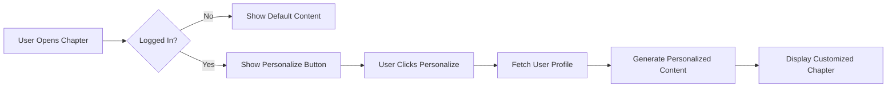

# Chapter Personalization Feature

## Overview
Allow logged-in users to personalize chapter content with a button click at the start of each chapter. The content will be dynamically adjusted based on their user profile (experience level, learning style, hardware, etc.).

---

## How It Works



---

## Implementation

### 1. API Endpoint for Content Personalization

**File: `auth-app/app/api/personalize/route.ts`**

```typescript
import { NextRequest, NextResponse } from "next/server";
import { auth } from "@/lib/auth";
import { Pool } from "@neondatabase/serverless";
import { PersonalizationEngine } from "@/lib/personalization";

const pool = new Pool({
  connectionString: process.env.NEON_DATABASE_URL!,
});

export async function POST(req: NextRequest) {
  try {
    const session = await auth.api.getSession({
      headers: req.headers,
    });

    if (!session) {
      return NextResponse.json({ error: "Unauthorized" }, { status: 401 });
    }

    const { chapterId, originalContent } = await req.json();

    // Get user profile
    const profileResult = await pool.query(
      "SELECT * FROM user_profiles WHERE user_id = $1",
      [session.user.id]
    );

    if (profileResult.rows.length === 0) {
      return NextResponse.json(
        { error: "Profile not found. Please complete onboarding." },
        { status: 404 }
      );
    }

    const profile = profileResult.rows[0];

    // Generate personalized content
    const personalizedContent = await generatePersonalizedContent(
      originalContent,
      profile,
      chapterId
    );

    // Track that user personalized this chapter
    await pool.query(
      `INSERT INTO user_progress (user_id, chapter_id, started_at, last_accessed)
       VALUES ($1, $2, CURRENT_TIMESTAMP, CURRENT_TIMESTAMP)
       ON CONFLICT (user_id, chapter_id)
       DO UPDATE SET last_accessed = CURRENT_TIMESTAMP`,
      [session.user.id, chapterId]
    );

    return NextResponse.json({
      success: true,
      personalizedContent,
      profile: {
        difficulty: PersonalizationEngine.getContentDifficulty(profile),
        learningStyle: profile.learning_style,
        hasHardware: profile.has_robot_hardware,
      },
    });
  } catch (error) {
    console.error("Personalization error:", error);
    return NextResponse.json(
      { error: "Failed to personalize content" },
      { status: 500 }
    );
  }
}

async function generatePersonalizedContent(
  originalContent: string,
  profile: any,
  chapterId: string
): Promise<string> {
  const difficulty = PersonalizationEngine.getContentDifficulty(profile);
  const systemPrompt = PersonalizationEngine.getChatbotSystemPrompt(profile);

  // Call OpenAI to personalize content
  const response = await fetch("https://api.openai.com/v1/chat/completions", {
    method: "POST",
    headers: {
      "Content-Type": "application/json",
      Authorization: `Bearer ${process.env.OPENAI_API_KEY}`,
    },
    body: JSON.stringify({
      model: "gpt-4-turbo-preview",
      messages: [
        {
          role: "system",
          content: `${systemPrompt}

You are personalizing textbook chapter content. Adapt the content to match the user's profile while maintaining all key information.

Instructions:
- Adjust complexity to ${difficulty} level
- Emphasize ${profile.learning_style} learning approach
- ${profile.has_robot_hardware ? `Include practical examples for ${profile.hardware_platforms.join(", ")}` : "Focus on simulation and theory"}
- Keep the same structure and headings
- Maintain all code examples but adjust comments and explanations
- Add personalized tips and suggestions`,
        },
        {
          role: "user",
          content: `Personalize this chapter content:\n\n${originalContent.substring(0, 8000)}`,
        },
      ],
      temperature: 0.7,
      max_tokens: 4000,
    }),
  });

  const data = await response.json();
  return data.choices[0].message.content;
}
```

---

### 2. React Component for Personalization Button

**File: `components/PersonalizeButton.tsx`**

```typescript
"use client";

import { useState } from "react";
import { authClient } from "@/lib/auth-client";

interface PersonalizeButtonProps {
  chapterId: string;
  originalContent: string;
  onPersonalized: (content: string, profile: any) => void;
}

export default function PersonalizeButton({
  chapterId,
  originalContent,
  onPersonalized,
}: PersonalizeButtonProps) {
  const [loading, setLoading] = useState(false);
  const [personalized, setPersonalized] = useState(false);
  const { data: session } = authClient.useSession();

  const handlePersonalize = async () => {
    setLoading(true);

    try {
      const response = await fetch("/api/personalize", {
        method: "POST",
        headers: {
          "Content-Type": "application/json",
        },
        body: JSON.stringify({
          chapterId,
          originalContent,
        }),
      });

      const data = await response.json();

      if (data.success) {
        onPersonalized(data.personalizedContent, data.profile);
        setPersonalized(true);
      } else {
        alert(data.error || "Failed to personalize content");
      }
    } catch (error) {
      console.error("Personalization error:", error);
      alert("Failed to personalize content");
    } finally {
      setLoading(false);
    }
  };

  const handleReset = () => {
    onPersonalized(originalContent, null);
    setPersonalized(false);
  };

  if (!session) {
    return null; // Don't show button if not logged in
  }

  return (
    <div className="personalize-container">
      {!personalized ? (
        <button
          onClick={handlePersonalize}
          disabled={loading}
          className="personalize-button"
        >
          {loading ? (
            <>
              <span className="spinner"></span>
              Personalizing...
            </>
          ) : (
            <>
              <svg
                className="icon"
                fill="none"
                stroke="currentColor"
                viewBox="0 0 24 24"
              >
                <path
                  strokeLinecap="round"
                  strokeLinejoin="round"
                  strokeWidth={2}
                  d="M5.121 17.804A13.937 13.937 0 0112 16c2.5 0 4.847.655 6.879 1.804M15 10a3 3 0 11-6 0 3 3 0 016 0zm6 2a9 9 0 11-18 0 9 9 0 0118 0z"
                />
              </svg>
              Personalize for Me
            </>
          )}
        </button>
      ) : (
        <div className="personalized-banner">
          <div className="banner-content">
            <svg
              className="check-icon"
              fill="none"
              stroke="currentColor"
              viewBox="0 0 24 24"
            >
              <path
                strokeLinecap="round"
                strokeLinejoin="round"
                strokeWidth={2}
                d="M9 12l2 2 4-4m6 2a9 9 0 11-18 0 9 9 0 0118 0z"
              />
            </svg>
            <span>Content personalized for your profile</span>
          </div>
          <button onClick={handleReset} className="reset-button">
            Show Original
          </button>
        </div>
      )}
    </div>
  );
}
```

---

### 3. Styling for Personalization UI

**File: `styles/personalize.css`**

```css
.personalize-container {
  margin: 2rem 0;
  padding: 1.5rem;
  background: linear-gradient(135deg, #667eea 0%, #764ba2 100%);
  border-radius: 12px;
  box-shadow: 0 4px 6px rgba(0, 0, 0, 0.1);
}

.personalize-button {
  display: flex;
  align-items: center;
  gap: 0.5rem;
  width: 100%;
  padding: 1rem 1.5rem;
  background: white;
  color: #667eea;
  border: none;
  border-radius: 8px;
  font-size: 1rem;
  font-weight: 600;
  cursor: pointer;
  transition: all 0.3s ease;
  box-shadow: 0 2px 4px rgba(0, 0, 0, 0.1);
}

.personalize-button:hover:not(:disabled) {
  transform: translateY(-2px);
  box-shadow: 0 4px 8px rgba(0, 0, 0, 0.15);
}

.personalize-button:disabled {
  opacity: 0.7;
  cursor: not-allowed;
}

.personalize-button .icon {
  width: 24px;
  height: 24px;
}

.spinner {
  display: inline-block;
  width: 20px;
  height: 20px;
  border: 3px solid rgba(102, 126, 234, 0.3);
  border-radius: 50%;
  border-top-color: #667eea;
  animation: spin 1s linear infinite;
}

@keyframes spin {
  to {
    transform: rotate(360deg);
  }
}

.personalized-banner {
  display: flex;
  align-items: center;
  justify-content: space-between;
  padding: 1rem 1.5rem;
  background: rgba(255, 255, 255, 0.95);
  border-radius: 8px;
  backdrop-filter: blur(10px);
}

.banner-content {
  display: flex;
  align-items: center;
  gap: 0.75rem;
  color: #10b981;
  font-weight: 600;
}

.check-icon {
  width: 24px;
  height: 24px;
}

.reset-button {
  padding: 0.5rem 1rem;
  background: transparent;
  color: #667eea;
  border: 2px solid #667eea;
  border-radius: 6px;
  font-size: 0.875rem;
  font-weight: 600;
  cursor: pointer;
  transition: all 0.2s ease;
}

.reset-button:hover {
  background: #667eea;
  color: white;
}

/* Personalized content highlighting */
.personalized-content {
  position: relative;
  padding-left: 1rem;
  border-left: 4px solid #667eea;
  background: linear-gradient(
    to right,
    rgba(102, 126, 234, 0.05),
    transparent
  );
}

.personalized-tip {
  margin: 1.5rem 0;
  padding: 1rem;
  background: #eff6ff;
  border-left: 4px solid #3b82f6;
  border-radius: 4px;
}

.personalized-tip::before {
  content: "💡 Personalized Tip: ";
  font-weight: 700;
  color: #3b82f6;
}

/* Mobile responsive */
@media (max-width: 768px) {
  .personalize-container {
    margin: 1rem 0;
    padding: 1rem;
  }

  .personalized-banner {
    flex-direction: column;
    gap: 1rem;
    align-items: stretch;
  }

  .reset-button {
    width: 100%;
  }
}
```

---

### 4. Integration with Chapter Component

**File: `components/ChapterContent.tsx`**

```typescript
"use client";

import { useState } from "react";
import PersonalizeButton from "./PersonalizeButton";
import ReactMarkdown from "react-markdown";

interface ChapterContentProps {
  chapterId: string;
  originalContent: string;
  title: string;
}

export default function ChapterContent({
  chapterId,
  originalContent,
  title,
}: ChapterContentProps) {
  const [content, setContent] = useState(originalContent);
  const [profile, setProfile] = useState<any>(null);

  const handlePersonalized = (personalizedContent: string, userProfile: any) => {
    setContent(personalizedContent);
    setProfile(userProfile);
  };

  return (
    <div className="chapter-container">
      <h1>{title}</h1>

      {/* Personalization Button at the top */}
      <PersonalizeButton
        chapterId={chapterId}
        originalContent={originalContent}
        onPersonalized={handlePersonalized}
      />

      {/* Show profile info if personalized */}
      {profile && (
        <div className="profile-info">
          <div className="profile-badge">
            <span className="badge-label">Difficulty:</span>
            <span className="badge-value">{profile.difficulty}</span>
          </div>
          <div className="profile-badge">
            <span className="badge-label">Learning Style:</span>
            <span className="badge-value">{profile.learningStyle}</span>
          </div>
          {profile.hasHardware && (
            <div className="profile-badge">
              <span className="badge-label">Hardware Mode:</span>
              <span className="badge-value">Enabled</span>
            </div>
          )}
        </div>
      )}

      {/* Chapter content */}
      <div className={profile ? "personalized-content" : ""}>
        <ReactMarkdown>{content}</ReactMarkdown>
      </div>
    </div>
  );
}
```

**Styling for profile badges:**

```css
.profile-info {
  display: flex;
  gap: 1rem;
  margin: 1rem 0;
  flex-wrap: wrap;
}

.profile-badge {
  display: inline-flex;
  align-items: center;
  gap: 0.5rem;
  padding: 0.5rem 1rem;
  background: #f3f4f6;
  border-radius: 20px;
  font-size: 0.875rem;
}

.badge-label {
  color: #6b7280;
  font-weight: 500;
}

.badge-value {
  color: #1f2937;
  font-weight: 700;
  text-transform: capitalize;
}
```

---

### 5. Usage in Docusaurus

**In your MDX file:**

```mdx
---
id: chapter-01
title: Introduction to Physical AI
---

import ChapterContent from '@site/src/components/ChapterContent';

export const chapterContent = `
# Introduction to Physical AI

Physical AI represents the convergence of artificial intelligence...

## Key Concepts

1. **Embodied Intelligence**
   - Physical interaction with environment
   - Sensor-motor coordination

2. **Real-time Processing**
   - Low-latency decision making
   - Edge computing requirements

...
`;

<ChapterContent
  chapterId="module-01/chapter-01"
  originalContent={chapterContent}
  title="Introduction to Physical AI"
/>
```

---

## Personalization Examples

### For Beginner User
**Original:**
```
Implement a PID controller for motor control.
```

**Personalized:**
```
Let's implement a PID controller for motor control step by step.

A PID controller is like a smart thermostat for your robot's motors.
It continuously adjusts the motor power to reach and maintain your
desired position or speed.

Here's a simple Python example with detailed comments:
[detailed code with explanations]

💡 Personalized Tip: Start by testing with just the P (proportional)
term before adding I and D. This makes debugging easier!
```

### For Advanced User with Hardware
**Original:**
```
Implement a PID controller for motor control.
```

**Personalized:**
```
PID Controller Implementation for Raspberry Pi

Here's an optimized C++ implementation for real-time motor control:
[efficient code]

💡 Personalized Tip: For your Raspberry Pi, consider using hardware
PWM pins (GPIO 12, 13, 18, 19) for better timing accuracy. You can
achieve ~1kHz control loop frequency with proper threading.

Hardware-specific considerations:
- Use pigpio library for precise PWM
- Implement anti-windup for integral term
- Consider feed-forward for known load dynamics
```

---

## Features

✅ **One-Click Personalization** - Button at chapter start
✅ **Profile-Based Adaptation** - Uses user's background data
✅ **Difficulty Adjustment** - Beginner/Intermediate/Advanced
✅ **Learning Style Matching** - Visual/Hands-on/Theoretical
✅ **Hardware-Specific Tips** - For users with robot hardware
✅ **Reversible** - Can switch back to original content
✅ **Progress Tracking** - Records personalization usage

---

## API Flow

```
1. User clicks "Personalize for Me"
2. Frontend sends: { chapterId, originalContent }
3. Backend fetches user profile from database
4. PersonalizationEngine generates custom prompt
5. OpenAI API personalizes content
6. Frontend displays personalized version
7. User can reset to original anytime
```

---

## Database Tracking

The system automatically tracks:
- When user personalizes a chapter
- Last accessed timestamp
- Can be used for analytics

```sql
-- Track personalization usage
SELECT
  user_id,
  COUNT(*) as chapters_personalized,
  MAX(last_accessed) as last_activity
FROM user_progress
GROUP BY user_id;
```

---

## Cost Considerations

**OpenAI API Usage:**
- ~8000 tokens input (chapter content)
- ~4000 tokens output (personalized version)
- Cost: ~$0.15 per personalization with GPT-4 Turbo

**Optimization:**
- Cache personalized content per user/chapter
- Use GPT-3.5-turbo for lower cost (~$0.01)
- Limit personalizations per user per day

---

## Next Steps

1. **Add caching** - Store personalized content to avoid re-generation
2. **Add preferences** - Let users choose personalization level
3. **Add A/B testing** - Compare personalized vs original engagement
4. **Add analytics** - Track which personalizations are most helpful

---

## Summary

Users can now click a button at the start of each chapter to get content personalized to their:
- Experience level (beginner/intermediate/advanced)
- Learning style (visual/hands-on/theoretical)
- Hardware availability (practical tips for their devices)
- Programming language preferences
- Goals and objectives

The personalization is **reversible**, **tracked**, and **seamless**! 🎯
