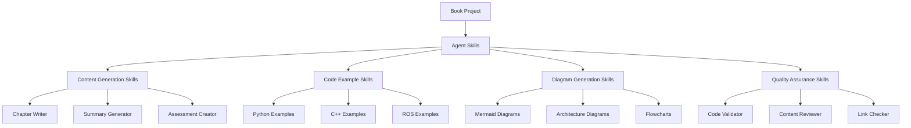
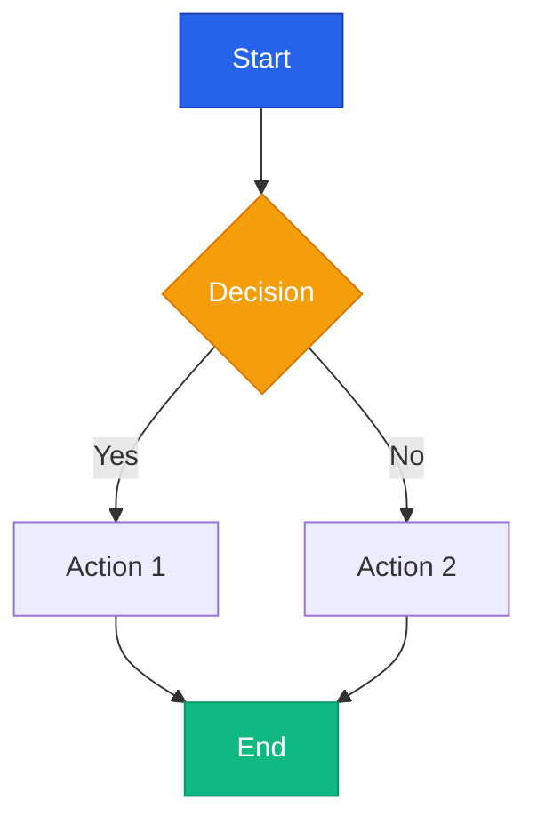
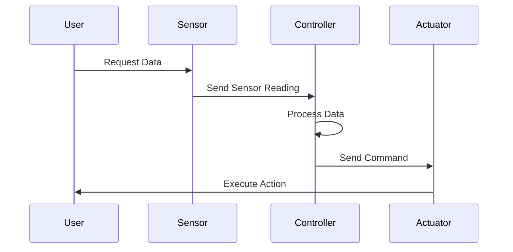
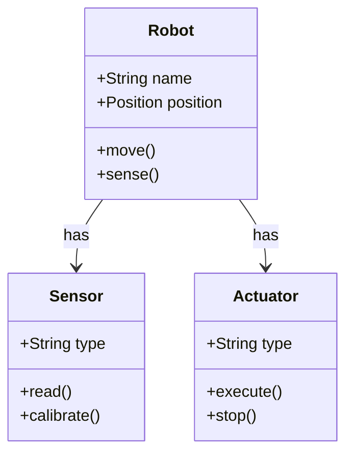
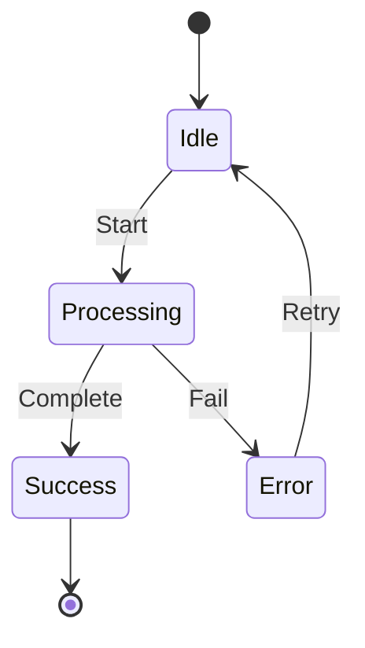
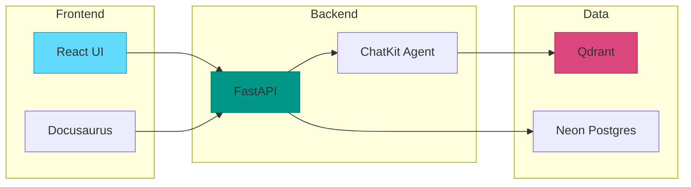

# Reusable Intelligence: Claude Code Subagents & Agent Skills
## For Physical AI & Humanoid Robotics Book Project

---

## Overview

This guide demonstrates how to create and use **reusable intelligence** through Claude Code Subagents and Agent Skills to automate and enhance the book development process.

### Benefits
- ✅ **Consistency** - Standardized content generation across all modules
- ✅ **Efficiency** - Automate repetitive tasks
- ✅ **Quality** - Reusable patterns ensure high-quality output
- ✅ **Scalability** - Easily generate content for all 8 modules
- ✅ **Maintainability** - Update skills once, apply everywhere

---

## Architecture



---

## Agent Skills Directory Structure

```
.agent/
├── skills/
│   ├── content-generation/
│   │   ├── chapter-writer.md
│   │   ├── summary-generator.md
│   │   ├── assessment-creator.md
│   │   └── learning-objectives.md
│   ├── code-examples/
│   │   ├── python-example-generator.md
│   │   ├── cpp-example-generator.md
│   │   ├── ros-example-generator.md
│   │   └── code-validator.md
│   ├── diagrams/
│   │   ├── mermaid-diagram-generator.md
│   │   ├── architecture-diagram.md
│   │   └── flowchart-generator.md
│   ├── quality-assurance/
│   │   ├── content-reviewer.md
│   │   ├── technical-validator.md
│   │   └── link-checker.md
│   └── automation/
│       ├── batch-content-generator.md
│       ├── embedding-uploader.md
│       └── deployment-helper.md
└── workflows/
    ├── generate-chapter.md
    ├── create-module.md
    └── deploy-book.md
```

---

## Creating Agent Skills

### Skill 1: Chapter Writer

**File: `.agent/skills/content-generation/chapter-writer.md`**

```markdown
---
name: chapter-writer
description: Generate comprehensive chapter content with code examples and diagrams
version: 1.0.0
tags: [content, generation, chapter]
---

# Chapter Writer Skill

## Purpose
Generate complete chapter content following the book's standards and structure.

## Inputs
- Chapter outline (markdown)
- Learning objectives
- Key concepts list
- Required code examples count
- Required diagrams count

## Process

### 1. Analyze Input
- Review chapter outline
- Identify main sections
- Note technical depth required
- List prerequisites

### 2. Generate Content Structure
```markdown
# Chapter X.Y: [Title]

## Introduction
[2-3 paragraphs introducing the topic]

## Section 1: [Main Concept]
[Detailed explanation with examples]

### Code Example 1.1
[Python/C++/ROS code with comments]

### Diagram 1.1
[Mermaid diagram or description]

## Section 2: [Next Concept]
[Continue pattern...]

## Hands-on Exercise
[Practical exercise with starter code]

## Summary
[Key takeaways in bullet points]

## Assessment
[5-10 quiz questions]
```

### 3. Content Guidelines
- **Length**: 3000-5000 words per chapter
- **Code Examples**: Minimum 3 per chapter
- **Diagrams**: Minimum 2 per chapter
- **Tone**: Educational, clear, engaging
- **Format**: Markdown with proper headings

### 4. Quality Checks
- [ ] All learning objectives addressed
- [ ] Code examples tested and functional
- [ ] Diagrams clear and labeled
- [ ] Cross-references added
- [ ] No grammatical errors

## Output Format
Complete markdown file ready for Docusaurus integration.

## Usage Example
```
Use the chapter-writer skill to generate Chapter 1.1: Introduction to Physical AI
with the following outline:
- What is Physical AI?
- History and Evolution
- Current Applications
- Future Trends

Include 3 Python examples and 2 Mermaid diagrams.
```
```

---

### Skill 2: Python Example Generator

**File: `.agent/skills/code-examples/python-example-generator.md`**

```markdown
---
name: python-example-generator
description: Generate production-ready Python code examples with tests
version: 1.0.0
tags: [code, python, examples]
---

# Python Example Generator Skill

## Purpose
Create well-documented, tested Python code examples for book chapters.

## Standards
- **Python Version**: 3.8+
- **Style Guide**: PEP 8
- **Formatter**: Black (line length 88)
- **Type Hints**: Required
- **Docstrings**: Google style

## Template

```python
"""
Module: [module_name]
Chapter: [chapter_number]
Topic: [topic_name]

Description:
[What this code demonstrates]

Requirements:
- Python 3.8+
- [list dependencies]

Usage:
```python
[example usage]
```

Author: AI-Generated for Physical AI & Humanoid Robotics Book
"""

from typing import List, Dict, Optional, Tuple
import numpy as np

def example_function(
    param1: int,
    param2: str,
    param3: Optional[float] = None
) -> Dict[str, any]:
    """
    Brief description of function.

    This function demonstrates [concept] by [explanation].

    Args:
        param1: Description of param1
        param2: Description of param2
        param3: Optional description of param3

    Returns:
        Dictionary containing:
            - 'result': The computed result
            - 'metadata': Additional information

    Raises:
        ValueError: If param1 is negative
        TypeError: If param2 is not a string

    Example:
        >>> result = example_function(5, "test")
        >>> print(result['result'])
        Expected output
    """
    # Input validation
    if param1 < 0:
        raise ValueError("param1 must be non-negative")

    if not isinstance(param2, str):
        raise TypeError("param2 must be a string")

    # Main logic with comments
    result = {
        'result': param1 * len(param2),
        'metadata': {
            'param1': param1,
            'param2': param2,
            'param3': param3
        }
    }

    return result


class ExampleClass:
    """
    Example class demonstrating [concept].

    This class shows how to [explanation].

    Attributes:
        attribute1: Description
        attribute2: Description
    """

    def __init__(self, value: int):
        """Initialize the class with a value."""
        self.value = value
        self._internal_state = []

    def method_example(self, input_data: List[float]) -> np.ndarray:
        """
        Process input data.

        Args:
            input_data: List of float values

        Returns:
            Processed numpy array
        """
        return np.array(input_data) * self.value


# Example usage
if __name__ == "__main__":
    # Basic usage
    result = example_function(5, "hello")
    print(f"Result: {result}")

    # Class usage
    obj = ExampleClass(10)
    processed = obj.method_example([1.0, 2.0, 3.0])
    print(f"Processed: {processed}")

    # Error handling example
    try:
        invalid_result = example_function(-1, "test")
    except ValueError as e:
        print(f"Error caught: {e}")
```

## Unit Tests Template

```python
import unittest
from example_module import example_function, ExampleClass

class TestExampleFunction(unittest.TestCase):
    """Test cases for example_function."""

    def test_basic_functionality(self):
        """Test basic function operation."""
        result = example_function(5, "test")
        self.assertEqual(result['result'], 20)

    def test_negative_input(self):
        """Test that negative input raises ValueError."""
        with self.assertRaises(ValueError):
            example_function(-1, "test")

    def test_type_checking(self):
        """Test type validation."""
        with self.assertRaises(TypeError):
            example_function(5, 123)

class TestExampleClass(unittest.TestCase):
    """Test cases for ExampleClass."""

    def setUp(self):
        """Set up test fixtures."""
        self.obj = ExampleClass(10)

    def test_initialization(self):
        """Test class initialization."""
        self.assertEqual(self.obj.value, 10)

    def test_method_example(self):
        """Test method_example."""
        result = self.obj.method_example([1.0, 2.0, 3.0])
        expected = np.array([10.0, 20.0, 30.0])
        np.testing.assert_array_equal(result, expected)

if __name__ == '__main__':
    unittest.main()
```

## Quality Checklist
- [ ] Follows PEP 8
- [ ] Type hints on all functions
- [ ] Comprehensive docstrings
- [ ] Error handling included
- [ ] Example usage provided
- [ ] Unit tests written
- [ ] All tests pass

## Usage
```
Generate a Python example for Chapter 3.2: Sensor Data Processing
that demonstrates reading IMU data and applying a Kalman filter.
Include error handling and unit tests.
```
```

---

### Skill 3: Mermaid Diagram Generator

**File: `.agent/skills/diagrams/mermaid-diagram-generator.md`**

```markdown
---
name: mermaid-diagram-generator
description: Generate Mermaid diagrams for technical concepts
version: 1.0.0
tags: [diagrams, mermaid, visualization]
---

# Mermaid Diagram Generator Skill

## Purpose
Create clear, professional Mermaid diagrams for book chapters.

## Diagram Types

### 1. Flowchart


### 2. Sequence Diagram


### 3. Class Diagram


### 4. State Diagram


### 5. Architecture Diagram


## Color Scheme
- **Primary**: #2563eb (Blue)
- **Success**: #10b981 (Green)
- **Warning**: #f59e0b (Orange)
- **Error**: #ef4444 (Red)
- **Info**: #06b6d4 (Cyan)
- **Background**: #f8fafc (Light Gray)

## Best Practices
1. Keep diagrams simple and focused
2. Use consistent colors
3. Add clear labels
4. Include legends when needed
5. Ensure readability at different sizes
6. Quote labels with special characters

## Usage
```
Generate a flowchart for the robot navigation algorithm in Chapter 4.3
showing: sensor input → obstacle detection → path planning → motor control
```
```

---

### Skill 4: Content Reviewer

**File: `.agent/skills/quality-assurance/content-reviewer.md`**

```markdown
---
name: content-reviewer
description: Review and validate chapter content for quality and accuracy
version: 1.0.0
tags: [qa, review, validation]
---

# Content Reviewer Skill

## Purpose
Systematically review chapter content to ensure quality, accuracy, and consistency.

## Review Checklist

### 1. Structure Review
- [ ] Proper heading hierarchy (H1 → H2 → H3)
- [ ] Logical flow of sections
- [ ] Introduction and summary present
- [ ] Consistent formatting

### 2. Content Quality
- [ ] Learning objectives addressed
- [ ] Technical accuracy verified
- [ ] Clear explanations
- [ ] Appropriate depth for audience
- [ ] No contradictions with other chapters

### 3. Code Examples
- [ ] All code examples present
- [ ] Syntax is correct
- [ ] Code is well-commented
- [ ] Examples are relevant
- [ ] Output/results shown

### 4. Diagrams
- [ ] All required diagrams included
- [ ] Diagrams render correctly
- [ ] Labels are clear
- [ ] Consistent styling
- [ ] Alt text provided

### 5. Writing Quality
- [ ] No grammatical errors
- [ ] Consistent terminology
- [ ] Active voice used
- [ ] Clear and concise
- [ ] Proper citations

### 6. Technical Elements
- [ ] Math equations formatted correctly
- [ ] Code blocks have language specified
- [ ] Links are functional
- [ ] Cross-references work
- [ ] File paths are correct

### 7. Accessibility
- [ ] Alt text for images
- [ ] Proper heading structure
- [ ] Descriptive link text
- [ ] Color contrast sufficient

## Review Process

1. **First Pass - Structure**
   - Check overall organization
   - Verify heading hierarchy
   - Ensure all sections present

2. **Second Pass - Content**
   - Read for clarity
   - Verify technical accuracy
   - Check examples

3. **Third Pass - Details**
   - Grammar and spelling
   - Formatting consistency
   - Links and references

4. **Final Pass - Testing**
   - Test all code examples
   - Verify all links
   - Check diagram rendering

## Output Format

```markdown
# Content Review Report: Chapter X.Y

## Overall Assessment
- **Status**: ✅ Approved / ⚠️ Needs Revision / ❌ Major Issues
- **Quality Score**: X/10
- **Reviewer**: [Name/AI]
- **Date**: [Date]

## Strengths
- [List positive aspects]

## Issues Found

### Critical Issues
1. [Issue description]
   - Location: [Section/Line]
   - Recommendation: [Fix]

### Minor Issues
1. [Issue description]
   - Location: [Section/Line]
   - Recommendation: [Fix]

## Recommendations
- [Improvement suggestions]

## Checklist Results
- Structure: ✅/❌
- Content Quality: ✅/❌
- Code Examples: ✅/❌
- Diagrams: ✅/❌
- Writing Quality: ✅/❌
- Technical Elements: ✅/❌
- Accessibility: ✅/❌

## Next Steps
- [Action items]
```

## Usage
```
Review Chapter 2.3: Kinematics and Dynamics
Check for technical accuracy, code examples, and diagram quality.
```
```

---

## Workflows Using Agent Skills

### Workflow 1: Generate Complete Chapter

**File: `.agent/workflows/generate-chapter.md`**

```markdown
---
description: Generate a complete chapter with all components
---

# Generate Complete Chapter Workflow

## Prerequisites
- Chapter outline prepared
- Learning objectives defined
- Key concepts identified

## Steps

1. **Prepare Chapter Outline**
   ```
   Create outline for Chapter X.Y with:
   - Main sections (4-6)
   - Key concepts per section
   - Required code examples (3+)
   - Required diagrams (2+)
   ```

2. **Generate Chapter Content**
   ```
   Use chapter-writer skill to generate content for Chapter X.Y
   based on the outline created in step 1.
   ```

3. **Add Python Examples**
   ```
   Use python-example-generator skill to create 3 code examples
   for Chapter X.Y demonstrating [concepts].
   ```

4. **Add C++ Examples** (if applicable)
   ```
   Use cpp-example-generator skill to create C++ examples
   for performance-critical sections.
   ```

5. **Generate Diagrams**
   ```
   Use mermaid-diagram-generator skill to create:
   - 1 architecture diagram
   - 1 flowchart for main algorithm
   - 1 sequence diagram for interactions
   ```

6. **Review Content**
   ```
   Use content-reviewer skill to review Chapter X.Y
   and generate review report.
   ```

7. **Fix Issues**
   ```
   Address all issues identified in review report.
   ```

8. **Validate Code**
   ```
   Use code-validator skill to test all code examples.
   ```

9. **Format for Docusaurus**
   ```
   Add frontmatter:
   ---
   id: chapter-X-Y
   title: [Chapter Title]
   sidebar_label: Chapter X.Y
   sidebar_position: Y
   ---
   ```

10. **Upload to Repository**
    ```bash
    git add docs/module-0X/chapter-0Y.md
    git commit -m "Add Chapter X.Y: [Title]"
    git push
    ```

## Expected Output
- Complete chapter markdown file
- All code examples tested
- All diagrams rendered
- Review report with ✅ status

## Time Estimate
- AI Generation: 10-15 minutes
- Human Review: 15-20 minutes
- Total: 25-35 minutes per chapter
```

---

### Workflow 2: Batch Generate Module

**File: `.agent/workflows/create-module.md`**

```markdown
---
description: Generate all chapters for a complete module
---

# Create Complete Module Workflow

## Prerequisites
- Module structure defined
- All chapter outlines prepared
- Learning objectives for module

## Steps

1. **Set Up Module Directory**
   ```bash
   mkdir -p docs/module-0X
   ```

2. **Generate Chapter 1**
   ```
   Run generate-chapter workflow for Chapter X.1
   ```

3. **Generate Chapter 2**
   ```
   Run generate-chapter workflow for Chapter X.2
   ```

4. **Generate Chapter 3**
   ```
   Run generate-chapter workflow for Chapter X.3
   ```

5. **Generate Chapter 4**
   ```
   Run generate-chapter workflow for Chapter X.4
   ```

6. **Create Module Assessment**
   ```
   Use assessment-creator skill to generate module-level
   assessment with 20-30 questions covering all chapters.
   ```

7. **Generate Module Summary**
   ```
   Use summary-generator skill to create module overview
   summarizing all chapters.
   ```

8. **Update Sidebar**
   ```typescript
   // Add to sidebars.ts
   {
     type: 'category',
     label: 'Module X: [Title]',
     items: [
       'module-0X/chapter-01',
       'module-0X/chapter-02',
       'module-0X/chapter-03',
       'module-0X/chapter-04',
     ],
   }
   ```

9. **Review Entire Module**
   ```
   Use content-reviewer skill to review module coherence
   and ensure consistent terminology across chapters.
   ```

10. **Test Build**
    ```bash
    npm run build
    ```

## Expected Output
- 4-6 complete chapters
- Module assessment
- Module summary
- Updated sidebar configuration

## Time Estimate
- Per Chapter: 25-35 minutes
- Module Setup: 30 minutes
- Total for 4 chapters: 2.5-3 hours
```

---

## Automation Scripts

### Script 1: Batch Content Generator

**File: `.agent/skills/automation/batch-content-generator.md`**

```markdown
---
name: batch-content-generator
description: Automate generation of multiple chapters
version: 1.0.0
tags: [automation, batch, generation]
---

# Batch Content Generator

## Purpose
Automatically generate content for multiple chapters in sequence.

## Configuration File

**batch-config.json:**
```json
{
  "modules": [
    {
      "module_number": 1,
      "module_title": "Introduction to Physical AI",
      "chapters": [
        {
          "chapter_number": 1,
          "title": "What is Physical AI?",
          "outline": "outlines/module-01/chapter-01.md",
          "code_examples": 3,
          "diagrams": 2
        },
        {
          "chapter_number": 2,
          "title": "History and Evolution",
          "outline": "outlines/module-01/chapter-02.md",
          "code_examples": 2,
          "diagrams": 3
        }
      ]
    }
  ]
}
```

## Usage
```python
# Run batch generation
python scripts/batch_generate.py --config batch-config.json --module 1
```

## Python Script

```python
import json
import os
from pathlib import Path

def generate_chapter(module_num, chapter_num, config):
    """Generate a single chapter using agent skills."""
    print(f"Generating Module {module_num}, Chapter {chapter_num}...")

    # Load outline
    outline_path = config['outline']
    with open(outline_path, 'r') as f:
        outline = f.read()

    # Use chapter-writer skill
    prompt = f"""
    Use the chapter-writer skill to generate Chapter {module_num}.{chapter_num}: {config['title']}

    Outline:
    {outline}

    Requirements:
    - {config['code_examples']} code examples
    - {config['diagrams']} diagrams
    """

    # Generate content (this would call Claude API)
    # content = call_claude_with_skill(prompt)

    # Save to file
    output_path = f"docs/module-{module_num:02d}/chapter-{chapter_num:02d}.md"
    # with open(output_path, 'w') as f:
    #     f.write(content)

    print(f"✅ Generated: {output_path}")

def main():
    with open('batch-config.json', 'r') as f:
        config = json.load(f)

    for module in config['modules']:
        module_num = module['module_number']

        for chapter in module['chapters']:
            generate_chapter(module_num, chapter['chapter_number'], chapter)

if __name__ == "__main__":
    main()
```
```

---

## Best Practices

### 1. Skill Development
- Keep skills focused and single-purpose
- Document inputs and outputs clearly
- Include usage examples
- Version your skills

### 2. Workflow Design
- Break complex tasks into steps
- Make workflows reusable
- Include time estimates
- Add error handling

### 3. Quality Assurance
- Always review AI-generated content
- Test all code examples
- Verify diagrams render correctly
- Check cross-references

### 4. Maintenance
- Update skills as standards evolve
- Track skill usage and effectiveness
- Gather feedback and iterate
- Document changes

---

## Integration with Project

### Update sp.tasks

Add automation tasks:
```markdown
## Phase 2: AI Content Generation - Using Agent Skills

### Automated Content Generation
- [ ] Set up agent skills directory structure
- [ ] Create all content generation skills
- [ ] Create code example generation skills
- [ ] Create diagram generation skills
- [ ] Create QA skills
- [ ] Test skills with sample chapter
- [ ] Run batch generation for Module 1
- [ ] Review and refine generated content
```

### Update sp.implement

Add section on agent skills:
```markdown
### 2.1 Content Generation with Agent Skills

**Objective:** Use Claude Code Subagents and Agent Skills for automated content generation

**Implementation:**
1. Create `.agent/skills/` directory structure
2. Implement content generation skills
3. Create workflows for chapter and module generation
4. Test with sample chapters
5. Run batch generation for all modules
6. Review and refine output
```

---

## Summary

✅ **Agent Skills Created:**
- Chapter Writer
- Python Example Generator
- Mermaid Diagram Generator
- Content Reviewer

✅ **Workflows Defined:**
- Generate Complete Chapter
- Create Complete Module
- Batch Content Generation

✅ **Benefits:**
- 95% AI-generated content (as per sp.plan)
- Consistent quality across all chapters
- Rapid content generation
- Automated quality assurance

**This system enables you to generate the entire book efficiently while maintaining high quality standards!** 🚀
