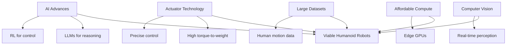
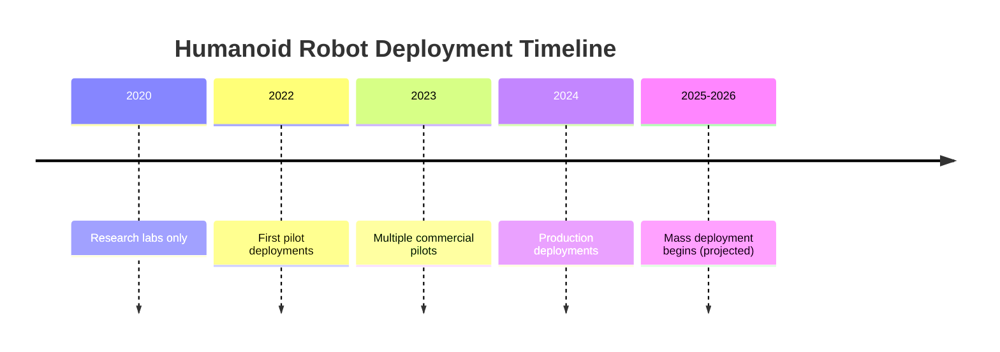

# Chapter 3: The Humanoid Robot Landscape

## Overview

The field of humanoid robotics has experienced explosive growth in recent years, driven by advances in AI, actuator technology, and computational power. This chapter surveys the current landscape of humanoid robots, from research platforms to commercial products, and explores the different approaches companies are taking to solve the challenge of creating capable, general-purpose humanoid robots.

:::info Learning Time
**Estimated Reading Time**: 50-60 minutes
**Hands-on Activities**: 20 minutes
**Total Chapter Time**: 1.5 hours
:::

---

## 3.1 The Humanoid Revolution

### Why Now?

Several technological convergences have made humanoid robots viable:



### Market Drivers

1. **Labor Shortages**
   - Aging populations in developed countries
   - Dangerous jobs (manufacturing, construction)
   - Repetitive tasks in warehouses

2. **Economic Viability**
   - Component costs decreasing
   - AI capabilities increasing
   - ROI becoming attractive

3. **Technological Readiness**
   - Sufficient battery technology
   - Powerful edge computing
   - Robust perception systems

---

## 3.2 Major Humanoid Platforms

### Boston Dynamics Atlas

**Company**: Boston Dynamics (Hyundai subsidiary)
**First Released**: 2013
**Current Version**: Atlas (2023)

**Specifications**:
- **Height**: 1.5m (5 ft)
- **Weight**: 89 kg (196 lbs)
- **DOF**: 28 degrees of freedom
- **Power**: Electric (hydraulic in earlier versions)
- **Runtime**: ~1 hour

**Key Capabilities**:
- **Parkour**: Backflips, jumps, complex obstacle courses
- **Manipulation**: Picking, throwing, tool use
- **Balance**: Recovery from pushes, walking on uneven terrain
- **Perception**: 3D vision, real-time environment mapping

**Technical Approach**:
- Model Predictive Control (MPC)
- Whole-body trajectory optimization
- Real-time dynamics simulation
- Proprietary control algorithms

**Use Cases**:
- Research platform
- Disaster response (DARPA Robotics Challenge)
- Industrial inspection
- Entertainment/demonstration

**Strengths**:
- ✅ Exceptional dynamic balance
- ✅ Impressive agility and athleticism
- ✅ Proven reliability

**Limitations**:
- ❌ Not commercially available
- ❌ High cost (estimated $150k+)
- ❌ Limited AI autonomy (mostly pre-programmed)

---

### Tesla Optimus (Tesla Bot)

**Company**: Tesla
**Announced**: 2021
**First Prototype**: 2022

**Specifications** (Gen 2, 2023):
- **Height**: 1.73m (5'8")
- **Weight**: 73 kg (161 lbs)
- **DOF**: 28+ degrees of freedom
- **Hands**: 11 DOF per hand
- **Power**: 2.3 kWh battery (~8 hours runtime)
- **Compute**: Tesla FSD computer

**Key Capabilities**:
- **Manipulation**: Delicate object handling (e.g., eggs)
- **Walking**: Smooth bipedal locomotion
- **Learning**: Vision-based imitation learning
- **Integration**: Tesla AI stack (vision, planning)

**Technical Approach**:
- Vision-only perception (no LiDAR)
- Neural network-based control
- Imitation learning from human demonstrations
- Leveraging Tesla's autonomous driving AI

**Planned Use Cases**:
- Factory automation (Tesla factories first)
- Household tasks
- Elderly care
- General-purpose labor

**Strengths**:
- ✅ Mass production capability (Tesla's manufacturing)
- ✅ Advanced AI integration
- ✅ Competitive pricing target ($20k-$30k)
- ✅ Rapid iteration

**Limitations**:
- ❌ Still in development (not commercially available)
- ❌ Unproven in real-world scenarios
- ❌ Limited public demonstrations

---

### Figure 01

**Company**: Figure AI
**Founded**: 2022
**Funding**: $675M+ (OpenAI, Microsoft, NVIDIA, Amazon)

**Specifications**:
- **Height**: 1.68m (5'6")
- **Weight**: 60 kg (132 lbs)
- **DOF**: Full-body articulation
- **Runtime**: ~5 hours
- **Payload**: 20 kg

**Key Capabilities**:
- **Natural Language**: GPT-powered conversational interface
- **Vision-Language-Action**: Multimodal understanding
- **Manipulation**: Precise object handling
- **Learning**: Continuous improvement from deployment

**Technical Approach**:
- OpenAI integration for reasoning
- End-to-end neural networks
- Real-world deployment focus
- Fleet learning (robots learn from each other)

**Target Use Cases**:
- Warehouse logistics
- Retail environments
- Manufacturing
- Commercial deployment (BMW partnership announced)

**Strengths**:
- ✅ Strong AI partnerships (OpenAI)
- ✅ Commercial focus
- ✅ Impressive natural language interaction
- ✅ Real customer deployments

**Limitations**:
- ❌ Young company (limited track record)
- ❌ High competition
- ❌ Scaling challenges ahead

---

### Sanctuary AI Phoenix

**Company**: Sanctuary AI (Canada)
**Generation**: 7th generation (2024)

**Specifications**:
- **Height**: 1.7m (5'7")
- **Weight**: 70 kg (155 lbs)
- **Hands**: Carbon™ hands with human-like dexterity
- **Sensors**: Extensive tactile sensing

**Key Capabilities**:
- **Dexterity**: 20+ DOF hands with tactile feedback
- **Teleoperation**: Human-in-the-loop control
- **Task Learning**: Rapid task acquisition
- **Cognitive Architecture**: Proprietary AI system

**Technical Approach**:
- "Carbon" AI control system
- Emphasis on manipulation and dexterity
- Teleoperation for training data collection
- Subsumption architecture

**Target Markets**:
- Retail (demonstrated at grocery stores)
- Manufacturing
- Logistics

**Strengths**:
- ✅ Exceptional hand dexterity
- ✅ Practical commercial focus
- ✅ Real deployments (Canadian Tire)

**Limitations**:
- ❌ Less dynamic than Atlas
- ❌ Smaller company/funding

---

### Agility Robotics Digit

**Company**: Agility Robotics
**First Released**: 2019
**Current Version**: Digit V2

**Specifications**:
- **Height**: 1.75m (5'9")
- **Weight**: 65 kg (143 lbs)
- **Payload**: 16 kg (35 lbs)
- **Runtime**: ~4 hours
- **Unique**: Bipedal but not fully humanoid (no head)

**Key Capabilities**:
- **Logistics**: Box handling, package delivery
- **Navigation**: Stairs, obstacles, uneven terrain
- **Manipulation**: Two-armed grasping
- **Autonomy**: Warehouse navigation

**Technical Approach**:
- Specialized for logistics
- Simplified design (no hands, simplified upper body)
- Proven in real deployments
- Focus on reliability over versatility

**Deployments**:
- Amazon warehouses (testing)
- GXO Logistics
- Span (warehouse automation)

**Strengths**:
- ✅ Real commercial deployments
- ✅ Proven reliability
- ✅ Practical design for specific tasks
- ✅ Strong partnerships

**Limitations**:
- ❌ Limited manipulation (no fingers)
- ❌ Not general-purpose
- ❌ Less impressive visually

---

### 1X Technologies (formerly Halodi Robotics)

**Company**: 1X Technologies (Norway/USA)
**Robots**: EVE (wheeled) and NEO (bipedal humanoid)

**NEO Specifications**:
- **Height**: 1.65m (5'5")
- **Weight**: 30 kg (66 lbs) - remarkably light!
- **Design**: Soft, safe materials
- **Approach**: Biomimetic, human-safe

**Key Capabilities**:
- **Safety**: Designed for home environments
- **Learning**: VLA (Vision-Language-Action) models
- **Embodied AI**: End-to-end neural control

**Technical Approach**:
- Lightweight, compliant design
- Focus on safety over strength
- Neural network-based control
- Home environment specialization

**Strengths**:
- ✅ Extremely lightweight and safe
- ✅ Home-focused design
- ✅ Strong AI foundation

**Limitations**:
- ❌ Lower payload capacity
- ❌ Less proven than competitors

---

### Unitree H1 & G1

**Company**: Unitree Robotics (China)
**Models**: H1 (full-size), G1 (compact)

**H1 Specifications**:
- **Height**: 1.8m (5'11")
- **Weight**: 47 kg (104 lbs) - very lightweight
- **Speed**: 3.3 m/s walking, 5.0 m/s running
- **Price**: ~$90,000 (remarkably affordable)

**G1 Specifications**:
- **Height**: 1.32m (4'4")
- **Weight**: 35 kg (77 lbs)
- **Price**: ~$16,000 (extremely affordable)

**Key Capabilities**:
- **Speed**: Fastest humanoid walking/running
- **Agility**: Backflips, dynamic movements
- **Affordability**: Lowest price point

**Technical Approach**:
- Aggressive cost optimization
- Leveraging Chinese manufacturing
- Open research platform
- Rapid iteration

**Strengths**:
- ✅ Exceptional price-to-performance
- ✅ High speed and agility
- ✅ Available for purchase (research)

**Limitations**:
- ❌ Less sophisticated AI
- ❌ Limited manipulation capabilities
- ❌ Newer to market

---

## 3.3 Comparison Matrix

| Platform | Height | Weight | Price | Availability | Best For |
|----------|--------|--------|-------|--------------|----------|
| **Boston Dynamics Atlas** | 1.5m | 89kg | $150k+ | Research only | Dynamic performance, R&D |
| **Tesla Optimus** | 1.73m | 73kg | $20-30k (target) | In development | Mass production, general tasks |
| **Figure 01** | 1.68m | 60kg | TBD | Limited deployment | Commercial logistics, AI integration |
| **Sanctuary Phoenix** | 1.7m | 70kg | TBD | Limited deployment | Dexterous manipulation |
| **Agility Digit** | 1.75m | 65kg | ~$250k | Commercial | Warehouse logistics |
| **1X NEO** | 1.65m | 30kg | TBD | In development | Home environments, safety |
| **Unitree H1** | 1.8m | 47kg | $90k | Available | Research, speed/agility |
| **Unitree G1** | 1.32m | 35kg | $16k | Available | Education, research |

---

## 3.4 Technical Approaches Comparison

### Control Strategies

**Model-Based Control** (Boston Dynamics)
```python
# Simplified MPC approach
class ModelPredictiveController:
    def __init__(self, robot_model):
        self.model = robot_model
        self.horizon = 1.0  # seconds

    def compute_control(self, current_state, desired_state):
        # Predict future states
        predicted_trajectory = self.model.simulate(
            current_state,
            horizon=self.horizon
        )

        # Optimize control to minimize error
        optimal_control = self.optimize(
            predicted_trajectory,
            desired_state
        )

        return optimal_control
```

**Learning-Based Control** (Tesla, Figure)
```python
# Neural network policy
class NeuralPolicy:
    def __init__(self):
        self.network = VisionLanguageActionModel()

    def get_action(self, observation, language_command):
        # End-to-end: pixels + text -> motor commands
        action = self.network.forward(
            image=observation['camera'],
            text=language_command
        )
        return action
```

**Hybrid Approaches** (Most modern systems)
- High-level: Learning-based task planning
- Low-level: Model-based control for stability

---

## 3.5 Key Technologies

### Actuation

**Electric Motors** (Most modern robots)
- High efficiency
- Precise control
- Quieter operation
- Lower maintenance

**Hydraulic** (Early Atlas)
- Higher power-to-weight
- Better for dynamic movements
- More complex, heavier

**Quasi-Direct Drive** (Unitree)
- Low gear ratio
- High backdrivability
- Natural compliance

### Perception

**Vision-Only** (Tesla Optimus)
- Multiple cameras
- Neural network processing
- No LiDAR dependency

**Multi-Modal** (Most others)
- Cameras + LiDAR + depth sensors
- Redundancy and robustness
- Better 3D understanding

### Hands

**Dexterous Hands** (Sanctuary, Figure)
- 10-20 DOF per hand
- Tactile sensors
- Human-like manipulation

**Simplified Grippers** (Agility Digit)
- 2-3 DOF
- Reliable grasping
- Task-specific design

---

## 3.6 Industry Trends

### 1. Convergence on ~$20-30k Price Point

Companies targeting mass market need affordable pricing:
- Tesla: $20-30k target
- Unitree G1: Already at $16k
- Economies of scale will drive prices down

### 2. AI-First Design

Modern humanoids integrate AI from the ground up:
- Vision-Language-Action models
- End-to-end learning
- Continuous improvement from deployment

### 3. Commercial Deployments Accelerating



### 4. Specialization vs. Generalization

**Specialists** (Agility Digit):
- Optimized for specific tasks
- Faster to market
- Proven ROI

**Generalists** (Tesla Optimus, Figure):
- Versatile across tasks
- Larger addressable market
- Longer development time

### 5. Open Source Movement

Increasing open-source contributions:
- Unitree: Open SDK and simulation
- Research platforms available for purchase
- Shared datasets and benchmarks

---

## 3.7 Application Domains

### Manufacturing

**Current**: Repetitive assembly, quality inspection
**Future**: Complex assembly, collaborative work

**Example**: BMW + Figure partnership
- Automotive assembly tasks
- Working alongside humans
- Flexible redeployment

### Logistics & Warehousing

**Current**: Box moving, sorting, inventory
**Future**: Full warehouse automation

**Leaders**: Agility Robotics, Amazon

### Retail & Service

**Current**: Shelf stocking, customer assistance
**Future**: Full store operations

**Example**: Sanctuary AI in Canadian Tire

### Healthcare & Elderly Care

**Current**: Limited pilots
**Future**: Patient assistance, companionship

**Challenges**: Safety certification, trust

### Household

**Current**: Research only
**Future**: Cleaning, cooking, general assistance

**Timeline**: 5-10 years to mass market

---

## 3.8 Technical Challenges

### 1. Dexterity

**Challenge**: Human hands have 27 DOF and incredible sensitivity

**Current Solutions**:
- Simplified grippers (fewer DOF)
- Soft robotics (compliant materials)
- Tactile sensing arrays

**Future**: Artificial muscles, advanced materials

### 2. Energy Efficiency

**Challenge**: Humans consume ~100W, robots consume 500-1000W

**Current**: 1-8 hour battery life

**Solutions**:
- More efficient actuators
- Better batteries
- Energy recovery (regenerative braking)

### 3. Robustness

**Challenge**: Robots must work reliably in unstructured environments

**Approaches**:
- Extensive testing
- Redundant systems
- Graceful degradation

### 4. Cost

**Challenge**: Manufacturing at scale while maintaining quality

**Solutions**:
- Vertical integration (Tesla approach)
- Standardized components
- Automated assembly

### 5. AI Generalization

**Challenge**: Robots must handle novel situations

**Approaches**:
- Large-scale training data
- Sim-to-real transfer
- Continuous learning from deployment

---

## 3.9 Future Outlook (2025-2030)

### Near-Term (2025-2026)

- **First mass deployments** in warehouses and factories
- **Price points** reaching $20-50k
- **Capabilities**: Structured environment tasks
- **Market size**: Thousands of units

### Mid-Term (2027-2028)

- **Broader commercial adoption** across industries
- **Improved dexterity** approaching human levels
- **Better AI** enabling more autonomous operation
- **Market size**: Tens of thousands of units

### Long-Term (2029-2030)

- **Consumer market** emergence (home robots)
- **General-purpose** capabilities
- **Price points** below $20k
- **Market size**: Hundreds of thousands of units

### Potential Disruptions

1. **Breakthrough in actuators**: Artificial muscles
2. **AI leap**: AGI-level reasoning
3. **Battery revolution**: 10x energy density
4. **Regulatory**: Safety standards, liability frameworks

---

## 3.10 Choosing a Platform for Learning

### For This Course

We'll focus on **simulation** and **ROS 2** which work with any platform:
- Universal skills
- No hardware required
- Transferable knowledge

### If You Want Hardware

**Budget < $20k**: Unitree G1
- Most affordable
- Good capabilities
- Active community

**Budget $50-100k**: Unitree H1
- Research-grade
- High performance
- Available now

**For Research**: Contact universities
- Often have shared platforms
- Access to Atlas, Digit, etc.

---

## 3.11 Learning Objectives

By completing this chapter, you should be able to:

### Knowledge Objectives
- [ ] **Identify** major humanoid robot platforms and their manufacturers
- [ ] **List** key specifications for each major platform
- [ ] **Describe** different technical approaches (model-based vs. learning-based)
- [ ] **Explain** current application domains

### Comprehension Objectives
- [ ] **Compare** strengths and weaknesses of different platforms
- [ ] **Understand** industry trends and market drivers
- [ ] **Explain** why certain designs suit certain applications

### Application Objectives
- [ ] **Evaluate** which platform suits a given use case
- [ ] **Analyze** technical trade-offs in robot design
- [ ] **Predict** future developments based on current trends

---

## 3.12 Key Takeaways

:::tip Essential Concepts
1. **Multiple viable approaches** exist: Boston Dynamics' dynamics expertise, Tesla's AI-first approach, Agility's commercial focus

2. **Price points are dropping** rapidly: From $150k+ to sub-$20k in just a few years

3. **Commercial deployments** are accelerating: Moving from research to real-world applications

4. **AI integration** is key differentiator: Modern robots leverage LLMs, VLAs, and continuous learning

5. **Specialization vs. generalization** trade-off: Choose based on time-to-market vs. addressable market
:::

:::warning Industry Reality Check
- 🤔 Most impressive demos are **cherry-picked** - real performance varies
- 💰 Announced prices often **don't include** support, training, integration
- ⏰ Timelines are **optimistic** - expect delays
- 🔧 **Maintenance and reliability** are often underestimated challenges
:::

---

## 3.13 Hands-On Activity: Platform Analysis

**Objective**: Develop critical evaluation skills for robot platforms

**Activity**: Choose a use case and evaluate which platform is best suited:

### Example Use Case: Restaurant Service

**Requirements**:
- Navigate dining room
- Carry food trays (5-10 kg)
- Interact with customers
- Work 8-hour shifts
- Safe around humans

**Evaluation**:

| Platform | Suitability | Reasoning |
|----------|-------------|-----------|
| Atlas | ❌ Low | Overqualified, too expensive, intimidating |
| Optimus | ⚠️ Medium | Good capabilities but unproven, not available |
| Figure 01 | ✅ High | Natural language, safe, commercial focus |
| Digit | ⚠️ Medium | Good payload but limited interaction |
| 1X NEO | ✅ High | Designed for human spaces, safe, friendly |

**Your Turn**: Evaluate platforms for:
1. **Warehouse inventory management**
2. **Elderly care companion**
3. **Construction site assistance**

---

## 3.14 Discussion Questions

1. **Form vs. Function**: Do we need fully humanoid robots, or are specialized forms (like Digit) more practical?

2. **Open vs. Closed**: Should humanoid robot designs be open-sourced, or is proprietary development better for innovation?

3. **Safety Standards**: What safety certifications should be required before humanoids work alongside humans?

4. **Economic Impact**: How will widespread humanoid deployment affect employment and society?

5. **Design Philosophy**: Is Tesla's vision-only approach better than multi-sensor approaches? Why or why not?

6. **Market Timing**: Are we in a "humanoid bubble" or is this sustainable growth?

---

## 3.15 Further Reading & Resources

### Company Websites & Demos
- [Boston Dynamics Atlas](https://www.bostondynamics.com/atlas) - Latest demos
- [Tesla Optimus Updates](https://www.tesla.com/AI) - AI Day presentations
- [Figure AI](https://www.figure.ai/) - Company updates
- [Agility Robotics](https://agilityrobotics.com/) - Digit platform

### Industry Analysis
- **IEEE Spectrum Robotics** - Technical coverage
- **TechCrunch Robotics** - Industry news
- **The Robot Report** - Market analysis

### Academic Papers
- "A Survey of Humanoid Robotics" - IEEE Transactions
- "Bipedal Locomotion: State of the Art" - Annual Reviews
- "Economics of Humanoid Robots" - Various business journals

### Video Resources
- **Boston Dynamics YouTube** - Impressive demos
- **Tesla AI Day** - Technical deep dives
- **Figure AI demos** - Natural language interaction

---

## 3.16 Assessment Quiz

### Multiple Choice

1. Which humanoid robot is known for the most dynamic movements (parkour, backflips)?
   - A) Tesla Optimus
   - B) Boston Dynamics Atlas
   - C) Agility Digit
   - D) Unitree G1

2. What is Tesla Optimus's key differentiator?
   - A) Hydraulic actuation
   - B) Vision-only perception
   - C) Lowest price
   - D) Fastest speed

3. Which company has actual commercial deployments in warehouses?
   - A) Boston Dynamics
   - B) Tesla
   - C) Agility Robotics
   - D) 1X Technologies

### Short Answer

4. Explain the trade-off between specialized robots (like Digit) and general-purpose humanoids (like Optimus).

5. Why are humanoid robot prices dropping so rapidly?

6. What are three key technical challenges still facing humanoid robotics?

### Critical Thinking

7. **Design Analysis**: If you were designing a humanoid for hospital environments, what would be your top 3 design priorities and why?

8. **Market Prediction**: Which application domain do you think will see humanoid robots first at scale, and why?

---

## Next Chapter Preview

In **Chapter 4: Sensor Systems**, we'll dive deep into:
- LiDAR technology and 3D mapping
- RGB and depth cameras
- IMUs for balance and orientation
- Force/torque sensors for manipulation
- Sensor fusion techniques

**Get ready to understand how robots perceive the world!**

---

**Chapter 3 Complete! ✅**

You now understand the current landscape of humanoid robotics and can evaluate different platforms for various applications.
