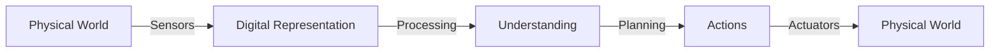
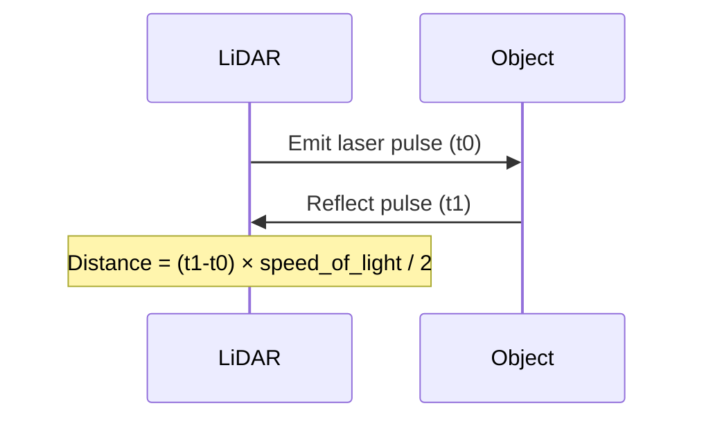
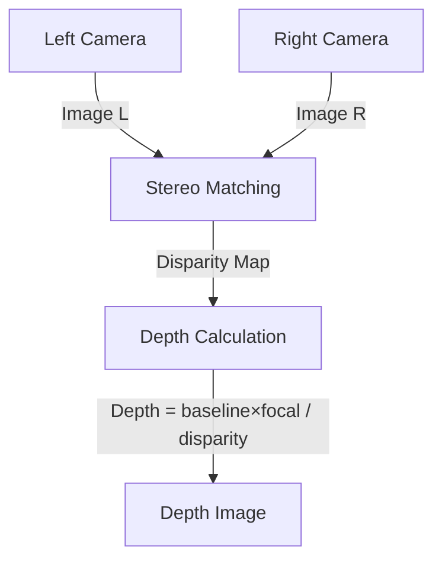
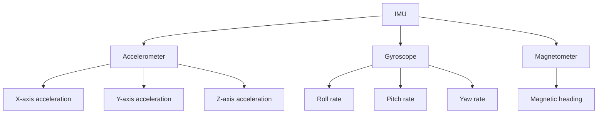
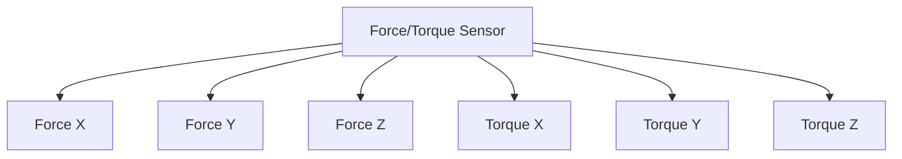
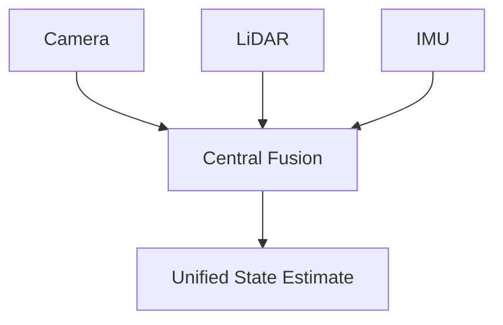
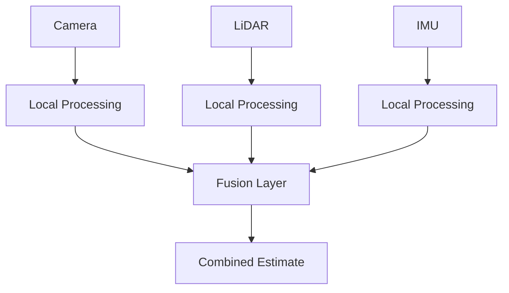

# Chapter 4: Sensor Systems for Humanoid Robots

## Overview

Sensors are the eyes, ears, and touch of a robot—they transform the physical world into digital information that the robot's brain can process. This chapter explores the key sensor technologies used in humanoid robots, how they work, their strengths and limitations, and how to combine them effectively through sensor fusion.

:::info Learning Time
**Estimated Reading Time**: 60-70 minutes
**Hands-on Activities**: 30 minutes
**Total Chapter Time**: 1.5-2 hours
:::

---

## 4.1 The Importance of Perception

### Why Sensors Matter



**Without good sensors, robots are blind:**
- Can't detect obstacles
- Can't locate objects
- Can't maintain balance
- Can't interact safely

**Sensor quality determines:**
- Task capabilities
- Safety margins
- Operating speed
- Reliability

### Sensor Categories

| Category | Purpose | Examples |
|----------|---------|----------|
| **Exteroceptive** | Sense external environment | Cameras, LiDAR, microphones |
| **Proprioceptive** | Sense robot's own state | Encoders, IMU, joint sensors |
| **Tactile** | Sense physical contact | Force/torque, pressure, tactile arrays |

---

## 4.2 LiDAR (Light Detection and Ranging)

### How LiDAR Works

**Principle**: Measure distance by timing laser light reflections



**Process**:
1. Emit laser pulse
2. Measure time until reflection returns
3. Calculate distance: `d = (time × c) / 2`
4. Rotate to scan area
5. Build 3D point cloud

### Types of LiDAR

**Mechanical Spinning LiDAR**
- **Pros**: 360° coverage, long range (100m+)
- **Cons**: Expensive ($1k-$100k), moving parts
- **Examples**: Velodyne, Ouster
- **Use**: Autonomous vehicles, outdoor robots

**Solid-State LiDAR**
- **Pros**: No moving parts, cheaper, compact
- **Cons**: Limited field of view
- **Examples**: Livox, Luminar
- **Use**: Modern humanoid robots

**Flash LiDAR**
- **Pros**: Instant full-frame capture
- **Cons**: Shorter range (< 30m)
- **Examples**: Advanced Navigation
- **Use**: Indoor navigation

### LiDAR Specifications

**Key Parameters**:
- **Range**: 0.1m to 200m (varies by model)
- **Accuracy**: ±2-5cm typical
- **Resolution**: 0.1° to 2° angular resolution
- **Scan Rate**: 5-20 Hz
- **Points per Second**: 100k to 2M+

**Example: Velodyne VLP-16**
```
Range: 100m
Channels: 16
Points/sec: ~300,000
FOV: 360° horizontal, ±15° vertical
Weight: 830g
Power: 8W
Price: ~$4,000
```

### LiDAR Data Format

**Point Cloud**: Collection of 3D points

```python
# Example: Processing LiDAR point cloud
import numpy as np

class LiDARProcessor:
    def __init__(self):
        self.min_range = 0.1  # meters
        self.max_range = 50.0

    def process_scan(self, point_cloud):
        """
        point_cloud: Nx3 array of [x, y, z] coordinates
        """
        # Filter by range
        distances = np.linalg.norm(point_cloud, axis=1)
        valid_mask = (distances > self.min_range) & (distances < self.max_range)
        filtered_points = point_cloud[valid_mask]

        # Ground plane removal
        ground_threshold = 0.1  # meters
        non_ground = filtered_points[filtered_points[:, 2] > ground_threshold]

        # Clustering for object detection
        objects = self.cluster_points(non_ground)

        return objects

    def cluster_points(self, points):
        # DBSCAN or similar clustering algorithm
        from sklearn.cluster import DBSCAN

        clustering = DBSCAN(eps=0.3, min_samples=10)
        labels = clustering.fit_predict(points)

        # Extract clusters
        unique_labels = set(labels) - {-1}  # Remove noise
        clusters = []
        for label in unique_labels:
            cluster_points = points[labels == label]
            clusters.append({
                'center': cluster_points.mean(axis=0),
                'size': cluster_points.max(axis=0) - cluster_points.min(axis=0),
                'points': cluster_points
            })

        return clusters
```

### Applications in Humanoid Robots

**Navigation**:
- Obstacle detection
- Map building (SLAM)
- Path planning

**Manipulation**:
- Object localization
- Scene understanding
- Collision avoidance

**Limitations**:
- ❌ Struggles with transparent/reflective surfaces (glass, mirrors)
- ❌ No color information
- ❌ Can be affected by rain, fog, dust
- ❌ Relatively expensive
- ❌ High power consumption

---

## 4.3 RGB Cameras

### How Cameras Work

**Principle**: Capture light through lens onto sensor


**Components**:
- **Lens**: Focuses light
- **Sensor**: CCD or CMOS chip
- **Processor**: Converts to digital image

### Camera Specifications

**Key Parameters**:
- **Resolution**: 640x480 (VGA) to 4K (3840x2160)
- **Frame Rate**: 30 fps (standard) to 120+ fps (high-speed)
- **Field of View**: 60° to 180° (fisheye)
- **Dynamic Range**: Ability to handle bright/dark areas
- **Shutter Type**: Global (all pixels at once) vs. Rolling (row by row)

**Example: Intel RealSense D435**
```
RGB Resolution: 1920x1080
Depth Resolution: 1280x720
Frame Rate: 30 fps
FOV: 87° × 58°
Range: 0.3m to 3m (depth)
Price: ~$200
```

### Computer Vision Tasks

**Object Detection**
```python
import cv2
import numpy as np

class ObjectDetector:
    def __init__(self, model_path):
        # Load pre-trained YOLO model
        self.net = cv2.dnn.readNet(model_path)
        self.classes = ["person", "cup", "bottle", "chair", ...]

    def detect(self, image):
        # Prepare image
        blob = cv2.dnn.blobFromImage(
            image, 1/255.0, (416, 416), swapRB=True, crop=False
        )

        # Run detection
        self.net.setInput(blob)
        outputs = self.net.forward(self.get_output_layers())

        # Parse detections
        detections = []
        for output in outputs:
            for detection in output:
                scores = detection[5:]
                class_id = np.argmax(scores)
                confidence = scores[class_id]

                if confidence > 0.5:
                    # Extract bounding box
                    center_x = int(detection[0] * image.shape[1])
                    center_y = int(detection[1] * image.shape[0])
                    width = int(detection[2] * image.shape[1])
                    height = int(detection[3] * image.shape[0])

                    detections.append({
                        'class': self.classes[class_id],
                        'confidence': float(confidence),
                        'bbox': (center_x, center_y, width, height)
                    })

        return detections
```

**Semantic Segmentation**
- Classify each pixel
- Understand scene layout
- Identify walkable surfaces

**Pose Estimation**
- Detect human skeletons
- Track body keypoints
- Enable human-robot interaction

### Advantages & Limitations

**Advantages**:
- ✅ Rich information (color, texture, patterns)
- ✅ Inexpensive ($10-$500)
- ✅ Low power consumption
- ✅ Mature algorithms and libraries
- ✅ Passive sensing (no emitted light)

**Limitations**:
- ❌ No direct depth information
- ❌ Sensitive to lighting conditions
- ❌ Requires significant computation for processing
- ❌ Limited range (depends on object size)

---

## 4.4 Depth Cameras

### How Depth Cameras Work

**Stereo Vision**:
- Two cameras (like human eyes)
- Compare images to calculate depth
- Triangulation-based



**Structured Light**:
- Project known pattern
- Observe distortion
- Calculate depth from deformation

**Time-of-Flight (ToF)**:
- Emit modulated infrared light
- Measure phase shift of reflection
- Calculate distance

### Popular Depth Cameras

**Intel RealSense D435** (Stereo)
- Range: 0.3m - 3m
- Resolution: 1280x720
- Frame Rate: 90 fps
- Price: ~$200

**Microsoft Azure Kinect** (ToF)
- Range: 0.5m - 5.5m
- Resolution: 1024x1024
- Frame Rate: 30 fps
- Price: ~$400

**Stereolabs ZED 2** (Stereo)
- Range: 0.3m - 20m
- Resolution: 2208x1242
- Frame Rate: 60 fps
- Price: ~$450

### Depth Data Processing

```python
class DepthProcessor:
    def __init__(self, camera_intrinsics):
        self.fx = camera_intrinsics['fx']  # Focal length x
        self.fy = camera_intrinsics['fy']  # Focal length y
        self.cx = camera_intrinsics['cx']  # Principal point x
        self.cy = camera_intrinsics['cy']  # Principal point y

    def pixel_to_3d(self, u, v, depth):
        """
        Convert pixel coordinates + depth to 3D point

        Args:
            u, v: Pixel coordinates
            depth: Depth value in meters

        Returns:
            (x, y, z) in camera frame
        """
        x = (u - self.cx) * depth / self.fx
        y = (v - self.cy) * depth / self.fy
        z = depth

        return (x, y, z)

    def create_point_cloud(self, rgb_image, depth_image):
        """Generate colored 3D point cloud"""
        height, width = depth_image.shape
        points = []
        colors = []

        for v in range(height):
            for u in range(width):
                depth = depth_image[v, u]

                if depth > 0:  # Valid depth
                    point_3d = self.pixel_to_3d(u, v, depth)
                    color = rgb_image[v, u]

                    points.append(point_3d)
                    colors.append(color)

        return np.array(points), np.array(colors)
```

### Applications

**Object Grasping**:
- Determine object 3D pose
- Plan grasp points
- Estimate object size

**Obstacle Avoidance**:
- Detect obstacles in path
- Measure distances
- Safe navigation

**Scene Understanding**:
- 3D reconstruction
- Surface normal estimation
- Spatial relationships

---

## 4.5 IMU (Inertial Measurement Unit)

### What is an IMU?

**Components**:
1. **Accelerometer**: Measures linear acceleration (3 axes)
2. **Gyroscope**: Measures angular velocity (3 axes)
3. **Magnetometer**: Measures magnetic field (optional, for compass)



### How IMUs Work

**Accelerometer**:
- Measures proper acceleration (including gravity)
- At rest: reads gravity (9.81 m/s² downward)
- In motion: reads acceleration + gravity

**Gyroscope**:
- Measures rotation rate (degrees/second)
- Integrate over time to get orientation
- Drift accumulates over time

**Sensor Fusion**:
- Combine accelerometer + gyroscope
- Complementary filter or Kalman filter
- Estimate orientation accurately

### IMU Data Processing

```python
import numpy as np

class IMUProcessor:
    def __init__(self, sample_rate=100):  # Hz
        self.dt = 1.0 / sample_rate
        self.orientation = np.array([0.0, 0.0, 0.0])  # roll, pitch, yaw
        self.alpha = 0.98  # Complementary filter coefficient

    def process_imu_data(self, accel, gyro):
        """
        Args:
            accel: [ax, ay, az] in m/s²
            gyro: [gx, gy, gz] in rad/s

        Returns:
            orientation: [roll, pitch, yaw] in radians
        """
        # Gyroscope integration (high-pass)
        gyro_roll = self.orientation[0] + gyro[0] * self.dt
        gyro_pitch = self.orientation[1] + gyro[1] * self.dt
        gyro_yaw = self.orientation[2] + gyro[2] * self.dt

        # Accelerometer orientation (low-pass)
        accel_roll = np.arctan2(accel[1], accel[2])
        accel_pitch = np.arctan2(-accel[0],
                                  np.sqrt(accel[1]**2 + accel[2]**2))

        # Complementary filter
        self.orientation[0] = (self.alpha * gyro_roll +
                              (1 - self.alpha) * accel_roll)
        self.orientation[1] = (self.alpha * gyro_pitch +
                              (1 - self.alpha) * accel_pitch)
        self.orientation[2] = gyro_yaw  # No accel reference for yaw

        return self.orientation

    def detect_fall(self, accel):
        """Detect if robot is falling"""
        total_accel = np.linalg.norm(accel)

        # Free fall: total acceleration near zero
        if total_accel < 2.0:  # m/s²
            return True

        # Impact: sudden high acceleration
        if total_accel > 30.0:  # m/s²
            return True

        return False
```

### Applications in Humanoid Robots

**Balance Control**:
- Detect tilt
- Measure angular velocity
- Trigger balance corrections

**Fall Detection**:
- Recognize free-fall
- Activate protective measures
- Emergency stop

**Odometry**:
- Dead reckoning
- Estimate position (with drift)
- Complement other sensors

**Vibration Monitoring**:
- Detect mechanical issues
- Monitor gait quality
- Predictive maintenance

### IMU Specifications

**Example: Bosch BMI088**
```
Accelerometer Range: ±3g to ±24g
Gyroscope Range: ±125°/s to ±2000°/s
Sample Rate: Up to 2 kHz
Noise: 150 μg/√Hz (accel), 0.014°/s/√Hz (gyro)
Price: ~$10
```

**Challenges**:
- ❌ Gyroscope drift over time
- ❌ Accelerometer includes gravity
- ❌ Magnetometer affected by metal/electronics
- ❌ Requires sensor fusion for accuracy

---

## 4.6 Force/Torque Sensors

### What Are Force/Torque Sensors?

**Purpose**: Measure forces and moments applied to robot

**6-Axis F/T Sensor** measures:
- **Forces**: Fx, Fy, Fz (3 axes)
- **Torques**: Tx, Ty, Tz (3 axes)



### How They Work

**Strain Gauge-Based**:
- Deformable structure
- Strain gauges measure deformation
- Convert to force/torque values

**Capacitive**:
- Measure capacitance changes
- Higher sensitivity
- More expensive

### Applications

**Compliant Grasping**:
```python
class ForceControlledGripper:
    def __init__(self, target_force=5.0):  # Newtons
        self.target_force = target_force
        self.kp = 0.1  # Proportional gain

    def grasp_object(self, force_sensor, gripper):
        """Close gripper until target force reached"""
        while True:
            current_force = force_sensor.read_force_z()

            if current_force >= self.target_force:
                break  # Target force reached

            # Proportional control
            error = self.target_force - current_force
            gripper_velocity = self.kp * error
            gripper.set_velocity(gripper_velocity)

            time.sleep(0.01)  # 100 Hz control loop

        gripper.stop()
        print(f"Grasped with force: {current_force:.2f} N")
```

**Contact Detection**:
- Detect when robot touches something
- Trigger reflexive responses
- Safety monitoring

**Assembly Tasks**:
- Peg-in-hole insertion
- Precise force control
- Detect successful assembly

**Human-Robot Interaction**:
- Detect human touch
- Measure handshake force
- Safe physical interaction

### Specifications

**Example: ATI Mini40**
```
Force Range: ±40 N (Fx, Fy), ±120 N (Fz)
Torque Range: ±2 Nm (all axes)
Resolution: 1/50 N (force), 1/1000 Nm (torque)
Sample Rate: Up to 7 kHz
Price: ~$3,000
```

---

## 4.7 Sensor Fusion

### Why Sensor Fusion?

**Single sensors have limitations**:
- Cameras: No depth
- LiDAR: No color
- IMU: Drifts over time

**Fusion provides**:
- Redundancy (if one fails)
- Complementary information
- Higher accuracy
- Robustness

### Fusion Architectures

**Centralized Fusion**:


**Decentralized Fusion**:


### Kalman Filter Example

```python
import numpy as np

class KalmanFilter:
    """Simple Kalman filter for sensor fusion"""

    def __init__(self, state_dim, measurement_dim):
        self.state = np.zeros(state_dim)
        self.covariance = np.eye(state_dim)

        # Process noise
        self.Q = np.eye(state_dim) * 0.01

        # Measurement noise
        self.R = np.eye(measurement_dim) * 0.1

    def predict(self, F, B=None, u=None):
        """
        Prediction step

        Args:
            F: State transition matrix
            B: Control input matrix (optional)
            u: Control input (optional)
        """
        # Predict state
        self.state = F @ self.state
        if B is not None and u is not None:
            self.state += B @ u

        # Predict covariance
        self.covariance = F @ self.covariance @ F.T + self.Q

    def update(self, z, H):
        """
        Update step

        Args:
            z: Measurement
            H: Measurement matrix
        """
        # Innovation
        y = z - H @ self.state

        # Innovation covariance
        S = H @ self.covariance @ H.T + self.R

        # Kalman gain
        K = self.covariance @ H.T @ np.linalg.inv(S)

        # Update state
        self.state = self.state + K @ y

        # Update covariance
        I = np.eye(len(self.state))
        self.covariance = (I - K @ H) @ self.covariance

    def get_state(self):
        return self.state

# Example: Fusing IMU and vision for position estimation
class RobotStateEstimator:
    def __init__(self):
        # State: [x, y, z, vx, vy, vz]
        self.kf = KalmanFilter(state_dim=6, measurement_dim=3)

    def process_imu(self, accel, dt):
        """Prediction from IMU"""
        # State transition (constant acceleration model)
        F = np.array([
            [1, 0, 0, dt, 0, 0],
            [0, 1, 0, 0, dt, 0],
            [0, 0, 1, 0, 0, dt],
            [0, 0, 0, 1, 0, 0],
            [0, 0, 0, 0, 1, 0],
            [0, 0, 0, 0, 0, 1]
        ])

        # Control input (acceleration)
        B = np.array([
            [0.5*dt**2, 0, 0],
            [0, 0.5*dt**2, 0],
            [0, 0, 0.5*dt**2],
            [dt, 0, 0],
            [0, dt, 0],
            [0, 0, dt]
        ])

        self.kf.predict(F, B, accel)

    def process_vision(self, position):
        """Update from vision system"""
        # Measurement matrix (observe position only)
        H = np.array([
            [1, 0, 0, 0, 0, 0],
            [0, 1, 0, 0, 0, 0],
            [0, 0, 1, 0, 0, 0]
        ])

        self.kf.update(position, H)

    def get_position(self):
        state = self.kf.get_state()
        return state[:3]  # x, y, z
```

### Visual-Inertial Odometry (VIO)

Fusing camera + IMU for robust localization:

**Advantages**:
- Camera: Accurate but slow
- IMU: Fast but drifts
- Together: Fast AND accurate

**Used in**:
- Smartphones (ARKit, ARCore)
- VR headsets
- Drones
- Humanoid robots

---

## 4.8 Sensor Placement on Humanoid Robots

### Head-Mounted Sensors

**Typical Configuration**:
- Stereo cameras (eyes)
- RGB camera (center)
- Optional: LiDAR (forehead)
- IMU (inside head)

**Advantages**:
- Human-like perspective
- Pan/tilt capability
- Protected location

### Torso Sensors

- IMU (center of mass)
- Additional cameras (360° awareness)
- LiDAR (navigation)

### Hand/Wrist Sensors

- Force/torque sensors (wrist)
- Tactile sensors (fingertips)
- Cameras (wrist-mounted for manipulation)

### Foot Sensors

- Force sensors (ground contact)
- Pressure distribution
- IMU (each foot)

---

## 4.9 Practical Considerations

### Sensor Selection Criteria

| Criterion | Questions to Ask |
|-----------|------------------|
| **Range** | How far must you sense? |
| **Accuracy** | How precise must measurements be? |
| **Update Rate** | How fast must you react? |
| **Environment** | Indoor/outdoor? Lighting? Weather? |
| **Cost** | Budget constraints? |
| **Power** | Battery life requirements? |
| **Size/Weight** | Payload limitations? |
| **Computation** | Processing power available? |

### Common Pitfalls

**Over-Sensing**:
- ❌ More sensors = more complexity
- ❌ More data to process
- ❌ Higher cost and weight

**Under-Sensing**:
- ❌ Missing critical information
- ❌ Unsafe operation
- ❌ Limited capabilities

**Poor Calibration**:
- ❌ Inaccurate measurements
- ❌ Sensor fusion failures
- ❌ Unreliable behavior

---

## 4.10 Learning Objectives

By completing this chapter, you should be able to:

### Knowledge Objectives
- [ ] **Describe** how LiDAR, cameras, IMUs, and force sensors work
- [ ] **List** specifications for common sensor types
- [ ] **Identify** appropriate sensors for different tasks
- [ ] **Explain** the purpose of sensor fusion

### Comprehension Objectives
- [ ] **Compare** strengths and weaknesses of different sensors
- [ ] **Understand** when to use each sensor type
- [ ] **Explain** how sensor fusion improves perception
- [ ] **Describe** common sensor placement strategies

### Application Objectives
- [ ] **Select** appropriate sensors for a given robot application
- [ ] **Design** a sensor suite for a humanoid robot
- [ ] **Implement** basic sensor processing algorithms
- [ ] **Evaluate** sensor fusion approaches

---

## 4.11 Key Takeaways

:::tip Essential Concepts
1. **LiDAR** provides accurate 3D distance measurements but is expensive and power-hungry

2. **Cameras** offer rich visual information but require significant processing and lack direct depth

3. **Depth cameras** combine color and depth but have limited range

4. **IMUs** enable balance and orientation tracking but drift over time

5. **Force/torque sensors** enable compliant interaction and precise manipulation

6. **Sensor fusion** combines complementary sensors for robust, accurate perception
:::

:::warning Practical Tips
- 🔧 **Always calibrate** sensors before use
- 🔋 **Consider power budgets** - sensors can drain batteries quickly
- 💻 **Plan for computation** - processing sensor data requires significant CPU/GPU
- 🛡️ **Build redundancy** - critical systems should have backup sensors
- 🧪 **Test in target environment** - lab performance ≠ real-world performance
:::

---

## 4.12 Hands-On Activity: Sensor Selection

**Objective**: Practice selecting sensors for specific applications

### Scenario 1: Warehouse Navigation Robot

**Requirements**:
- Navigate aisles autonomously
- Detect obstacles (boxes, people, forklifts)
- Operate in varying lighting
- Budget: $5,000 for sensors

**Your Task**: Select sensor suite and justify choices

**Suggested Solution**:
- **LiDAR** (Velodyne VLP-16): 360° obstacle detection ($4,000)
- **IMU** (Bosch BMI088): Orientation and odometry ($10)
- **RGB Camera** (Intel RealSense): Visual confirmation ($200)
- **Wheel Encoders**: Odometry (included)

**Total**: ~$4,210

### Scenario 2: Delicate Object Manipulation

**Requirements**:
- Grasp fragile objects (eggs, glassware)
- Precise force control
- Visual object recognition
- Budget: $3,000

**Your Task**: Design sensor system

### Scenario 3: Outdoor Humanoid Assistant

**Requirements**:
- Walk on uneven terrain
- Operate in sunlight and rain
- Carry objects (up to 10kg)
- Interact with humans
- Budget: $8,000

**Your Task**: Complete sensor specification

---

## 4.13 Discussion Questions

1. **Trade-offs**: Why might Tesla Optimus use vision-only while others use LiDAR? What are the pros/cons?

2. **Redundancy**: When is sensor redundancy worth the added cost and complexity?

3. **Future Sensors**: What new sensor technologies might transform humanoid robotics in the next 5-10 years?

4. **Privacy**: Cameras on robots raise privacy concerns. How should this be addressed?

5. **Failure Modes**: How should a robot behave when a critical sensor fails?

6. **Bio-Inspiration**: How do human senses compare to robot sensors? What can we learn?

---

## 4.14 Further Reading & Resources

### Technical Documentation
- [Intel RealSense Documentation](https://dev.intelrealsense.com/)
- [Velodyne LiDAR Manuals](https://velodynelidar.com/products/)
- [Bosch Sensortec IMU Guides](https://www.bosch-sensortec.com/)

### Academic Papers
- "LiDAR-based 3D Object Detection" - IEEE Transactions on Robotics
- "Visual-Inertial Odometry" - Computer Vision and Pattern Recognition
- "Sensor Fusion for Mobile Robots" - International Journal of Robotics Research

### Software Libraries
- **OpenCV**: Computer vision algorithms
- **PCL** (Point Cloud Library): LiDAR processing
- **ROS sensor packages**: sensor_msgs, tf2, robot_localization

### Video Tutorials
- "How LiDAR Works" - Veritasium
- "Camera Calibration Explained" - Cyrill Stachniss
- "IMU Sensor Fusion" - Phil's Lab

---

## 4.15 Assessment Quiz

### Multiple Choice

1. What does LiDAR measure?
   - A) Color and texture
   - B) Distance using laser light
   - C) Magnetic fields
   - D) Temperature

2. Which sensor is best for detecting transparent objects?
   - A) LiDAR
   - B) RGB camera
   - C) Force/torque sensor
   - D) IMU

3. What causes gyroscope drift?
   - A) Gravity
   - B) Integration of noise over time
   - C) Magnetic interference
   - D) Temperature changes

### Short Answer

4. Explain why sensor fusion is necessary for robust robot perception.

5. Describe three applications of force/torque sensors in humanoid robots.

6. What are the main differences between stereo cameras and ToF depth cameras?

### Practical Problem

7. **System Design**: Design a complete sensor suite for a humanoid robot that must:
   - Navigate indoor environments
   - Manipulate household objects
   - Maintain balance on flat surfaces
   - Detect and avoid humans

   Specify: sensor types, quantities, placement, and estimated total cost.

---

## Next Steps

**Congratulations!** You've completed Week 1-2: Foundations of Physical AI.

**You've learned**:
- ✅ What Physical AI is and why it matters
- ✅ Embodied intelligence principles
- ✅ Current humanoid robot landscape
- ✅ Essential sensor systems

**Next**: In **Weeks 3-5**, we'll dive into **ROS 2** - the robotic nervous system that connects all these sensors and actuators into a functioning robot!

---

**Chapter 4 Complete! ✅**

You now understand the key sensor technologies that enable robots to perceive and interact with the physical world.
