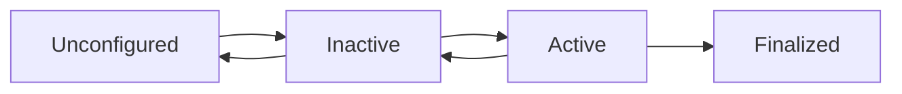



# Nodes, Topics, and Services

## Creating Your First ROS 2 Node

### Understanding Nodes

A **node** is the fundamental building block of a ROS 2 application. Each node should perform a single, well-defined task and communicate with other nodes through topics, services, or actions.

### Node Lifecycle



## Setting Up a ROS 2 Package

### Creating a Python Package

```bash
# Navigate to your workspace
cd ~/ros2_ws/src

# Create a new package
ros2 pkg create --build-type ament_python my_robot_controller \
  --dependencies rclpy std_msgs geometry_msgs sensor_msgs

# Package structure
my_robot_controller/
├── my_robot_controller/
│   └── __init__.py
├── package.xml
├── setup.py
├── setup.cfg
└── resource/
    └── my_robot_controller
```

### Package Configuration Files

**package.xml** - Package metadata and dependencies:
```xml
<?xml version="1.0"?>
<?xml-model href="http://download.ros.org/schema/package_format3.xsd" schematypens="http://www.w3.org/2001/XMLSchema"?>
<package format="3">
  <name>my_robot_controller</name>
  <version>0.0.1</version>
  <description>Robot controller package</description>
  <maintainer email="you@example.com">Your Name</maintainer>
  <license>Apache-2.0</license>

  <depend>rclpy</depend>
  <depend>std_msgs</depend>
  <depend>geometry_msgs</depend>
  <depend>sensor_msgs</depend>

  <test_depend>ament_copyright</test_depend>
  <test_depend>ament_flake8</test_depend>
  <test_depend>ament_pep257</test_depend>
  <test_depend>python3-pytest</test_depend>

  <export>
    <build_type>ament_python</build_type>
  </export>
</package>
```

**setup.py** - Python package configuration:
```python
from setuptools import setup

package_name = 'my_robot_controller'

setup(
    name=package_name,
    version='0.0.1',
    packages=[package_name],
    data_files=[
        ('share/ament_index/resource_index/packages',
            ['resource/' + package_name]),
        ('share/' + package_name, ['package.xml']),
    ],
    install_requires=['setuptools'],
    zip_safe=True,
    maintainer='Your Name',
    maintainer_email='you@example.com',
    description='Robot controller package',
    license='Apache-2.0',
    tests_require=['pytest'],
    entry_points={
        'console_scripts': [
            'my_first_node = my_robot_controller.my_first_node:main',
            'publisher_node = my_robot_controller.publisher_node:main',
            'subscriber_node = my_robot_controller.subscriber_node:main',
        ],
    },
)
```

## Writing a Simple Node

### Minimal Node Structure

Create `my_robot_controller/my_first_node.py`:

```python
#!/usr/bin/env python3
import rclpy
from rclpy.node import Node


class MyFirstNode(Node):
    """
    A minimal ROS 2 node that prints a message periodically.
    """

    def __init__(self):
        # Initialize the node with a name
        super().__init__('my_first_node')

        # Log that the node has started
        self.get_logger().info('My First Node has been started!')

        # Create a timer that calls timer_callback every 1.0 seconds
        self.timer = self.create_timer(1.0, self.timer_callback)
        self.counter = 0

    def timer_callback(self):
        """Called periodically by the timer."""
        self.counter += 1
        self.get_logger().info(f'Hello ROS 2! Count: {self.counter}')


def main(args=None):
    # Initialize ROS 2
    rclpy.init(args=args)

    # Create the node
    node = MyFirstNode()

    # Keep the node running
    rclpy.spin(node)

    # Cleanup
    node.destroy_node()
    rclpy.shutdown()


if __name__ == '__main__':
    main()
```

### Building and Running

```bash
# Build the package
cd ~/ros2_ws
colcon build --packages-select my_robot_controller --symlink-install

# Source the workspace
source install/setup.bash

# Run the node
ros2 run my_robot_controller my_first_node
```

**Output:**
```
[INFO] [my_first_node]: My First Node has been started!
[INFO] [my_first_node]: Hello ROS 2! Count: 1
[INFO] [my_first_node]: Hello ROS 2! Count: 2
[INFO] [my_first_node]: Hello ROS 2! Count: 3
...
```

## Publishers and Topics

### Creating a Publisher Node

Create `my_robot_controller/publisher_node.py`:

```python
#!/usr/bin/env python3
import rclpy
from rclpy.node import Node
from std_msgs.msg import String
from geometry_msgs.msg import Twist


class RobotNewsPublisher(Node):
    """
    Publishes robot status updates and velocity commands.
    """

    def __init__(self):
        super().__init__('robot_news_publisher')

        # Create a publisher for robot news (String messages)
        self.news_publisher = self.create_publisher(
            String,           # Message type
            'robot_news',     # Topic name
            10                # QoS history depth
        )

        # Create a publisher for velocity commands
        self.cmd_vel_publisher = self.create_publisher(
            Twist,
            'cmd_vel',
            10
        )

        # Timer for publishing news
        self.news_timer = self.create_timer(2.0, self.publish_news)

        # Timer for publishing velocity commands
        self.cmd_timer = self.create_timer(0.1, self.publish_velocity)

        self.get_logger().info('Robot News Publisher has been started')

    def publish_news(self):
        """Publish a news message."""
        msg = String()
        msg.data = 'Robot is operational and ready!'
        self.news_publisher.publish(msg)
        self.get_logger().info(f'Publishing: "{msg.data}"')

    def publish_velocity(self):
        """Publish velocity commands."""
        msg = Twist()
        msg.linear.x = 0.5   # Move forward at 0.5 m/s
        msg.angular.z = 0.1  # Turn at 0.1 rad/s
        self.cmd_vel_publisher.publish(msg)


def main(args=None):
    rclpy.init(args=args)
    node = RobotNewsPublisher()
    rclpy.spin(node)
    node.destroy_node()
    rclpy.shutdown()


if __name__ == '__main__':
    main()
```

### Message Types

Common ROS 2 message types:

**std_msgs:**
- `String` - Text data
- `Int32`, `Float64` - Numeric data
- `Bool` - Boolean values
- `Header` - Timestamp and frame info

**geometry_msgs:**
- `Point` - 3D position (x, y, z)
- `Pose` - Position + orientation
- `Twist` - Linear and angular velocity
- `Transform` - 3D transformation

**sensor_msgs:**
- `Image` - Camera images
- `LaserScan` - LiDAR data
- `Imu` - IMU sensor data
- `JointState` - Robot joint positions/velocities

## Subscribers

### Creating a Subscriber Node

Create `my_robot_controller/subscriber_node.py`:

```python
#!/usr/bin/env python3
import rclpy
from rclpy.node import Node
from std_msgs.msg import String
from geometry_msgs.msg import Twist


class RobotNewsSubscriber(Node):
    """
    Subscribes to robot news and velocity commands.
    """

    def __init__(self):
        super().__init__('robot_news_subscriber')

        # Create a subscriber for robot news
        self.news_subscription = self.create_subscription(
            String,                    # Message type
            'robot_news',              # Topic name
            self.news_callback,        # Callback function
            10                         # QoS history depth
        )

        # Create a subscriber for velocity commands
        self.cmd_subscription = self.create_subscription(
            Twist,
            'cmd_vel',
            self.cmd_callback,
            10
        )

        self.get_logger().info('Robot News Subscriber has been started')

    def news_callback(self, msg):
        """Called when a news message is received."""
        self.get_logger().info(f'Received news: "{msg.data}"')

    def cmd_callback(self, msg):
        """Called when a velocity command is received."""
        self.get_logger().info(
            f'Velocity command - Linear: {msg.linear.x:.2f}, '
            f'Angular: {msg.angular.z:.2f}'
        )


def main(args=None):
    rclpy.init(args=args)
    node = RobotNewsSubscriber()
    rclpy.spin(node)
    node.destroy_node()
    rclpy.shutdown()


if __name__ == '__main__':
    main()
```

### Testing Publisher and Subscriber

```bash
# Terminal 1: Run publisher
ros2 run my_robot_controller publisher_node

# Terminal 2: Run subscriber
ros2 run my_robot_controller subscriber_node

# Terminal 3: Monitor topics
ros2 topic list
ros2 topic echo /robot_news
ros2 topic hz /cmd_vel
ros2 topic bw /cmd_vel
```

## Services

### Understanding Services

Services provide **synchronous request-response** communication:
- Client sends a request
- Server processes it
- Server sends back a response

### Creating a Service Server

Create `my_robot_controller/add_two_ints_server.py`:

```python
#!/usr/bin/env python3
import rclpy
from rclpy.node import Node
from example_interfaces.srv import AddTwoInts


class AddTwoIntsServer(Node):
    """
    Service server that adds two integers.
    """

    def __init__(self):
        super().__init__('add_two_ints_server')

        # Create a service
        self.service = self.create_service(
            AddTwoInts,              # Service type
            'add_two_ints',          # Service name
            self.add_two_ints_callback  # Callback function
        )

        self.get_logger().info('Add Two Ints Server has been started')

    def add_two_ints_callback(self, request, response):
        """
        Service callback that adds two integers.

        Args:
            request: Contains 'a' and 'b' (int64)
            response: Contains 'sum' (int64)
        """
        response.sum = request.a + request.b
        self.get_logger().info(
            f'Request: {request.a} + {request.b} = {response.sum}'
        )
        return response


def main(args=None):
    rclpy.init(args=args)
    node = AddTwoIntsServer()
    rclpy.spin(node)
    node.destroy_node()
    rclpy.shutdown()


if __name__ == '__main__':
    main()
```

### Creating a Service Client

Create `my_robot_controller/add_two_ints_client.py`:

```python
#!/usr/bin/env python3
import rclpy
from rclpy.node import Node
from example_interfaces.srv import AddTwoInts
import sys


class AddTwoIntsClient(Node):
    """
    Service client that calls the add_two_ints service.
    """

    def __init__(self, a, b):
        super().__init__('add_two_ints_client')

        # Create a client
        self.client = self.create_client(AddTwoInts, 'add_two_ints')

        # Wait for service to be available
        while not self.client.wait_for_service(timeout_sec=1.0):
            self.get_logger().info('Waiting for service to be available...')

        # Create and send request
        self.send_request(a, b)

    def send_request(self, a, b):
        """Send a request to the service."""
        request = AddTwoInts.Request()
        request.a = a
        request.b = b

        self.get_logger().info(f'Sending request: {a} + {b}')

        # Call service asynchronously
        self.future = self.client.call_async(request)
        self.future.add_done_callback(self.response_callback)

    def response_callback(self, future):
        """Called when the service response is received."""
        try:
            response = future.result()
            self.get_logger().info(f'Result: {response.sum}')
        except Exception as e:
            self.get_logger().error(f'Service call failed: {e}')


def main(args=None):
    rclpy.init(args=args)

    # Get arguments from command line
    if len(sys.argv) < 3:
        print('Usage: ros2 run my_robot_controller add_two_ints_client <a> <b>')
        return

    a = int(sys.argv[1])
    b = int(sys.argv[2])

    node = AddTwoIntsClient(a, b)
    rclpy.spin(node)
    node.destroy_node()
    rclpy.shutdown()


if __name__ == '__main__':
    main()
```

### Testing Services

```bash
# Terminal 1: Start the server
ros2 run my_robot_controller add_two_ints_server

# Terminal 2: Call the service
ros2 run my_robot_controller add_two_ints_client 5 7

# Or use command line
ros2 service call /add_two_ints example_interfaces/srv/AddTwoInts "{a: 10, b: 20}"
```

## Advanced Topics

### Quality of Service (QoS) Profiles

```python
from rclpy.qos import QoSProfile, ReliabilityPolicy, HistoryPolicy, DurabilityPolicy

# Sensor data QoS (best effort, volatile)
sensor_qos = QoSProfile(
    reliability=ReliabilityPolicy.BEST_EFFORT,
    durability=DurabilityPolicy.VOLATILE,
    history=HistoryPolicy.KEEP_LAST,
    depth=10
)

# Create publisher with custom QoS
self.publisher = self.create_publisher(
    LaserScan,
    'scan',
    qos_profile=sensor_qos
)

# System state QoS (reliable, transient local)
state_qos = QoSProfile(
    reliability=ReliabilityPolicy.RELIABLE,
    durability=DurabilityPolicy.TRANSIENT_LOCAL,
    history=HistoryPolicy.KEEP_LAST,
    depth=1
)
```

### Parameters

```python
class ParameterizedNode(Node):
    def __init__(self):
        super().__init__('parameterized_node')

        # Declare parameters with default values
        self.declare_parameter('robot_name', 'my_robot')
        self.declare_parameter('max_speed', 1.0)
        self.declare_parameter('debug_mode', False)

        # Get parameter values
        self.robot_name = self.get_parameter('robot_name').value
        self.max_speed = self.get_parameter('max_speed').value
        self.debug_mode = self.get_parameter('debug_mode').value

        self.get_logger().info(f'Robot name: {self.robot_name}')
        self.get_logger().info(f'Max speed: {self.max_speed}')

        # Add parameter callback for dynamic updates
        self.add_on_set_parameters_callback(self.parameter_callback)

    def parameter_callback(self, params):
        """Called when parameters are changed."""
        for param in params:
            if param.name == 'max_speed':
                self.max_speed = param.value
                self.get_logger().info(f'Max speed updated to: {self.max_speed}')
        return SetParametersResult(successful=True)
```

**Setting parameters:**
```bash
# Set at launch
ros2 run my_robot_controller parameterized_node --ros-args -p robot_name:=atlas -p max_speed:=2.5

# Set at runtime
ros2 param set /parameterized_node max_speed 3.0
```

## Learning Objectives

By the end of this chapter, you should be able to:

- [ ] Create a ROS 2 Python package
- [ ] Write a basic ROS 2 node using rclpy
- [ ] Implement publishers and subscribers
- [ ] Create service servers and clients
- [ ] Use different message types
- [ ] Configure QoS profiles
- [ ] Work with parameters

## Key Takeaways

:::tip Remember
1. **Nodes** are independent processes with a single responsibility
2. **Publishers** send data on topics (fire-and-forget)
3. **Subscribers** receive data from topics (callback-based)
4. **Services** provide request-response communication
5. **QoS profiles** control reliability and performance
6. **Parameters** allow runtime configuration
7. Always use **object-oriented** approach with `rclpy.Node`
:::

## Hands-On Project

### Project: Robot State Monitor

Create a system with three nodes:

**1. Sensor Simulator** (`sensor_simulator.py`)
- Publishes simulated sensor data (temperature, battery level)
- Uses custom QoS for sensor data

**2. State Monitor** (`state_monitor.py`)
- Subscribes to sensor data
- Provides a service to query current state
- Logs warnings when values are out of range

**3. State Client** (`state_client.py`)
- Calls the state query service
- Displays current robot state

**Challenge**: Add parameters for sensor update rate and warning thresholds!

## Next Steps

In the next chapter, we'll learn about **Building ROS 2 Packages** with proper structure, launch files, and configuration.

---

## Further Reading

- [rclpy API Documentation](https://docs.ros2.org/latest/api/rclpy/)
- [ROS 2 Tutorials](https://docs.ros.org/en/humble/Tutorials.html)
- [Writing a Simple Publisher and Subscriber](https://docs.ros.org/en/humble/Tutorials/Beginner-Client-Libraries/Writing-A-Simple-Py-Publisher-And-Subscriber.html)

## Discussion Questions

1. When would you choose a service over a topic for communication?
2. How does QoS affect the behavior of publishers and subscribers?
3. Why is it important to use the object-oriented approach with rclpy?
4. What are the advantages of using parameters over hardcoded values?
