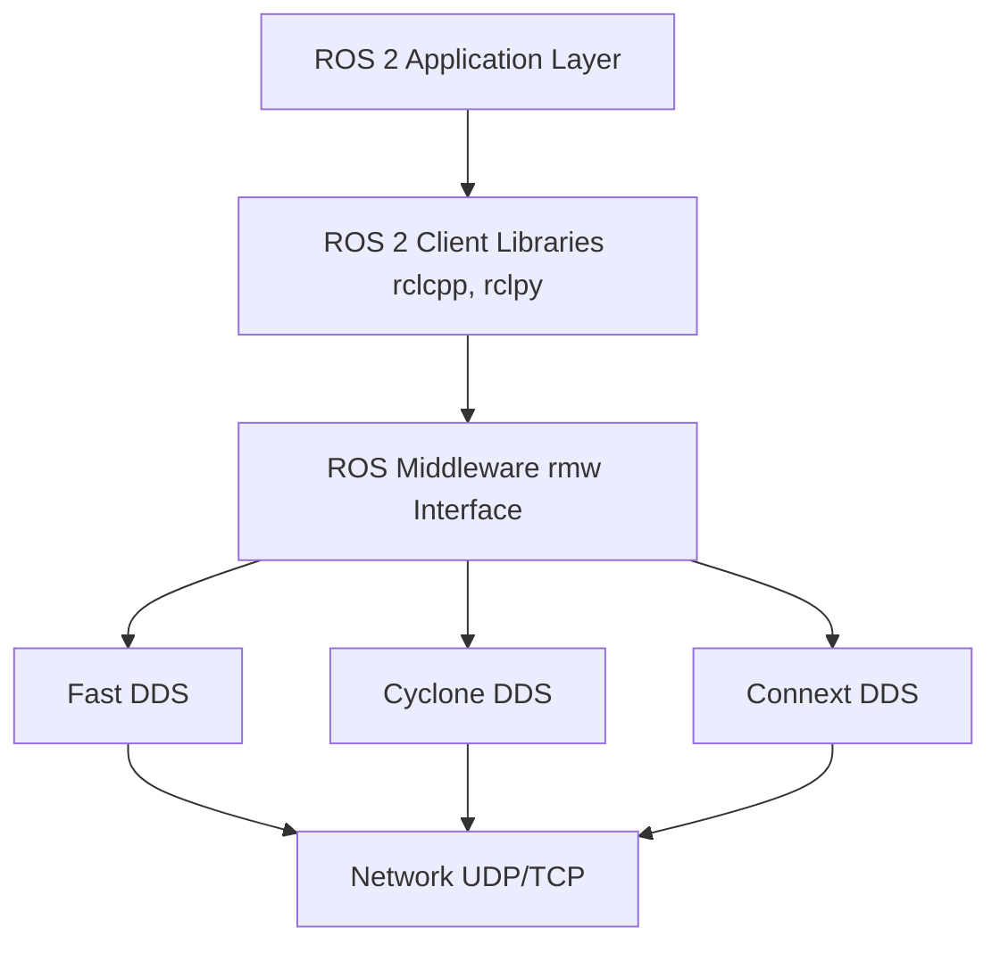



## Introduction to ROS 2

**ROS 2 (Robot Operating System 2)** is a complete rewrite of ROS 1, designed from the ground up to address the limitations of its predecessor and meet the demands of modern robotics applications. It provides a robust, real-time capable middleware for building complex robot systems.

### Why ROS 2?

ROS 1 was revolutionary, but it had limitations:
- ❌ No real-time support
- ❌ Single point of failure (roscore)
- ❌ Limited security features
- ❌ Poor support for multi-robot systems
- ❌ Not suitable for production environments

ROS 2 addresses all these issues:
- ✅ Real-time capable
- ✅ Fully distributed (no master node)
- ✅ Built-in security (DDS-Security)
- ✅ Multi-robot and multi-platform support
- ✅ Production-ready

## The DDS Foundation

### What is DDS?

**DDS (Data Distribution Service)** is the communication middleware that powers ROS 2. It's an open standard designed for real-time, scalable, and reliable data exchange in distributed systems.



### Key DDS Features

**1. Publish-Subscribe Model**
- Data-centric communication
- Decoupled publishers and subscribers
- Automatic discovery

**2. Quality of Service (QoS)**
- Fine-grained control over reliability
- Deadline and liveliness policies
- History and durability settings

**3. Discovery System**
- Automatic peer discovery
- No central broker required
- Dynamic network topology

## ROS 2 Distributions

### Current Distributions (2024-2025)

| Distribution | Release Date | EOL Date | Status | Recommended For |
|--------------|--------------|----------|--------|-----------------|
| **Humble Hawksbill** | May 2022 | May 2027 | LTS | Production systems |
| **Iron Irwini** | May 2023 | Nov 2024 | EOL Soon | - |
| **Jazzy Jalisco** | May 2024 | May 2029 | LTS | New projects |
| **Kilted Kaiju** | May 2025 | Nov 2026 | Future | - |

:::tip Recommendation
For this course, we recommend **ROS 2 Humble** (LTS) for stability, or **Jazzy** for the latest features.
:::

## Core Concepts

### 1. The Computational Graph

ROS 2 creates a network of processes (nodes) that communicate with each other:


**Key Elements:**
- **Nodes**: Independent processes
- **Topics**: Named buses for data streams
- **Services**: Request-response communication
- **Actions**: Long-running tasks with feedback
- **Parameters**: Configuration values

### 2. Nodes

A **node** is a participant in the ROS 2 graph that uses a client library to communicate with other nodes.

**Characteristics:**
- Performs a single, well-defined task
- Can publish, subscribe, provide services, or call actions
- Can run in the same process or different machines
- Discovered automatically via DDS

**Example Node Responsibilities:**
- `camera_driver`: Publishes camera images
- `object_detector`: Subscribes to images, publishes detections
- `motion_planner`: Plans robot movements
- `motor_controller`: Controls actuators

### 3. Topics

**Topics** are named buses for continuous data streams using a publish-subscribe pattern.

**Characteristics:**
- **Many-to-many**: Multiple publishers and subscribers
- **Asynchronous**: No blocking
- **Typed**: Each topic has a specific message type
- **QoS-controlled**: Reliability and performance tuning

**Common Use Cases:**
- Sensor data streams (camera, LiDAR, IMU)
- Robot state information (joint positions, velocities)
- Command streams (velocity commands, trajectories)

### 4. Services

**Services** provide synchronous request-response communication.

**Characteristics:**
- **One-to-one**: Single client, single server
- **Synchronous**: Client waits for response
- **Typed**: Request and response have specific types
- **Fast**: For quick operations only

**Common Use Cases:**
- Querying robot state
- Triggering specific actions
- Configuration changes
- Quick calculations

### 5. Actions

**Actions** are for long-running tasks that need feedback and can be preempted.

**Characteristics:**
- **Goal-Feedback-Result**: Three-part communication
- **Cancellable**: Can be preempted
- **Asynchronous**: Non-blocking
- **Stateful**: Track execution progress

**Common Use Cases:**
- Navigation to a goal
- Grasping an object
- Following a trajectory
- Multi-step operations

### 6. Parameters

**Parameters** are configuration values that can be set at runtime.

**Characteristics:**
- **Node-specific**: Each node has its own parameters
- **Dynamic**: Can be changed while running
- **Typed**: Integer, float, string, boolean, arrays
- **Persistent**: Can be saved to files

**Common Use Cases:**
- Tuning controller gains
- Setting sensor configurations
- Adjusting algorithm parameters
- Debug flags

## Client Libraries

### rclcpp (C++)

The C++ client library for ROS 2:
- High performance
- Zero-copy message passing
- Template-based
- Full feature support

### rclpy (Python)

The Python client library for ROS 2:
- Rapid prototyping
- Easy to learn
- Good for AI/ML integration
- Slightly lower performance than C++

**For this course, we'll focus on rclpy** because:
- Python is widely used in AI/ML
- Easier to learn and prototype
- Sufficient performance for most applications
- Better integration with AI frameworks

## ROS 2 Workspace Structure

### Standard Workspace Layout

```
ros2_ws/
├── src/                    # Source code
│   ├── package1/
│   │   ├── package1/      # Python package
│   │   ├── setup.py
│   │   ├── setup.cfg
│   │   └── package.xml
│   └── package2/
├── build/                  # Build artifacts
├── install/                # Installed packages
└── log/                    # Build and runtime logs
```

### Build System: colcon

ROS 2 uses **colcon** (collective construction) as its build tool:

```bash
# Build all packages
colcon build

# Build specific package
colcon build --packages-select my_package

# Build with symlink install (for Python)
colcon build --symlink-install

# Clean build
rm -rf build install log
colcon build
```

## Communication Patterns

### 1. Publisher-Subscriber (Topics)

**Use when:**
- Continuous data streams
- Multiple consumers
- Fire-and-forget semantics
- Sensor data, state information

**Example:**
```
Camera → /image_raw → Vision Node
                   → Display Node
                   → Recording Node
```

### 2. Request-Response (Services)

**Use when:**
- One-off queries
- Quick operations (< 1 second)
- Synchronous response needed
- State queries, configuration

**Example:**
```
Client → [Request: Get Robot State] → Server
Client ← [Response: Joint Positions] ← Server
```

### 3. Goal-Feedback-Result (Actions)

**Use when:**
- Long-running operations
- Need progress feedback
- Cancellation required
- Navigation, manipulation

**Example:**
```
Client → [Goal: Navigate to (x,y)] → Server
Client ← [Feedback: 50% complete] ← Server
Client ← [Feedback: 75% complete] ← Server
Client ← [Result: Success!] ← Server
```

## Quality of Service (QoS)

### QoS Policies

QoS policies control the behavior of communication:

| Policy | Options | Use Case |
|--------|---------|----------|
| **Reliability** | Reliable, Best Effort | Critical data vs. sensor streams |
| **Durability** | Transient Local, Volatile | Late-joining subscribers |
| **History** | Keep Last N, Keep All | Buffer management |
| **Deadline** | Duration | Real-time requirements |
| **Liveliness** | Automatic, Manual | Connection monitoring |

### Common QoS Profiles

**1. Sensor Data**
```python
from rclpy.qos import QoSProfile, ReliabilityPolicy, HistoryPolicy

sensor_qos = QoSProfile(
    reliability=ReliabilityPolicy.BEST_EFFORT,
    history=HistoryPolicy.KEEP_LAST,
    depth=10
)
```

**2. Services (Default)**
```python
service_qos = QoSProfile(
    reliability=ReliabilityPolicy.RELIABLE,
    history=HistoryPolicy.KEEP_LAST,
    depth=10
)
```

**3. System State**
```python
state_qos = QoSProfile(
    reliability=ReliabilityPolicy.RELIABLE,
    durability=DurabilityPolicy.TRANSIENT_LOCAL,
    history=HistoryPolicy.KEEP_LAST,
    depth=1
)
```

## ROS 2 Command-Line Tools

### Essential Commands

```bash
# List all nodes
ros2 node list

# Get node info
ros2 node info /my_node

# List all topics
ros2 topic list

# Echo topic data
ros2 topic echo /my_topic

# Get topic info
ros2 topic info /my_topic

# Publish to topic
ros2 topic pub /my_topic std_msgs/msg/String "data: 'Hello'"

# List services
ros2 service list

# Call a service
ros2 service call /my_service std_srvs/srv/Trigger

# List parameters
ros2 param list

# Get parameter value
ros2 param get /my_node my_param

# Set parameter value
ros2 param set /my_node my_param 42

# Run a node
ros2 run package_name node_name

# Launch a launch file
ros2 launch package_name launch_file.py
```

## Learning Objectives

By the end of this chapter, you should be able to:

- [ ] Explain the key differences between ROS 1 and ROS 2
- [ ] Describe the role of DDS in ROS 2 architecture
- [ ] Identify the core concepts: nodes, topics, services, actions, parameters
- [ ] Understand when to use topics vs. services vs. actions
- [ ] Explain Quality of Service (QoS) policies
- [ ] Use basic ROS 2 command-line tools

## Key Takeaways

:::tip Remember
1. **ROS 2 is built on DDS** - a real-time, distributed middleware
2. **Nodes are independent processes** that communicate via topics, services, and actions
3. **Topics** = continuous data streams (pub-sub)
4. **Services** = quick request-response
5. **Actions** = long-running tasks with feedback
6. **QoS policies** control communication behavior
7. **No roscore** - fully distributed architecture
:::

## Hands-On Exercise

### Exercise: Exploring the ROS 2 Graph

1. **Install ROS 2** (if not already installed)
2. **Run the turtlesim demo:**

```bash
# Terminal 1: Start turtlesim
ros2 run turtlesim turtlesim_node

# Terminal 2: Start teleop
ros2 run turtlesim turtle_teleop_key

# Terminal 3: Explore the graph
ros2 node list
ros2 topic list
ros2 topic echo /turtle1/pose
ros2 topic info /turtle1/cmd_vel
```

3. **Visualize the graph:**
```bash
# Install rqt_graph
sudo apt install ros-humble-rqt-graph

# Run it
rqt_graph
```

**Questions to explore:**
- How many nodes are running?
- What topics connect them?
- What message types are used?
- What happens when you change QoS settings?

## Next Steps

In the next chapter, we'll dive deep into **Nodes, Topics, and Services**, learning how to create our own ROS 2 nodes and implement communication patterns.

---

## Further Reading

- [ROS 2 Documentation](https://docs.ros.org/en/humble/)
- [DDS Foundation](https://www.dds-foundation.org/)
- [ROS 2 Design](https://design.ros2.org/)
- [Fast DDS Documentation](https://fast-dds.docs.eprosima.com/)

## Discussion Questions

1. Why did ROS 2 choose DDS instead of creating a custom middleware?
2. In what scenarios would you choose services over topics?
3. How does the distributed nature of ROS 2 benefit multi-robot systems?
4. What are the trade-offs between reliable and best-effort QoS?
