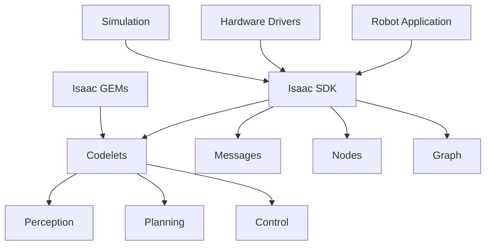


# Chapter 1: NVIDIA Isaac SDK and Isaac Sim

## Overview

NVIDIA Isaac is a comprehensive platform for developing, testing, and deploying AI-powered robots. This chapter introduces Isaac SDK for robot software development and Isaac Sim for photorealistic simulation, both leveraging NVIDIA's GPU acceleration and AI capabilities.

:::info Learning Time
**Estimated Reading Time**: 60-70 minutes
**Hands-on Activities**: 60 minutes
**Total Chapter Time**: 2-2.5 hours
:::

---

## 1.1 The NVIDIA Isaac Platform

### What is Isaac?

**NVIDIA Isaac** is an end-to-end platform for intelligent robots:
- **Isaac SDK**: Software development kit for robot applications
- **Isaac Sim**: Photorealistic robot simulator built on Omniverse
- **Isaac GEMs**: Pre-built AI models and algorithms
- **Isaac ROS**: ROS 2 packages with GPU acceleration

### Why NVIDIA Isaac?

**Traditional Approach:**
```
CPU-based processing → Slow perception → Limited AI → Simple behaviors
```

**Isaac Approach:**
```
GPU-accelerated → Real-time AI → Advanced perception → Intelligent behaviors
```

**Key Advantages:**
- ⚡ **GPU Acceleration**: 10-100x faster than CPU
- 🤖 **AI-First**: Built for deep learning and computer vision
- 📸 **Photorealistic Sim**: Isaac Sim with ray tracing
- 🔄 **Sim-to-Real**: Seamless transfer to physical robots
- 🎯 **Pre-trained Models**: Ready-to-use AI components

---

## 1.2 Isaac SDK Architecture

### Core Components



**Key Concepts:**

| Component | Description |
|-----------|-------------|
| **Codelets** | Modular computation units (like ROS nodes) |
| **Messages** | Data structures for communication |
| **Nodes** | Containers for codelets |
| **Graph** | Application structure (nodes + connections) |
| **GEMs** | Pre-built algorithms (SLAM, object detection, etc.) |

### Isaac SDK vs. ROS 2

| Feature | Isaac SDK | ROS 2 |
|---------|-----------|-------|
| **Performance** | GPU-optimized | CPU-focused |
| **AI Integration** | Native deep learning | Requires integration |
| **Simulation** | Isaac Sim (photorealistic) | Gazebo (functional) |
| **Learning Curve** | Steeper | Moderate |
| **Ecosystem** | NVIDIA-centric | Broad community |
| **Best For** | AI-heavy robots | General robotics |

:::tip Recommendation
Use **Isaac SDK** for perception-heavy, AI-driven robots. Use **ROS 2** for traditional robotics workflows. They can work together via Isaac ROS!
:::

---

## 1.3 Isaac Sim Overview

### What is Isaac Sim?

**Isaac Sim** is a robotics simulator built on NVIDIA Omniverse:
- Photorealistic rendering with ray tracing
- Accurate physics simulation (PhysX)
- Synthetic data generation for AI training
- Multi-robot simulation
- ROS/ROS 2 integration

### Isaac Sim vs. Gazebo

| Feature | Isaac Sim | Gazebo |
|---------|-----------|--------|
| **Graphics** | Photorealistic (RTX) | Functional |
| **Physics** | PhysX (GPU) | ODE/Bullet (CPU) |
| **Performance** | Excellent (GPU) | Moderate (CPU) |
| **AI Training** | Native support | Limited |
| **Synthetic Data** | High-quality | Basic |
| **Price** | Free (NVIDIA GPU required) | Free |

### System Requirements

**Minimum:**
- NVIDIA RTX GPU (2060 or better)
- 16GB RAM
- Ubuntu 20.04/22.04 or Windows 10/11
- 50GB storage

**Recommended:**
- NVIDIA RTX 3080 or better
- 32GB+ RAM
- NVMe SSD
- Multi-core CPU

---

## 1.4 Installing Isaac Sim

### Installation Steps

**1. Install Omniverse Launcher:**
```bash
# Download from: https://www.nvidia.com/en-us/omniverse/download/
# Install the launcher
chmod +x omniverse-launcher-linux.AppImage
./omniverse-launcher-linux.AppImage
```

**2. Install Isaac Sim via Launcher:**
1. Open Omniverse Launcher
2. Go to "Exchange" tab
3. Find "Isaac Sim"
4. Click "Install"
5. Wait for download (~20GB)

**3. Verify Installation:**
```bash
# Launch Isaac Sim
~/.local/share/ov/pkg/isaac_sim-*/isaac-sim.sh
```

### First Launch

**Isaac Sim Interface:**
```
┌─────────────────────────────────────────────────┐
│  Menu Bar (File, Edit, Window, Isaac Sim)      │
├──────────┬──────────────────────────┬───────────┤
│          │                          │           │
│  Stage   │      Viewport            │ Property  │
│  (Tree)  │   (3D View)              │ (Details) │
│          │                          │           │
│          │                          │           │
├──────────┴──────────────────────────┴───────────┤
│              Content Browser                    │
│           Console (Logs)                        │
└─────────────────────────────────────────────────┘
```

---

## 1.5 Creating Your First Isaac Sim Scene

### Basic Scene Setup

**1. Create New Stage:**
```
File → New
```

**2. Add Ground Plane:**
```
Create → Physics → Ground Plane
```

**3. Add Lighting:**
```
Create → Light → Dome Light
- Intensity: 1000
- Texture: (optional HDRI)
```

**4. Add a Robot:**
```
Isaac Sim → Robots → Franka
```

**5. Run Simulation:**
```
Press Play button (or Space)
```

### Example: Simple Robot Scene

**Python API:**
```python
from omni.isaac.kit import SimulationApp

# Launch Isaac Sim
simulation_app = SimulationApp({"headless": False})

from omni.isaac.core import World
from omni.isaac.core.robots import Robot
from omni.isaac.core.utils.stage import add_reference_to_stage
import numpy as np

# Create world
world = World()

# Add ground
world.scene.add_default_ground_plane()

# Add robot
robot_prim_path = "/World/Franka"
add_reference_to_stage(
    usd_path="omniverse://localhost/NVIDIA/Assets/Isaac/2023.1.0/Isaac/Robots/Franka/franka.usd",
    prim_path=robot_prim_path
)

robot = Robot(prim_path=robot_prim_path)
world.scene.add(robot)

# Reset world
world.reset()

# Simulation loop
for i in range(1000):
    world.step(render=True)

    # Get robot state
    position, orientation = robot.get_world_pose()
    print(f"Robot position: {position}")

# Cleanup
simulation_app.close()
```

---

## 1.6 Isaac Sim with ROS 2

### ROS 2 Bridge

**Enable ROS 2:**
```
Window → Extensions
Search: "ROS2"
Enable: omni.isaac.ros2_bridge
```

**Configure ROS 2:**
```python
from omni.isaac.core import SimulationApp
simulation_app = SimulationApp({"headless": False})

from omni.isaac.core import World
from omni.isaac.core.utils.extensions import enable_extension

# Enable ROS 2 bridge
enable_extension("omni.isaac.ros2_bridge")

# Create world
world = World()
world.scene.add_default_ground_plane()

# Add robot with ROS 2 interface
# (Robot will automatically publish joint states, TF, etc.)

world.reset()

# Simulation loop
while simulation_app.is_running():
    world.step(render=True)

simulation_app.close()
```

**Published Topics:**
- `/joint_states` - Robot joint positions/velocities
- `/tf` - Transform tree
- `/camera/image_raw` - Camera images
- `/scan` - LiDAR data

**Subscribed Topics:**
- `/cmd_vel` - Velocity commands
- `/joint_command` - Joint position commands

---

## 1.7 Synthetic Data Generation

### Why Synthetic Data?

**Real-world data collection:**
- ⏱️ Time-consuming
- 💰 Expensive
- 🏷️ Manual labeling required
- 📊 Limited scenarios

**Synthetic data:**
- ⚡ Instant generation
- 💻 Automatic labeling
- 🎲 Infinite variations
- 🎯 Perfect ground truth

### Generating Labeled Images

**Example: Object Detection Dataset:**
```python
import omni.replicator.core as rep

# Create randomized scene
def randomize_scene():
    # Random objects
    objects = rep.create.from_usd(
        usd="omniverse://localhost/NVIDIA/Assets/Isaac/Props/YCB/Axis_Aligned/*.usd",
        count=10
    )

    # Random positions
    with objects:
        rep.modify.pose(
            position=rep.distribution.uniform((-0.5, -0.5, 0), (0.5, 0.5, 0.5)),
            rotation=rep.distribution.uniform((0, 0, 0), (360, 360, 360))
        )

    # Random lighting
    light = rep.create.light(
        light_type="Dome",
        intensity=rep.distribution.uniform(500, 1500)
    )

    return objects

# Setup camera
camera = rep.create.camera(position=(1, 1, 1), look_at=(0, 0, 0))

# Render settings
render_product = rep.create.render_product(camera, (512, 512))

# Attach writers (save data)
writer = rep.WriterRegistry.get("BasicWriter")
writer.initialize(
    output_dir="_output",
    rgb=True,
    bounding_box_2d_tight=True,
    semantic_segmentation=True
)
writer.attach([render_product])

# Generate data
with rep.trigger.on_frame(num_frames=1000):
    randomize_scene()

# Run
rep.orchestrator.run()
```

**Output:**
- RGB images
- Bounding boxes (JSON)
- Semantic segmentation masks
- Depth maps
- Instance segmentation

---

## 1.8 Isaac GEMs (Pre-built Algorithms)

### Available GEMs

**Perception:**
- Object detection (DOPE, CenterPose)
- Pose estimation
- Semantic segmentation
- Visual SLAM

**Navigation:**
- Path planning (RRT, A*)
- Obstacle avoidance
- Localization
- Mapping

**Manipulation:**
- Grasp planning
- Motion planning (Lula)
- Inverse kinematics
- Trajectory optimization

### Example: Using DOPE for Object Detection

**DOPE (Deep Object Pose Estimation):**
```python
from omni.isaac.dope import DOPE

# Initialize DOPE
dope = DOPE(
    model_path="/path/to/dope/model",
    object_name="soup_can"
)

# Process image
rgb_image = get_camera_image()
detections = dope.infer(rgb_image)

# Get pose
for detection in detections:
    position = detection['location']
    orientation = detection['quaternion']
    confidence = detection['score']

    print(f"Object at {position} with confidence {confidence}")
```

---

## 1.9 Isaac ROS (GPU-Accelerated ROS 2)

### What is Isaac ROS?

**Isaac ROS** provides GPU-accelerated ROS 2 packages:
- 10-100x faster than CPU
- Drop-in replacements for standard ROS packages
- Optimized for NVIDIA GPUs

### Available Packages

**Perception:**
- `isaac_ros_image_proc` - Image processing
- `isaac_ros_dnn_inference` - Deep learning inference
- `isaac_ros_object_detection` - Object detection
- `isaac_ros_pose_estimation` - 6D pose estimation

**SLAM:**
- `isaac_ros_visual_slam` - Visual odometry and SLAM

**Navigation:**
- `isaac_ros_nvblox` - 3D reconstruction and mapping

### Installation

```bash
# Install Isaac ROS
cd ~/ros2_ws/src
git clone https://github.com/NVIDIA-ISAAC-ROS/isaac_ros_common.git

# Install dependencies
cd isaac_ros_common
./scripts/run_dev.sh

# Build
cd ~/ros2_ws
colcon build --packages-select isaac_ros_image_proc

# Source
source install/setup.bash
```

### Example: GPU-Accelerated Image Processing

**CPU version (slow):**
```bash
ros2 run image_proc resize --ros-args \
  -r image:=/camera/image_raw \
  -r image/resize:=/camera/image_resized
```

**GPU version (fast):**
```bash
ros2 run isaac_ros_image_proc resize_node --ros-args \
  -r image:=/camera/image_raw \
  -r image/resize:=/camera/image_resized
```

**Performance:**
- CPU: ~30 FPS
- GPU (Isaac ROS): ~300 FPS

---

## 1.10 Learning Objectives

By completing this chapter, you should be able to:

### Knowledge Objectives
- [ ] **Explain** the NVIDIA Isaac platform components
- [ ] **Describe** Isaac Sim's advantages over Gazebo
- [ ] **List** Isaac GEMs and their purposes

### Comprehension Objectives
- [ ] **Understand** when to use Isaac vs. ROS 2
- [ ] **Compare** Isaac Sim and Gazebo capabilities
- [ ] **Explain** synthetic data generation benefits

### Application Objectives
- [ ] **Install** and configure Isaac Sim
- [ ] **Create** basic robot simulations
- [ ] **Generate** synthetic training data
- [ ] **Use** Isaac ROS packages

---

## 1.11 Key Takeaways

:::tip Essential Concepts
1. **Isaac Platform** = Isaac SDK + Isaac Sim + Isaac GEMs + Isaac ROS

2. **GPU acceleration** provides 10-100x speedup for AI tasks

3. **Isaac Sim** offers photorealistic simulation with ray tracing

4. **Synthetic data** generation accelerates AI model training

5. **Isaac ROS** provides GPU-accelerated ROS 2 packages

6. **Isaac GEMs** are pre-built, production-ready algorithms
:::

:::warning System Requirements
- NVIDIA RTX GPU required (2060 minimum, 3080+ recommended)
- 16GB+ RAM (32GB recommended)
- Ubuntu 20.04/22.04 or Windows 10/11
- Significant storage space (~50GB+)
:::

---

## 1.12 Hands-On Exercise

### Exercise: Build Your First Isaac Sim Scene

**Goal**: Create a simulated robot environment with ROS 2 integration

**Steps**:
1. Install Isaac Sim via Omniverse Launcher
2. Create a new scene with ground plane and lighting
3. Add a Franka robot
4. Enable ROS 2 bridge
5. Publish joint commands from ROS 2
6. Visualize in RViz

**Bonus**: Add a camera to the robot and publish images to ROS 2!

---

## Next Steps

In the next chapter, we'll explore **AI-Powered Perception and Manipulation** using Isaac Sim's deep learning capabilities!

---

## Further Reading

- [NVIDIA Isaac Documentation](https://docs.nvidia.com/isaac/index.html)
- [Isaac Sim Documentation](https://docs.omniverse.nvidia.com/isaacsim/latest/index.html)
- [Isaac ROS](https://nvidia-isaac-ros.github.io/)
- [Omniverse Replicator](https://docs.omniverse.nvidia.com/prod_extensions/prod_extensions/ext_replicator.html)

---

**Chapter 1 Complete! ✅**

You now understand the NVIDIA Isaac platform and can create photorealistic robot simulations!
