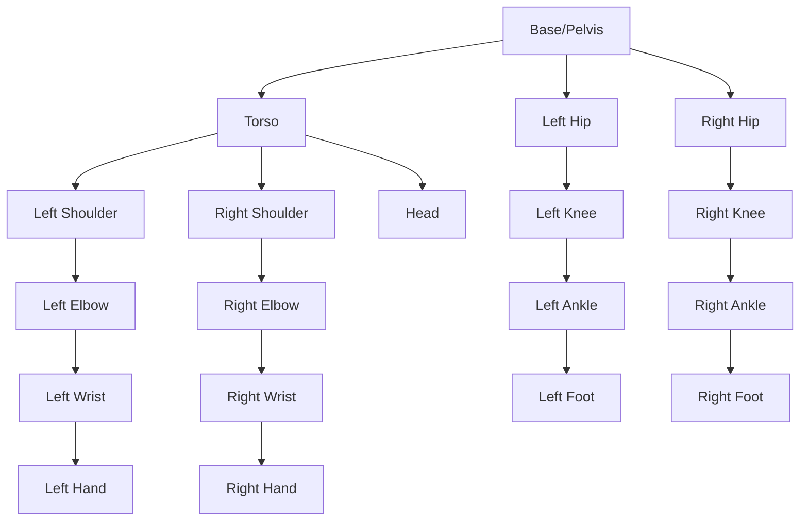



# Chapter 1: Humanoid Robot Kinematics and Dynamics

## Overview

Understanding humanoid robot kinematics and dynamics is essential for controlling complex multi-degree-of-freedom systems. This chapter covers forward/inverse kinematics, Jacobians, dynamics equations, and practical implementation for humanoid robots.

:::info Learning Time
**Estimated Reading Time**: 70-80 minutes
**Hands-on Activities**: 60 minutes
**Total Chapter Time**: 2-2.5 hours
:::

---

## 1.1 Humanoid Robot Structure

### Typical DOF Configuration

**Full Humanoid (~30-50 DOF):**
```
Head: 2-3 DOF (pan, tilt, roll)
Arms: 7 DOF each × 2 = 14 DOF
  - Shoulder: 3 DOF
  - Elbow: 1 DOF
  - Wrist: 3 DOF
Hands: 6-12 DOF each × 2 = 12-24 DOF
Torso: 3 DOF (roll, pitch, yaw)
Legs: 6 DOF each × 2 = 12 DOF
  - Hip: 3 DOF
  - Knee: 1 DOF
  - Ankle: 2 DOF

Total: ~30-50 DOF
```

**Kinematic Chain:**


---

## 1.2 Forward Kinematics

### Denavit-Hartenberg (DH) Parameters

**DH Convention** describes each joint with 4 parameters:
- **a**: Link length
- **α**: Link twist
- **d**: Link offset
- **θ**: Joint angle

**Transformation Matrix:**
```
T_i = Rot(z, θ_i) * Trans(z, d_i) * Trans(x, a_i) * Rot(x, α_i)

     [cos(θ) -sin(θ)cos(α)  sin(θ)sin(α) a*cos(θ)]
T_i = [sin(θ)  cos(θ)cos(α) -cos(θ)sin(α) a*sin(θ)]
     [  0       sin(α)        cos(α)         d    ]
     [  0         0             0            1    ]
```

### Example: 7-DOF Arm Forward Kinematics

**Python Implementation:**
```python
import numpy as np

def dh_transform(a, alpha, d, theta):
    """
    Compute DH transformation matrix
    """
    ct = np.cos(theta)
    st = np.sin(theta)
    ca = np.cos(alpha)
    sa = np.sin(alpha)

    T = np.array([
        [ct, -st*ca,  st*sa, a*ct],
        [st,  ct*ca, -ct*sa, a*st],
        [0,   sa,     ca,    d   ],
        [0,   0,      0,     1   ]
    ])
    return T

class HumanoidArm:
    def __init__(self):
        # DH parameters for 7-DOF arm
        # [a, alpha, d, theta_offset]
        self.dh_params = [
            [0,      np.pi/2,  0.333, 0],      # Joint 1
            [0,     -np.pi/2,  0,     0],      # Joint 2
            [0,      np.pi/2,  0.316, 0],      # Joint 3
            [0.0825, np.pi/2,  0,     0],      # Joint 4
            [-0.0825,-np.pi/2, 0.384, 0],      # Joint 5
            [0,      np.pi/2,  0,     0],      # Joint 6
            [0.088,  0,        0.107, 0]       # Joint 7
        ]

    def forward_kinematics(self, joint_angles):
        """
        Compute end-effector pose from joint angles

        Args:
            joint_angles: array of 7 joint angles (radians)

        Returns:
            4x4 transformation matrix (end-effector pose)
        """
        T = np.eye(4)

        for i, (a, alpha, d, theta_offset) in enumerate(self.dh_params):
            theta = joint_angles[i] + theta_offset
            T_i = dh_transform(a, alpha, d, theta)
            T = T @ T_i

        return T

    def get_position(self, joint_angles):
        """Get end-effector position"""
        T = self.forward_kinematics(joint_angles)
        return T[:3, 3]

    def get_orientation(self, joint_angles):
        """Get end-effector orientation (rotation matrix)"""
        T = self.forward_kinematics(joint_angles)
        return T[:3, :3]

# Usage
arm = HumanoidArm()
joint_angles = np.array([0, -np.pi/4, 0, -np.pi/2, 0, np.pi/4, 0])

# Get end-effector pose
T_ee = arm.forward_kinematics(joint_angles)
position = arm.get_position(joint_angles)
orientation = arm.get_orientation(joint_angles)

print(f"End-effector position: {position}")
print(f"End-effector orientation:\n{orientation}")
```

---

## 1.3 Inverse Kinematics

### The IK Problem

**Given**: Desired end-effector pose (position + orientation)
**Find**: Joint angles that achieve that pose

**Challenges:**
- Multiple solutions (redundancy)
- No closed-form solution for complex robots
- Joint limits and singularities

### Numerical IK: Jacobian-Based

**Jacobian Matrix** relates joint velocities to end-effector velocity:
```
ẋ = J(q) * q̇

where:
  ẋ = end-effector velocity (6D: linear + angular)
  q̇ = joint velocities
  J = Jacobian matrix (6 × n)
```

**Inverse Jacobian Method:**
```
q̇ = J^(-1) * ẋ
```

**Python Implementation:**
```python
import numpy as np
from scipy.optimize import minimize

class InverseKinematics:
    def __init__(self, arm):
        self.arm = arm

    def compute_jacobian(self, joint_angles, delta=1e-6):
        """
        Numerical Jacobian computation

        Returns:
            6×7 Jacobian matrix
        """
        n_joints = len(joint_angles)
        J = np.zeros((6, n_joints))

        # Current pose
        T_current = self.arm.forward_kinematics(joint_angles)
        pos_current = T_current[:3, 3]

        # Numerical differentiation
        for i in range(n_joints):
            # Perturb joint i
            q_perturbed = joint_angles.copy()
            q_perturbed[i] += delta

            # Compute perturbed pose
            T_perturbed = self.arm.forward_kinematics(q_perturbed)
            pos_perturbed = T_perturbed[:3, 3]

            # Linear velocity Jacobian
            J[:3, i] = (pos_perturbed - pos_current) / delta

            # Angular velocity Jacobian (simplified)
            # For full implementation, use rotation matrix difference
            J[3:, i] = 0  # Placeholder

        return J

    def solve_ik_jacobian(self, target_position, initial_guess=None,
                          max_iterations=100, tolerance=1e-3):
        """
        Solve IK using Jacobian pseudoinverse
        """
        if initial_guess is None:
            q = np.zeros(7)
        else:
            q = initial_guess.copy()

        for iteration in range(max_iterations):
            # Current position
            current_pos = self.arm.get_position(q)

            # Error
            error = target_position - current_pos

            # Check convergence
            if np.linalg.norm(error) < tolerance:
                print(f"Converged in {iteration} iterations")
                return q, True

            # Compute Jacobian
            J = self.compute_jacobian(q)
            J_pos = J[:3, :]  # Position part only

            # Pseudoinverse
            J_pinv = np.linalg.pinv(J_pos)

            # Update joint angles
            delta_q = J_pinv @ error
            q += delta_q * 0.1  # Step size

            # Apply joint limits (example: ±π)
            q = np.clip(q, -np.pi, np.pi)

        print(f"Did not converge after {max_iterations} iterations")
        return q, False

    def solve_ik_optimization(self, target_position, target_orientation=None):
        """
        Solve IK using numerical optimization
        """
        def objective(q):
            # Position error
            current_pos = self.arm.get_position(q)
            pos_error = np.linalg.norm(target_position - current_pos)

            # Orientation error (if provided)
            if target_orientation is not None:
                current_ori = self.arm.get_orientation(q)
                ori_error = np.linalg.norm(target_orientation - current_ori)
                return pos_error + ori_error

            return pos_error

        # Initial guess
        q0 = np.zeros(7)

        # Bounds (joint limits)
        bounds = [(-np.pi, np.pi)] * 7

        # Optimize
        result = minimize(objective, q0, bounds=bounds, method='SLSQP')

        return result.x, result.success

# Usage
ik = InverseKinematics(arm)

# Target position
target_pos = np.array([0.5, 0.2, 0.4])

# Solve IK
joint_solution, success = ik.solve_ik_jacobian(target_pos)

if success:
    print(f"IK Solution: {joint_solution}")
    # Verify
    achieved_pos = arm.get_position(joint_solution)
    print(f"Achieved position: {achieved_pos}")
    print(f"Error: {np.linalg.norm(target_pos - achieved_pos):.6f} m")
```

---

## 1.4 Dynamics: Equations of Motion

### Lagrangian Dynamics

**Lagrangian:**
```
L = T - V

where:
  T = kinetic energy
  V = potential energy
```

**Euler-Lagrange Equation:**
```
d/dt(∂L/∂q̇) - ∂L/∂q = τ

Expands to:
M(q)q̈ + C(q,q̇)q̇ + G(q) = τ

where:
  M(q) = inertia matrix
  C(q,q̇) = Coriolis/centrifugal terms
  G(q) = gravity terms
  τ = joint torques
```

### Recursive Newton-Euler Algorithm

**More efficient for computing dynamics:**

```python
import numpy as np

class HumanoidDynamics:
    def __init__(self, robot_model):
        self.robot = robot_model
        self.n_joints = len(robot_model.links)

    def forward_dynamics(self, q, q_dot, tau):
        """
        Compute joint accelerations from torques

        Args:
            q: joint positions
            q_dot: joint velocities
            tau: joint torques

        Returns:
            q_ddot: joint accelerations
        """
        # Compute M, C, G
        M = self.compute_inertia_matrix(q)
        C = self.compute_coriolis_matrix(q, q_dot)
        G = self.compute_gravity_vector(q)

        # Solve: M*q_ddot = tau - C*q_dot - G
        q_ddot = np.linalg.solve(M, tau - C @ q_dot - G)

        return q_ddot

    def inverse_dynamics(self, q, q_dot, q_ddot):
        """
        Compute required torques for desired motion

        Args:
            q: joint positions
            q_dot: joint velocities
            q_ddot: desired joint accelerations

        Returns:
            tau: required joint torques
        """
        M = self.compute_inertia_matrix(q)
        C = self.compute_coriolis_matrix(q, q_dot)
        G = self.compute_gravity_vector(q)

        # τ = M*q_ddot + C*q_dot + G
        tau = M @ q_ddot + C @ q_dot + G

        return tau

    def compute_inertia_matrix(self, q):
        """
        Compute joint-space inertia matrix M(q)
        Uses composite rigid body algorithm
        """
        # Simplified implementation
        # In practice, use libraries like pinocchio or rbdl
        M = np.eye(self.n_joints) * 10.0  # Placeholder
        return M

    def compute_coriolis_matrix(self, q, q_dot):
        """
        Compute Coriolis/centrifugal matrix C(q, q_dot)
        """
        # Simplified
        C = np.zeros((self.n_joints, self.n_joints))
        return C

    def compute_gravity_vector(self, q):
        """
        Compute gravity compensation vector G(q)
        """
        # Simplified
        G = np.zeros(self.n_joints)
        return G

# Usage with physics library (PyBullet example)
import pybullet as p
import pybullet_data

# Initialize PyBullet
p.connect(p.GUI)
p.setAdditionalSearchPath(pybullet_data.getDataPath())
p.setGravity(0, 0, -9.81)

# Load humanoid
robot_id = p.loadURDF("humanoid/humanoid.urdf")

# Get dynamics
q = [0] * p.getNumJoints(robot_id)
q_dot = [0] * p.getNumJoints(robot_id)
q_ddot = [0] * p.getNumJoints(robot_id)

# Compute inverse dynamics (gravity compensation)
tau = p.calculateInverseDynamics(robot_id, q, q_dot, q_ddot)

print(f"Gravity compensation torques: {tau}")
```

---

## 1.5 Whole-Body Control

### Task-Space Control

**Control end-effector in Cartesian space:**

```python
class WholeBodyController:
    def __init__(self, robot):
        self.robot = robot

    def compute_joint_torques(self, q, q_dot,
                             desired_ee_pos, desired_ee_vel,
                             Kp=100, Kd=20):
        """
        Operational space control

        Args:
            q: current joint positions
            q_dot: current joint velocities
            desired_ee_pos: desired end-effector position
            desired_ee_vel: desired end-effector velocity
            Kp, Kd: PD gains

        Returns:
            tau: joint torques
        """
        # Current end-effector state
        current_ee_pos = self.robot.get_position(q)

        # Jacobian
        J = self.robot.compute_jacobian(q)
        J_pos = J[:3, :]

        # End-effector velocity
        current_ee_vel = J_pos @ q_dot

        # Desired end-effector acceleration (PD control)
        pos_error = desired_ee_pos - current_ee_pos
        vel_error = desired_ee_vel - current_ee_vel
        desired_ee_acc = Kp * pos_error + Kd * vel_error

        # Operational space inertia
        M = self.robot.compute_inertia_matrix(q)
        Lambda = np.linalg.inv(J_pos @ np.linalg.inv(M) @ J_pos.T)

        # Task-space force
        F = Lambda @ desired_ee_acc

        # Joint torques
        tau = J_pos.T @ F

        # Add gravity compensation
        G = self.robot.compute_gravity_vector(q)
        tau += G

        return tau
```

---

## 1.6 Center of Mass (CoM) Computation

### Essential for Balance

**CoM Position:**
```
r_com = (Σ m_i * r_i) / M_total

where:
  m_i = mass of link i
  r_i = position of link i
  M_total = total mass
```

**Python Implementation:**
```python
def compute_com(robot, joint_angles):
    """
    Compute center of mass position
    """
    total_mass = 0
    com_position = np.zeros(3)

    for link in robot.links:
        # Get link pose
        T_link = robot.get_link_transform(link.id, joint_angles)
        link_pos = T_link[:3, 3]

        # Accumulate
        com_position += link.mass * link_pos
        total_mass += link.mass

    com_position /= total_mass
    return com_position

# CoM Jacobian (for velocity)
def compute_com_jacobian(robot, joint_angles):
    """
    Jacobian relating joint velocities to CoM velocity
    """
    J_com = np.zeros((3, robot.n_joints))
    total_mass = sum(link.mass for link in robot.links)

    for link in robot.links:
        # Link Jacobian
        J_link = robot.compute_link_jacobian(link.id, joint_angles)

        # Weighted by mass
        J_com += (link.mass / total_mass) * J_link[:3, :]

    return J_com
```

---

## 1.7 Learning Objectives

By completing this chapter, you should be able to:

### Knowledge Objectives
- [ ] **Explain** DH parameters and forward kinematics
- [ ] **Describe** inverse kinematics methods
- [ ] **List** components of robot dynamics equations

### Application Objectives
- [ ] **Compute** forward kinematics for humanoid arms
- [ ] **Solve** inverse kinematics numerically
- [ ] **Calculate** joint torques for desired motions
- [ ] **Implement** whole-body controllers

---

## 1.8 Key Takeaways

:::tip Essential Concepts
1. **Forward kinematics** maps joint angles → end-effector pose

2. **Inverse kinematics** is often solved numerically (Jacobian or optimization)

3. **Dynamics** equation: M(q)q̈ + C(q,q̇)q̇ + G(q) = τ

4. **Jacobian** relates joint velocities to end-effector velocities

5. **Whole-body control** coordinates multiple tasks simultaneously

6. **Center of mass** is critical for humanoid balance
:::

---

## Next Steps

In the next chapter, we'll explore **Bipedal Locomotion and Balance Control** - making humanoids walk!

---

## Further Reading

- [Modern Robotics (Lynch & Park)](http://hades.mech.northwestern.edu/index.php/Modern_Robotics)
- [Pinocchio Library](https://stack-of-tasks.github.io/pinocchio/)
- [Rigid Body Dynamics Library (RBDL)](https://rbdl.github.io/)

---

**Chapter 1 Complete! ✅**
