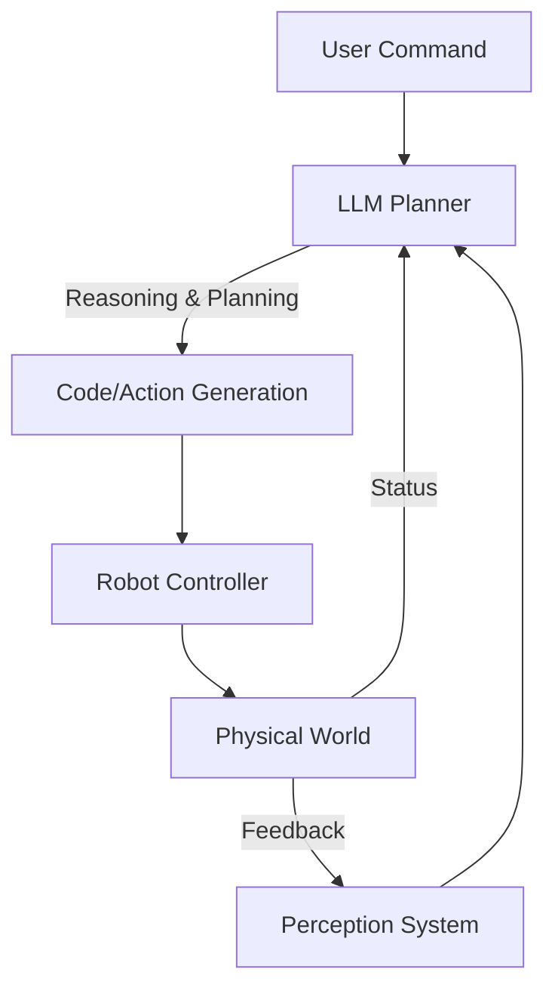

---
sidebar_position: 1
title: "Chapter 1: Integrating GPT Models for Conversational AI"
description: "Empowering robots with Large Language Models for natural conversation and reasoning"
---

# Chapter 1: Integrating GPT Models for Conversational AI

## Overview

Large Language Models (LLMs) like GPT-4 have revolutionized robotics by enabling natural language reasoning, zero-shot task planning, and common sense understanding. This chapter covers how to integrate LLMs into robot control loops, prompt engineering for robotics, and creating "embodied" agents.

:::info Learning Time
**Estimated Reading Time**: 50-60 minutes
**Hands-on Activities**: 45 minutes
**Total Chapter Time**: 1.5-2 hours
:::

---

## 1.1 The Role of LLMs in Robotics

### From Chatbots to Embodied Agents

**Traditional Chatbots:**
- Text-in, text-out
- No physical context
- No ability to act

**Embodied LLM Agents:**
- **Perception**: "See" the world (via vision-language models)
- **Reasoning**: Plan actions based on physical constraints
- **Action**: Output executable code or commands
- **Feedback**: Adjust plans based on success/failure

### Architecture of an LLM-Powered Robot



---

## 1.2 Prompt Engineering for Robots

### Structure of a Robotic Prompt

To make an LLM control a robot effectively, the prompt must include:
1.  **Role Definition**: "You are a robot assistant..."
2.  **API Documentation**: Available functions (`move_to(x,y)`, `pick(obj)`)
3.  **State Description**: "You are at (0,0), holding nothing."
4.  **Task**: "Bring me the apple."
5.  **Output Format**: "Return a Python list of commands."

**Example Prompt:**
```text
You are a home assistant robot. You have the following API:
- navigate_to(location_name): Moves to a location.
- pick_up(object_name): Picks up an object if found.
- place_on(surface_name): Places held object on surface.

Current State:
- You are in the Kitchen.
- You are holding: Nothing.
- Visible objects: [Apple, Cup, Table, Fridge]

User Request: "Put the apple in the fridge."

Think step-by-step, then output executable Python code.
```

**LLM Output:**
```python
# Plan:
# 1. Pick up the apple (it is visible).
# 2. Navigate to the fridge.
# 3. Place the apple in the fridge.

pick_up("Apple")
navigate_to("Fridge")
place_on("Fridge")
```

---

## 1.3 Integrating OpenAI API with ROS 2

### Basic Integration Pattern

**Python Node:**
```python
import rclpy
from rclpy.node import Node
from std_msgs.msg import String
import openai
import json

class LLMController(Node):
    def __init__(self):
        super().__init__('llm_controller')
        self.subscription = self.create_subscription(
            String, 'user_command', self.handle_command, 10)

        openai.api_key = "YOUR_OPENAI_API_KEY"

        # Robot API definition for the LLM
        self.system_prompt = """
        You are a robot controller. Output JSON commands.
        Available actions:
        - {"action": "move", "target": "location"}
        - {"action": "say", "text": "message"}
        """

    def handle_command(self, msg):
        user_text = msg.data
        self.get_logger().info(f"Received: {user_text}")

        response = openai.ChatCompletion.create(
            model="gpt-4",
            messages=[
                {"role": "system", "content": self.system_prompt},
                {"role": "user", "content": user_text}
            ]
        )

        content = response.choices[0].message.content
        self.execute_plan(content)

    def execute_plan(self, json_plan):
        try:
            plan = json.loads(json_plan)
            # Dispatch to actual robot controllers
            if plan['action'] == 'move':
                self.get_logger().info(f"Moving to {plan['target']}")
                # Call navigation action server...
            elif plan['action'] == 'say':
                self.get_logger().info(f"Saying: {plan['text']}")
                # Call TTS service...
        except Exception as e:
            self.get_logger().error(f"Execution failed: {e}")

def main():
    rclpy.init()
    node = LLMController()
    rclpy.spin(node)
    node.destroy_node()
    rclpy.shutdown()
```

---

## 1.4 Code Generation as Action

### Code-as-Policies

Instead of outputting JSON, LLMs can write full Python scripts that use the robot's high-level libraries. This allows for loops, conditionals, and math.

**Example: "Draw a circle"**
*User*: "Draw a circle with radius 10cm."
*LLM (Code Generation)*:
```python
import numpy as np

def draw_circle():
    center_x, center_y = 0.5, 0.0
    radius = 0.1
    for theta in np.linspace(0, 2*np.pi, 50):
        x = center_x + radius * np.cos(theta)
        y = center_y + radius * np.sin(theta)
        robot.move_to(x, y, z=0.0)

draw_circle()
```

**Safety Sandbox:**
Always execute generated code in a restricted environment (sandbox) to prevent malicious operations (e.g., file system access).

---

## 1.5 Handling Context and Memory

### Vector Databases for Long-term Memory

Robots need to remember past interactions and map observations.
**RAG (Retrieval-Augmented Generation)** for Robotics:
1.  **Store**: Save object locations ("Keys found on desk") into a vector DB (like Qdrant/Chroma).
2.  **Retrieve**: When user asks "Where are my keys?", query the DB.
3.  **Generate**: LLM answers "I saw them on the desk 5 minutes ago."

**Implementation Concept:**
```python
# When robot sees an object
memory.add(
    text="Red keys detected on the kitchen table",
    metadata={"timestamp": time.now(), "location": "kitchen_table"}
)

# When user asks
query = "Where are my keys?"
context = memory.search(query, limit=1)
# context = ["Red keys detected on the kitchen table..."]

prompt = f"Context: {context}\nUser: {query}\nAnswer:"
# LLM: "I saw your red keys on the kitchen table."
```

---

## 1.6 Challenges and Limitations

### Hallucinations
LLMs may invent non-existent objects or actions.
*   **Solution**: Grounding. Verify objects exist in the perception system before acting.

### Latency
Cloud API calls can take seconds.
*   **Solution**: Use smaller, local models (e.g., Llama 3, Mistral) for simple tasks, or run async planning while the robot is idle.

### Safety
"Throw the knife" -> LLM might comply.
*   **Solution**: Safety layer. A rule-based system or a separate "Safety LLM" that reviews plans before execution.

---

## 1.7 Learning Objectives

By completing this chapter, you should be able to:

### Knowledge Objectives
- [ ] **Explain** how LLMs can function as high-level robot planners.
- [ ] **Describe** the "Code-as-Policies" approach.
- [ ] **Understand** the importance of grounding and safety layers.

### Application Objectives
- [ ] **Create** a system prompt that defines a robot's API.
- [ ] **Build** a ROS 2 node that queries OpenAI/GPT-4 for actions.
- [ ] **Implement** a basic memory retrieval system for object locations.

---

## 1.8 Key Takeaways

:::tip Essential Concepts
1.  **LLMs are Planners**: They excel at breaking high-level goals into sequential steps.
2.  **Context is King**: Provide the robot's state and API clearly in the prompt.
3.  **Feedback Loops**: The robot must report success/failure back to the LLM to allow replanning.
4.  **Grounding**: Always verify LLM outputs against physical reality (perception).
:::

---

## Next Steps

In the next chapter, we'll explore **Speech Recognition and Natural Language Understanding** to give our robot a voice!
