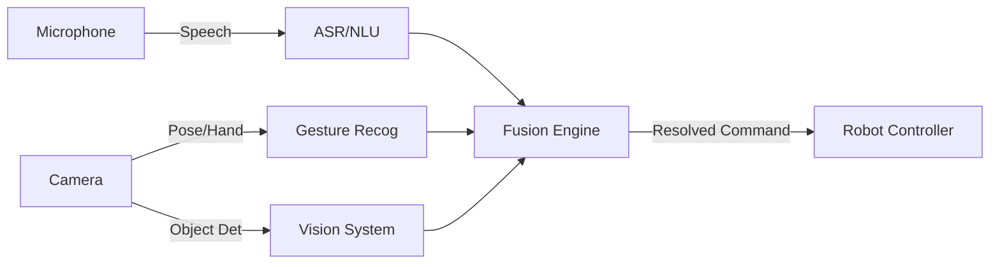



# Chapter 3: Multi-modal Interaction: Speech, Gesture, Vision

## Overview

Humans don't just talk; we point, look, and gesture while speaking. "Put *that* there" is meaningless without vision and gesture recognition. This chapter covers how to fuse speech, vision, and gesture data to create seamless human-robot interaction.

:::info Learning Time
**Estimated Reading Time**: 50-60 minutes
**Hands-on Activities**: 50 minutes
**Total Chapter Time**: 1.5-2 hours
:::

---

## 3.1 The Deictic Challenge

### "Put THAT there"

**Deixis** refers to words/expressions whose meaning depends on context (e.g., "this", "that", "here", "there").

To resolve "Put that there":
1.  **Speech**: Triggers the intent `MoveObject`.
2.  **Gesture (Pointing)**: Defines the target object ("that") and the destination ("there").
3.  **Vision**: Identifies the object at the pointed location.

---

## 3.2 Sensor Fusion for Interaction

### Time Synchronization

Inputs arrive at different times.
- **Speech**: "Look at this" (Duration: 1s)
- **Gesture**: Pointing starts at 0.5s, ends at 1.5s.

**Fusion Strategy:**
We need a **temporal window**. When a deictic word ("this") is detected in speech, look for gestures occurring within ±0.5 seconds of that timestamp.

### Architecture



---

## 3.3 Visual Grounding with Vision-Language Models (VLMs)

### CLIP and GPT-4V

Modern VLMs can directly understand images and text together.

**Scenario**: User holds up a screwdriver and asks "What is this?"
1.  **Capture Image**: Robot camera takes a frame.
2.  **Capture Audio**: "What is this?"
3.  **VLM Query**: Send image + text to GPT-4V or LLaVA.
4.  **Response**: "That is a Phillips head screwdriver."

**Zero-Shot Object Finding:**
User: "Pick up the red toy."
*   **VLM**: Scans the image for "red toy", returns bounding box.
*   **Robot**: Converts 2D bbox to 3D coordinates and picks it up.

---

## 3.4 Implementing Pointing Recognition

### Geometric Approach

1.  **Skeleton Tracking**: Use MediaPipe or OpenPose to get 3D landmarks of the human (Shoulder, Elbow, Wrist, Index Finger Tip).
2.  **Vector Calculation**: Create a vector from **Eye -> FingerTip** or **Elbow -> FingerTip**.
3.  **Ray Casting**: Cast a ray from the finger tip in the direction of the vector into the 3D world (point cloud).
4.  **Intersection**: Find which object the ray intersects.

```python
import numpy as np

def get_pointing_target(shoulder, wrist, finger_tip, objects):
    # Define pointing vector (e.g., Wrist to Tip)
    direction = finger_tip - wrist
    direction = direction / np.linalg.norm(direction)

    best_obj = None
    min_dist = float('inf')

    for obj in objects:
        # Calculate distance from object center to the ray
        # (Geometric distance from point to line)
        obj_vec = obj.position - finger_tip
        proj = np.dot(obj_vec, direction)
        if proj > 0: # Object is in front
            dist_sq = np.dot(obj_vec, obj_vec) - proj*proj
            if dist_sq < 0.1 and proj < min_dist: # Threshold 10cm radius
                min_dist = proj
                best_obj = obj

    return best_obj
```

---

## 3.5 Active Listening and Gaze

### "I'm listening"

Interaction isn't just input; it's also output. The robot should show it is attending.

**Behaviors:**
- **Face Tracking**: The robot's head should track the user's face.
- **Nodding**: When the user pauses speaking, the robot can nod to encourage continuation.
- **Gaze Aversion**: Constant staring is creepy. The robot should occasionally glance away (simulating thinking) and look back.

---

## 3.6 Case Study: A Receptionist Robot

**Scenario**: A guest arrives.
1.  **Vision**: Detects a person approaching.
2.  **Action**: Robot turns head, smiles (screen/LEDs), waves.
3.  **Speech**: "Hi, welcome! Who are you looking for?"
4.  **User**: "I'm here to see Alice."
5.  **Speech**: "Alice is in office 302."
6.  **Gesture**: Robot points arm towards the elevator.
7.  **Speech**: "It's that way."

This requires tight coordination of **Body Language** (pointing) and **Speech** ("that way").

---

## 3.7 Learning Objectives

By completing this chapter, you should be able to:

### Knowledge Objectives
- [ ] **Explain** the concept of Deixis and why it requires multi-modal fusion.
- [ ] **Describe** how Vision-Language Models (VLMs) simplify grounding.
- [ ] **Understand** the geometry of pointing recognition.

### Application Objectives
- [ ] **Implement** a "look at me" behavior (face tracking).
- [ ] **Build** a system that resolves "Pick up this" using a VLM or pointing ray-cast.
- [ ] **Design** a synchronized speech-and-gesture output (e.g., pointing while speaking).

---

## 3.8 Key Takeaways

:::tip Essential Concepts
1.  **Context Resolves Ambiguity**: Speech alone is often insufficient ("this", "that").
2.  **Temporal Fusion**: Inputs must be correlated in time.
3.  **VLMs are Powerful**: Models like GPT-4V bridge the gap between pixels and language effortlessly.
4.  **Social Cues**: Gaze and active listening make the robot feel "alive" and responsive.
:::

---

## Module 4 Complete! 🎉

**Congratulations!** You've completed Weeks 11-13: Humanoid Robot Development & Conversational AI.

**You've learned**:
- ✅ Humanoid kinematics, dynamics, and locomotion.
- ✅ Manipulation and natural HRI.
- ✅ Integrating LLMs for reasoning and planning.
- ✅ Speech pipelines and multi-modal fusion.

**Next**: You are ready to build the next generation of intelligent, social robots!
