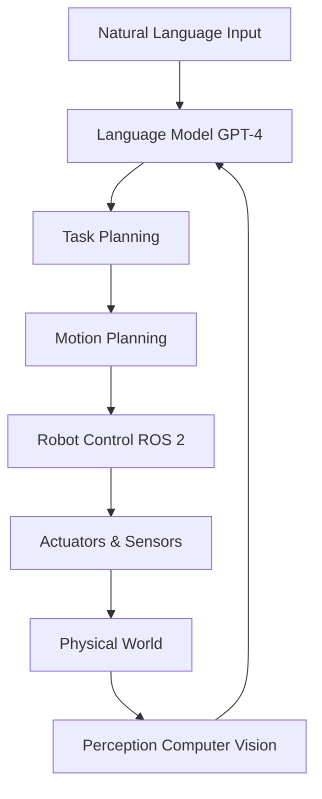

# Introduction to Physical AI

## What is Physical AI?

**Physical AI** represents a fundamental shift in artificial intelligence—from systems that exist purely in digital space to AI that understands and operates in the physical world.

Traditional AI excels at:
- Processing text and images
- Making predictions from data
- Playing games with defined rules

Physical AI goes further by:
- **Understanding physics**: Gravity, friction, momentum, collisions
- **Perceiving 3D space**: Depth, distance, spatial relationships
- **Manipulating objects**: Grasping, moving, assembling
- **Navigating environments**: Path planning, obstacle avoidance, balance

## From Digital to Embodied Intelligence

### The Digital Brain
Modern AI models like GPT-4 possess remarkable intelligence:
- Natural language understanding
- Reasoning and problem-solving
- Knowledge synthesis

But they lack a **body**—they cannot:
- Pick up a cup of coffee
- Navigate through a room
- Understand that dropping a glass will break it

### The Physical Body
Robots have existed for decades, but traditionally they:
- Follow pre-programmed routines
- Operate in structured environments (factories)
- Lack adaptability and learning

### The Convergence: Physical AI
**Physical AI = Digital Intelligence + Physical Embodiment**

This combination enables robots to:
1. **Learn from experience** in the physical world
2. **Adapt to new situations** using AI reasoning
3. **Understand natural language** commands
4. **Interact naturally** with humans

## Why Humanoid Robots?

### The Human-Centered World

Our world is designed for humans:
- Doorknobs at human height
- Stairs sized for human legs
- Tools shaped for human hands
- Spaces sized for human bodies

A humanoid robot can navigate this world without requiring infrastructure changes.

### Rich Training Data

Humans generate massive amounts of data:
- Videos of people performing tasks
- Motion capture data
- Demonstrations and tutorials
- Natural language instructions

This data can train humanoid robots to perform human-like tasks.

### Natural Interaction

Humans instinctively understand humanoid forms:
- We can predict their movements
- We know where to look for "eyes"
- We understand their reach and capabilities
- Communication feels more natural

## The Physical AI Stack

Building a Physical AI system requires multiple layers:

### Layer 1: Perception
**Sensors → Understanding**
- Cameras (RGB, Depth)
- LiDAR (3D mapping)
- IMU (balance and orientation)
- Force/torque sensors (touch)

### Layer 2: Cognition
**Understanding → Planning**
- Computer vision (object detection, segmentation)
- SLAM (Simultaneous Localization and Mapping)
- Language models (command interpretation)
- Task planning (breaking down goals)

### Layer 3: Action
**Planning → Movement**
- Path planning (navigation)
- Motion planning (arm movements)
- Inverse kinematics (joint control)
- Balance control (bipedal walking)

### Layer 4: Learning
**Experience → Improvement**
- Reinforcement learning (trial and error)
- Imitation learning (learning from demonstrations)
- Sim-to-real transfer (training in simulation)

## Real-World Applications

### Manufacturing & Logistics
- Assembly line work
- Warehouse picking and packing
- Quality inspection
- Inventory management

### Healthcare
- Patient assistance and mobility
- Surgical assistance
- Elderly care and companionship
- Hospital logistics

### Service Industry
- Restaurant service
- Hotel concierge
- Retail assistance
- Cleaning and maintenance

### Hazardous Environments
- Disaster response
- Nuclear facility inspection
- Space exploration
- Deep-sea operations

## The Challenge Ahead

Physical AI is harder than digital AI because:

1. **Physics is unforgiving**: A wrong calculation means a fall or collision
2. **Real-time requirements**: Robots can't pause to think for minutes
3. **Hardware constraints**: Limited compute, battery, payload
4. **Safety critical**: Robots interact with humans and valuable objects
5. **Sim-to-real gap**: Simulation doesn't perfectly match reality

## Course Roadmap

This course will teach you to build Physical AI systems:

**Weeks 1-2**: Foundations (this module)
- Physical AI principles
- Sensor systems
- Humanoid robot landscape

**Weeks 3-5**: ROS 2 - The Nervous System
- Robot software architecture
- Communication between components
- Building robot applications

**Weeks 6-7**: Simulation - The Digital Twin
- Physics simulation in Gazebo
- Visualization in Unity
- Sensor simulation

**Weeks 8-10**: NVIDIA Isaac - The AI Brain
- Advanced perception
- Reinforcement learning
- Sim-to-real transfer

**Weeks 11-13**: VLA - Language Meets Action
- Humanoid locomotion
- GPT integration
- Voice-controlled robots
- **Capstone Project**

## Learning Objectives

By the end of this chapter, you should be able to:

- [ ] Define Physical AI and explain how it differs from traditional AI
- [ ] Explain the concept of embodied intelligence
- [ ] Describe why humanoid robots are well-suited for human environments
- [ ] Identify the key components of the Physical AI stack
- [ ] List real-world applications of Physical AI
- [ ] Understand the unique challenges of Physical AI vs. digital AI

## Key Takeaways

:::tip Remember
1. **Physical AI** = AI that understands and operates in the physical world
2. **Humanoid robots** excel in human-centered environments
3. The **Physical AI stack** includes perception, cognition, action, and learning
4. **Real-world constraints** make Physical AI more challenging than digital AI
5. This course teaches you to build **complete Physical AI systems**
:::

## Next Steps

In the next chapter, we'll dive deeper into **Embodied Intelligence** and explore how robots develop an understanding of their own bodies and the world around them.

---

## Further Reading

- [NVIDIA Isaac Platform Overview](https://developer.nvidia.com/isaac)
- [ROS 2 Documentation](https://docs.ros.org/en/humble/)
- [Physical AI Research Papers](https://arxiv.org/list/cs.RO/recent)

## Discussion Questions

1. What advantages do humanoid robots have over wheeled robots in home environments?
2. How might Physical AI change the service industry in the next 10 years?
3. What ethical considerations should we keep in mind when deploying humanoid robots?
4. Why is the "sim-to-real gap" a significant challenge in Physical AI?
