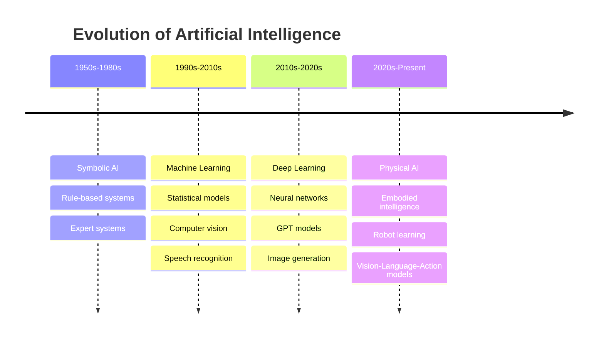
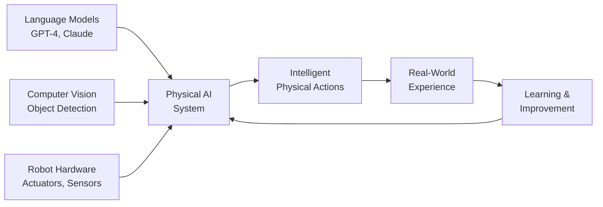
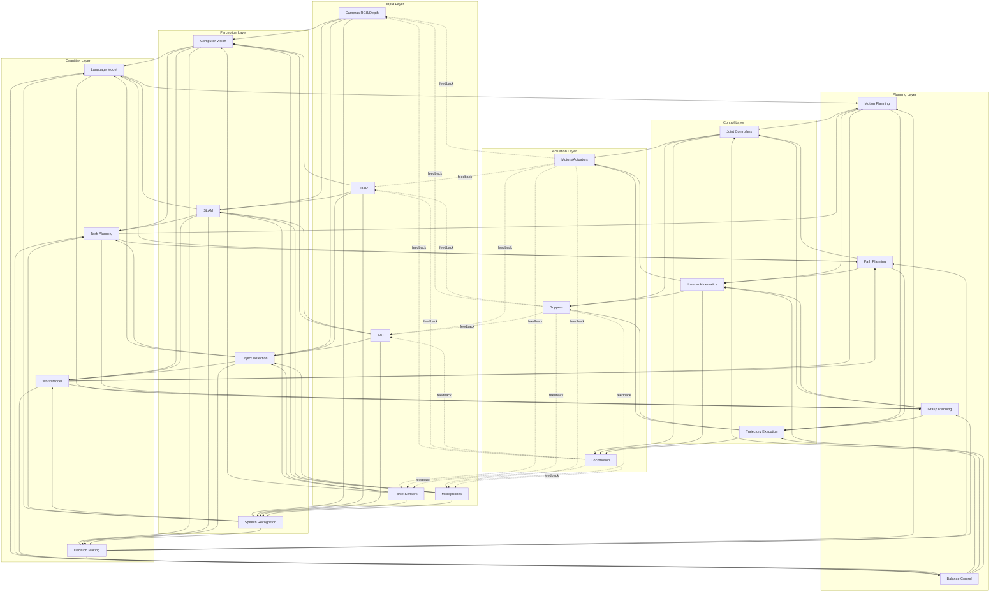

# Chapter 1: Introduction to Physical AI

## Overview

Welcome to the exciting world of **Physical AI**—where artificial intelligence meets the physical world through robotics. This chapter introduces you to the fundamental concepts, challenges, and opportunities in building intelligent systems that can perceive, reason about, and interact with the real world.

:::info Learning Time
**Estimated Reading Time**: 45-60 minutes
**Hands-on Activities**: 30 minutes
**Total Chapter Time**: 1.5-2 hours
:::

---

## 1.1 What is Physical AI?

**Physical AI** represents a paradigm shift in artificial intelligence—moving from systems that exist purely in digital space to AI that understands, navigates, and operates in the three-dimensional physical world.

### The Evolution of AI



### Traditional AI vs. Physical AI

| Aspect | Traditional AI | Physical AI |
|--------|---------------|-------------|
| **Environment** | Digital (text, images, data) | Physical (3D world, objects, spaces) |
| **Input** | Structured data, pixels | Sensors (cameras, LiDAR, IMU, force) |
| **Output** | Predictions, text, images | Physical actions, movements |
| **Constraints** | Computational limits | Physics, real-time, safety, hardware |
| **Feedback** | Labels, rewards | Physical consequences |
| **Examples** | ChatGPT, DALL-E, AlphaGo | Humanoid robots, autonomous vehicles |

### What Physical AI Can Do

Physical AI systems excel at tasks that require understanding and manipulating the physical world:

1. **Spatial Understanding**
   - Perceiving depth and 3D structure
   - Understanding spatial relationships
   - Navigating complex environments
   - Mapping unknown spaces

2. **Physical Manipulation**
   - Grasping objects of various shapes
   - Assembling components
   - Using tools
   - Performing delicate operations

3. **Dynamic Interaction**
   - Maintaining balance while moving
   - Reacting to unexpected forces
   - Coordinating multiple limbs
   - Adapting to changing conditions

4. **Embodied Reasoning**
   - Understanding physics (gravity, friction, momentum)
   - Predicting physical outcomes
   - Planning feasible actions
   - Learning from physical experience

### Real-World Example: Picking Up a Cup

Let's examine what's involved when a robot picks up a cup—a task humans do effortlessly:

```python
# Simplified pseudocode for robot cup grasping
class CupGraspingTask:
    def __init__(self, robot, perception_system):
        self.robot = robot
        self.perception = perception_system

    def execute(self):
        # 1. PERCEPTION: Locate the cup
        cup_pose = self.perception.detect_object("cup")

        # 2. REASONING: Plan the grasp
        grasp_pose = self.plan_grasp(cup_pose)

        # 3. MOTION PLANNING: Calculate trajectory
        trajectory = self.robot.plan_path(
            current_pose=self.robot.get_end_effector_pose(),
            target_pose=grasp_pose,
            avoid_collisions=True
        )

        # 4. EXECUTION: Move and grasp
        self.robot.execute_trajectory(trajectory)
        self.robot.close_gripper(force=5.0)  # Gentle grip

        # 5. VERIFICATION: Check success
        if self.robot.gripper_has_object():
            return "Success"
        else:
            return "Failed - retry with different grasp"

    def plan_grasp(self, cup_pose):
        # Consider cup orientation, handle position, etc.
        # This is where AI/ML models help
        return optimal_grasp_pose
```

This simple task requires:
- **Computer vision** to detect the cup
- **Spatial reasoning** to plan the grasp
- **Motion planning** to avoid obstacles
- **Force control** to grip without crushing
- **Feedback loops** to verify success

---

## 1.2 From Digital to Embodied Intelligence

### The Digital Brain

Modern large language models like GPT-4 demonstrate remarkable capabilities:

- **Natural Language Understanding**: Comprehending complex questions and context
- **Reasoning**: Solving problems through logical steps
- **Knowledge Synthesis**: Combining information from diverse sources
- **Code Generation**: Writing functional programs
- **Creative Tasks**: Writing stories, poems, and essays

**But they lack embodiment.** They cannot:
- Experience the physical world directly
- Understand that a dropped glass will shatter
- Feel the weight of an object
- Navigate through a cluttered room

### The Physical Body

Traditional industrial robots have existed since the 1960s:

- **Precision**: Repeating tasks with millimeter accuracy
- **Strength**: Lifting heavy payloads
- **Speed**: Operating faster than humans
- **Endurance**: Working 24/7 without fatigue

**But they lack intelligence.** They cannot:
- Adapt to new situations
- Learn from experience
- Understand natural language commands
- Handle unexpected objects or scenarios

### The Convergence: Physical AI

**Physical AI = Digital Intelligence + Physical Embodiment + Learning**



This convergence enables robots to:

1. **Understand Natural Language**
   ```python
   # Example: Natural language robot control
   command = "Please bring me the red cup from the kitchen table"

   # AI parses the command
   task = {
       "action": "fetch",
       "object": "cup",
       "properties": {"color": "red"},
       "location": "kitchen table",
       "destination": "user"
   }

   # Robot executes the task
   robot.execute_task(task)
   ```

2. **Learn from Demonstrations**
   - Watch humans perform tasks
   - Extract key patterns and strategies
   - Generalize to new situations

3. **Adapt to Novel Situations**
   - Recognize when a learned approach isn't working
   - Try alternative strategies
   - Update internal models based on outcomes

4. **Reason About Physics**
   - Predict what will happen if an action is taken
   - Understand object properties (fragile, heavy, slippery)
   - Plan actions that respect physical constraints

---

## 1.3 Why Humanoid Robots?

### The Human-Centered World Argument

Our entire civilization is designed around the human form:

| Environment Feature | Human Design | Humanoid Advantage |
|-------------------|--------------|-------------------|
| **Doorknobs** | At 1m height, twist mechanism | Can reach and operate |
| **Stairs** | 18cm rise, 28cm tread | Bipedal locomotion works |
| **Tools** | Shaped for 5-finger hands | Can use existing tools |
| **Furniture** | Chair/table heights for sitting | Can sit and work at desks |
| **Vehicles** | Pedals, steering wheels, seats | Can drive cars |
| **Spaces** | Corridors, doorways sized for humans | Fits through standard doors |

**Alternative robot forms** (wheeled, quadruped, specialized) would require:
- Redesigning infrastructure
- Custom tools and interfaces
- Accessibility modifications
- Higher deployment costs

### The Training Data Advantage

Humans generate enormous amounts of relevant data:

1. **Video Demonstrations**
   - YouTube has millions of "how-to" videos
   - Every human action is a potential training example
   - Diverse tasks: cooking, cleaning, assembly, sports

2. **Motion Capture Data**
   - Film industry generates high-quality human motion data
   - Sports science provides biomechanics data
   - VR/AR systems capture natural human movements

3. **Natural Language Instructions**
   - Recipes, manuals, tutorials written for humans
   - Voice commands and descriptions
   - Step-by-step guides

4. **Imitation Learning Potential**
   ```python
   # Example: Learning from human demonstrations
   class ImitationLearner:
       def __init__(self):
           self.demonstrations = []

       def observe_human(self, video_stream):
           # Extract human pose and actions
           human_poses = self.extract_poses(video_stream)
           object_interactions = self.detect_interactions(video_stream)

           # Store demonstration
           self.demonstrations.append({
               'poses': human_poses,
               'interactions': object_interactions
           })

       def learn_policy(self):
           # Train neural network to map observations to actions
           policy = self.train_behavior_cloning(self.demonstrations)
           return policy
   ```

### Natural Human-Robot Interaction

Humanoid form enables intuitive interaction:

1. **Predictable Behavior**
   - Humans can anticipate robot movements
   - Body language is familiar
   - Reach and capabilities are understood

2. **Social Acceptance**
   - Less intimidating than alien forms
   - Easier to empathize with
   - Better for service roles

3. **Communication**
   - Can use gestures and pointing
   - Eye contact and gaze direction
   - Facial expressions (if equipped)

4. **Collaboration**
   - Can work alongside humans naturally
   - Share tools and workspaces
   - Understand human intentions through body language

---

## 1.4 The Physical AI Stack

Building a complete Physical AI system requires integrating multiple technologies:



### Layer 1: Sensing & Perception

**Purpose**: Convert raw sensor data into meaningful information

**Key Technologies**:
- **RGB Cameras**: Color images for object recognition
- **Depth Cameras**: 3D structure (e.g., Intel RealSense, Azure Kinect)
- **LiDAR**: Precise distance measurements for mapping
- **IMU**: Acceleration and orientation for balance
- **Force/Torque Sensors**: Contact detection and grip force
- **Microphones**: Voice commands and audio localization

**Example: Object Detection Pipeline**
```python
import cv2
import numpy as np

class PerceptionSystem:
    def __init__(self):
        self.object_detector = load_yolo_model()
        self.depth_camera = DepthCamera()

    def detect_objects_3d(self, rgb_image, depth_image):
        # 2D object detection
        detections_2d = self.object_detector.detect(rgb_image)

        # Add 3D position using depth
        objects_3d = []
        for det in detections_2d:
            x, y, w, h = det.bbox
            center_x, center_y = x + w//2, y + h//2

            # Get depth at object center
            depth = depth_image[center_y, center_x]

            # Convert to 3D coordinates
            position_3d = self.depth_camera.pixel_to_3d(
                center_x, center_y, depth
            )

            objects_3d.append({
                'class': det.class_name,
                'confidence': det.confidence,
                'position': position_3d
            })

        return objects_3d
```

### Layer 2: Cognition & Understanding

**Purpose**: Interpret perceptual information and make decisions

**Key Technologies**:
- **Computer Vision**: Object recognition, segmentation, tracking
- **SLAM**: Build maps while localizing the robot
- **Language Models**: Understand commands and context
- **World Models**: Predict future states

**Example: Task Understanding**
```python
class CognitiveSystem:
    def __init__(self):
        self.llm = LanguageModel("gpt-4")
        self.world_model = WorldModel()

    def understand_command(self, natural_language_command):
        # Use LLM to parse command
        prompt = f"""
        Parse this robot command into structured format:
        Command: "{natural_language_command}"

        Output JSON with: action, object, location, constraints
        """

        parsed = self.llm.generate(prompt)
        task = json.loads(parsed)

        # Validate feasibility
        if self.world_model.is_feasible(task):
            return task
        else:
            return {"error": "Task not feasible in current state"}
```

### Layer 3: Planning & Decision Making

**Purpose**: Determine HOW to achieve goals

**Key Technologies**:
- **Motion Planning**: Collision-free trajectories (RRT, PRM)
- **Task Planning**: Breaking goals into steps (PDDL, HTN)
- **Grasp Planning**: Determining optimal grasps
- **Path Planning**: Navigation (A*, Dijkstra, DWA)

**Example: Motion Planning**
```python
from ompl import geometric as og
from ompl import base as ob

class MotionPlanner:
    def __init__(self, robot):
        self.robot = robot
        self.space = ob.RealVectorStateSpace(robot.num_joints)

    def plan_trajectory(self, start_config, goal_config, obstacles):
        # Set up planning problem
        si = ob.SpaceInformation(self.space)
        si.setStateValidityChecker(
            lambda state: self.is_collision_free(state, obstacles)
        )

        # Define start and goal
        start = ob.State(self.space)
        goal = ob.State(self.space)
        start.set_values(start_config)
        goal.set_values(goal_config)

        # Use RRT planner
        planner = og.RRT(si)
        pdef = ob.ProblemDefinition(si)
        pdef.setStartAndGoalStates(start, goal)
        planner.setProblemDefinition(pdef)

        # Solve
        solved = planner.solve(5.0)  # 5 second timeout

        if solved:
            path = pdef.getSolutionPath()
            return self.smooth_path(path)
        else:
            return None
```

### Layer 4: Control & Execution

**Purpose**: Execute planned actions on hardware

**Key Technologies**:
- **PID Controllers**: Position/velocity control
- **Inverse Kinematics**: Joint angles from end-effector pose
- **Balance Controllers**: Maintain stability
- **Compliance Control**: Safe interaction

**Example: Joint Control**
```python
class JointController:
    def __init__(self, kp=10.0, ki=0.1, kd=1.0):
        self.kp = kp  # Proportional gain
        self.ki = ki  # Integral gain
        self.kd = kd  # Derivative gain
        self.integral = 0
        self.prev_error = 0

    def compute_torque(self, desired_angle, current_angle, dt):
        # PID control
        error = desired_angle - current_angle
        self.integral += error * dt
        derivative = (error - self.prev_error) / dt

        torque = (self.kp * error +
                 self.ki * self.integral +
                 self.kd * derivative)

        self.prev_error = error
        return torque
```

### Layer 5: Learning & Adaptation

**Purpose**: Improve performance through experience

**Key Technologies**:
- **Reinforcement Learning**: Learn from rewards (PPO, SAC)
- **Imitation Learning**: Learn from demonstrations
- **Sim-to-Real Transfer**: Train in simulation, deploy on hardware
- **Online Learning**: Continuous improvement

**Example: Reinforcement Learning Setup**
```python
import gym
import numpy as np

class RobotLearner:
    def __init__(self, robot_env):
        self.env = robot_env
        self.policy = NeuralNetworkPolicy()

    def train_reaching_task(self, num_episodes=1000):
        for episode in range(num_episodes):
            state = self.env.reset()
            done = False
            episode_reward = 0

            while not done:
                # Select action using current policy
                action = self.policy.get_action(state)

                # Execute in environment
                next_state, reward, done, info = self.env.step(action)

                # Store experience
                self.policy.store_transition(
                    state, action, reward, next_state, done
                )

                # Update policy
                if len(self.policy.memory) > 1000:
                    self.policy.update()

                state = next_state
                episode_reward += reward

            print(f"Episode {episode}: Reward = {episode_reward}")
```

---

## 1.5 Real-World Applications

Physical AI is transforming multiple industries:

### Manufacturing & Logistics

**Current Applications**:
- **Warehouse Automation**: Amazon's robotic fulfillment centers
- **Assembly Lines**: BMW's collaborative robots
- **Quality Inspection**: Visual defect detection
- **Packaging**: Adaptive grasping of varied products

**Example Company**: **Boston Dynamics' Stretch**
- Autonomous mobile robot for warehouse unloading
- Computer vision to identify boxes
- Adaptive gripper for various package sizes
- Deployed in DHL and other logistics companies

### Healthcare & Elderly Care

**Current Applications**:
- **Surgical Assistance**: da Vinci surgical system
- **Rehabilitation**: Exoskeletons for mobility assistance
- **Patient Care**: Lifting and transferring patients
- **Companionship**: Social robots for elderly

**Example**: **Toyota's Human Support Robot (HSR)**
- Assists elderly and disabled individuals
- Fetches objects, opens curtains, picks up items
- Controlled via tablet or voice commands

### Service Industry

**Current Applications**:
- **Food Service**: Automated cooking and serving
- **Hospitality**: Hotel concierge and room service
- **Retail**: Inventory management and customer assistance
- **Cleaning**: Autonomous floor cleaning and sanitization

**Example**: **Serve Robotics**
- Sidewalk delivery robots
- Navigate urban environments autonomously
- Deliver food and packages
- Operating in Los Angeles and other cities

### Hazardous Environments

**Current Applications**:
- **Disaster Response**: Search and rescue in collapsed buildings
- **Nuclear Inspection**: Fukushima cleanup robots
- **Space Exploration**: Mars rovers and future humanoid astronauts
- **Underwater**: Deep-sea exploration and maintenance

**Example**: **NASA's Valkyrie (R5)**
- Humanoid robot designed for space missions
- Can operate tools designed for astronauts
- Potential for Mars base construction
- Tested for disaster response scenarios

---

## 1.6 The Challenges of Physical AI

Physical AI faces unique challenges that don't exist in purely digital AI:

### 1. Physics is Unforgiving

**Challenge**: Mistakes have real consequences
- A navigation error causes a collision
- Incorrect force breaks an object
- Loss of balance results in a fall
- No "undo" button in the physical world

**Solutions**:
- Extensive simulation testing
- Conservative safety margins
- Emergency stop mechanisms
- Redundant safety systems

### 2. Real-Time Requirements

**Challenge**: Robots can't pause to think

| Task | Required Response Time |
|------|----------------------|
| Balance control | < 10ms |
| Collision avoidance | < 100ms |
| Grasp adjustment | < 50ms |
| Navigation decisions | < 500ms |

**Solutions**:
- Hierarchical control (fast low-level, slower high-level)
- Predictive models
- Optimized algorithms
- Specialized hardware (GPUs, TPUs)

### 3. The Sim-to-Real Gap

**Challenge**: Simulation doesn't perfectly match reality

**Differences**:
- Physics engines are approximations
- Sensor noise not perfectly modeled
- Material properties vary
- Lighting and textures differ

**Solutions**:
- Domain randomization (train on varied simulations)
- Sim-to-real transfer techniques
- Real-world fine-tuning
- Hybrid approaches

```python
# Example: Domain Randomization
class DomainRandomization:
    def randomize_environment(self, sim):
        # Randomize physics
        sim.set_gravity(np.random.uniform(9.7, 9.9))
        sim.set_friction(np.random.uniform(0.3, 0.7))

        # Randomize appearance
        sim.set_lighting(np.random.uniform(0.5, 1.5))
        sim.randomize_textures()

        # Randomize object properties
        sim.set_object_mass(np.random.uniform(0.8, 1.2) * nominal_mass)
```

### 4. Hardware Constraints

**Challenge**: Limited compute, power, and payload

**Constraints**:
- Battery life (typically 1-4 hours)
- Onboard compute (can't run largest models)
- Weight limits (affects mobility)
- Cost constraints

**Solutions**:
- Edge computing
- Model compression and quantization
- Cloud offloading for heavy computation
- Efficient algorithms

### 5. Safety & Reliability

**Challenge**: Robots interact with humans and valuable objects

**Requirements**:
- Detect and avoid humans
- Limit force and speed near people
- Fail-safe behaviors
- Compliance with safety standards

**Example: Safety System**
```python
class SafetyMonitor:
    def __init__(self, robot):
        self.robot = robot
        self.max_force = 50.0  # Newtons
        self.safety_distance = 0.5  # meters

    def check_safety(self, sensor_data):
        # Check for nearby humans
        humans = sensor_data.detect_humans()
        for human in humans:
            distance = self.robot.distance_to(human)
            if distance < self.safety_distance:
                self.robot.reduce_speed(factor=0.3)
                if distance < 0.2:
                    self.robot.emergency_stop()

        # Check force limits
        if self.robot.get_contact_force() > self.max_force:
            self.robot.retract()
```

---

## 1.7 Course Roadmap

This course provides a comprehensive journey through Physical AI:

### Module 1: The Robotic Nervous System (Weeks 1-5)

**Focus**: ROS 2 - The middleware that connects robot components

**You'll Learn**:
- ROS 2 architecture and core concepts
- Creating nodes, topics, and services
- Building robot applications with Python (rclpy)
- URDF for robot description
- Launch files and parameters

**Hands-On Project**: Build a simulated mobile robot with sensors

### Module 2: The Digital Twin (Weeks 6-7)

**Focus**: Gazebo & Unity - Simulating physics and environments

**You'll Learn**:
- Setting up Gazebo simulation
- Physics simulation (gravity, collisions, friction)
- Sensor simulation (cameras, LiDAR, IMU)
- Unity for high-fidelity visualization
- Sim-to-real considerations

**Hands-On Project**: Create a simulated warehouse environment

### Module 3: The AI-Robot Brain (Weeks 8-10)

**Focus**: NVIDIA Isaac - Advanced perception and learning

**You'll Learn**:
- NVIDIA Isaac SDK and Isaac Sim
- Photorealistic simulation
- AI-powered perception
- Reinforcement learning for robot control
- Synthetic data generation

**Hands-On Project**: Train a robot arm to grasp objects using RL

### Module 4: Vision-Language-Action (Weeks 11-13)

**Focus**: VLA Models - Connecting language to physical actions

**You'll Learn**:
- Humanoid kinematics and dynamics
- Bipedal locomotion
- GPT integration for conversational control
- Speech recognition (Whisper)
- Multi-modal interaction

**Capstone Project**: Build an autonomous humanoid assistant

---

## 1.8 Learning Objectives

By completing this chapter, you should be able to:

### Knowledge Objectives
- [ ] **Define** Physical AI and distinguish it from traditional AI
- [ ] **Explain** the concept of embodied intelligence
- [ ] **Describe** the advantages of humanoid robot form factors
- [ ] **List** the key layers of the Physical AI stack
- [ ] **Identify** real-world applications across industries

### Comprehension Objectives
- [ ] **Compare** digital AI and Physical AI challenges
- [ ] **Explain** why the sim-to-real gap exists
- [ ] **Understand** the role of each layer in the Physical AI stack
- [ ] **Describe** how perception, cognition, and action integrate

### Application Objectives
- [ ] **Analyze** a physical task and identify required AI components
- [ ] **Design** a high-level architecture for a simple robot application
- [ ] **Evaluate** which robot form factor suits a given application

---

## 1.9 Key Takeaways

:::tip Essential Concepts
1. **Physical AI** bridges digital intelligence and physical embodiment, enabling robots to understand and interact with the real world

2. **Humanoid robots** are optimized for human-centered environments and can leverage vast amounts of human demonstration data

3. **The Physical AI stack** integrates sensing, perception, cognition, planning, control, and learning into a cohesive system

4. **Real-world constraints** (physics, real-time, safety, hardware) make Physical AI more challenging than digital AI

5. **Multiple technologies** (ROS 2, simulation, NVIDIA Isaac, VLA models) combine to create capable Physical AI systems
:::

:::warning Common Misconceptions
- ❌ "Physical AI is just robotics" → It's the integration of modern AI with robotics
- ❌ "Humanoid robots are always the best choice" → Form factor depends on the application
- ❌ "Simulation is enough for training" → Sim-to-real gap requires real-world validation
- ❌ "Physical AI is solved" → We're still in early stages; many challenges remain
:::

---

## 1.10 Hands-On Activity: Analyzing Physical Tasks

**Objective**: Develop intuition for the complexity of physical tasks

**Activity**: Choose 3 everyday tasks and analyze what a robot would need:

### Example: Making a Cup of Coffee

1. **Perception Needs**:
   - Locate coffee machine, cup, coffee beans
   - Detect water level
   - Read machine interface

2. **Cognition Needs**:
   - Understand coffee-making sequence
   - Adapt to different machine types
   - Handle errors (out of water, beans)

3. **Action Needs**:
   - Grasp and place cup
   - Pour beans (measure amount)
   - Press buttons
   - Pour water

4. **Challenges**:
   - Liquid handling (spills)
   - Precise placement
   - Timing (wait for brewing)
   - Safety (hot surfaces)

**Your Turn**: Analyze these tasks:
1. Folding laundry
2. Setting a dinner table
3. Watering plants

---

## 1.11 Discussion Questions

Reflect on these questions to deepen your understanding:

1. **Embodiment vs. Intelligence**: Can a system be intelligent without being embodied? What unique capabilities does embodiment provide?

2. **Form Factor Trade-offs**: In what scenarios would a wheeled robot be preferable to a humanoid? What about a quadruped?

3. **Ethical Considerations**: As humanoid robots become more capable, what ethical guidelines should govern their deployment in homes and public spaces?

4. **The Sim-to-Real Gap**: Why can't we perfectly simulate the real world? What aspects of physics are hardest to model accurately?

5. **Future Applications**: What new applications might emerge as Physical AI capabilities improve? Which industries will be most transformed?

6. **Human-Robot Collaboration**: How should robots behave to be good collaborators? What social norms should they follow?

---

## 1.12 Further Reading & Resources

### Academic Papers
- **"Physical Intelligence: The Next Frontier in AI"** - NVIDIA Research
- **"Embodied Intelligence via Learning and Evolution"** - Nature Machine Intelligence
- **"RT-2: Vision-Language-Action Models"** - Google DeepMind

### Industry Resources
- [NVIDIA Isaac Platform](https://developer.nvidia.com/isaac) - Official documentation
- [ROS 2 Documentation](https://docs.ros.org/en/humble/) - Robot Operating System
- [OpenAI Robotics Research](https://openai.com/research#robotics) - Latest research

### Video Resources
- **Boston Dynamics**: Atlas and Spot robot demonstrations
- **Tesla Bot (Optimus)**: Development updates
- **Figure AI**: Humanoid robot capabilities

### Books
- *"Probabilistic Robotics"* by Thrun, Burgard, Fox - Foundational algorithms
- *"Modern Robotics"* by Lynch and Park - Mechanics and control
- *"Deep Learning for Robot Perception and Cognition"* by Xie et al.

### Online Courses
- **Coursera**: "Robotics Specialization" by University of Pennsylvania
- **Udacity**: "Robotics Software Engineer" Nanodegree
- **edX**: "Autonomous Mobile Robots" by ETH Zurich

---

## 1.13 Assessment Quiz

Test your understanding:

### Multiple Choice

1. What distinguishes Physical AI from traditional AI?
   - A) Physical AI uses larger models
   - B) Physical AI operates in the 3D physical world
   - C) Physical AI is faster
   - D) Physical AI doesn't use neural networks

2. Why are humanoid robots well-suited for human environments?
   - A) They're cheaper to build
   - B) They're more intelligent
   - C) The world is designed for human form factors
   - D) They're easier to program

3. Which layer of the Physical AI stack handles sensor data interpretation?
   - A) Actuation
   - B) Control
   - C) Perception
   - D) Planning

### Short Answer

4. Explain the "sim-to-real gap" and why it's challenging.

5. List three real-world constraints that make Physical AI harder than digital AI.

6. Describe how language models (like GPT-4) can enhance robot capabilities.

### Practical Exercise

7. Design a high-level system architecture for a robot that can:
   - Navigate a hospital
   - Deliver medications to patient rooms
   - Interact with staff using natural language

   Include: sensors needed, key software components, and main challenges.

---

## Next Chapter Preview

In **Chapter 2: Embodied Intelligence**, we'll explore:
- How robots develop body awareness (proprioception)
- The role of sensorimotor learning
- Morphological computation
- Case studies of embodied AI systems

**Get ready to dive deeper into how robots "understand" their own bodies!**

---

**Chapter 1 Complete! ✅**

You now have a solid foundation in Physical AI concepts. In the next chapters, we'll build on this knowledge with hands-on technical skills.
