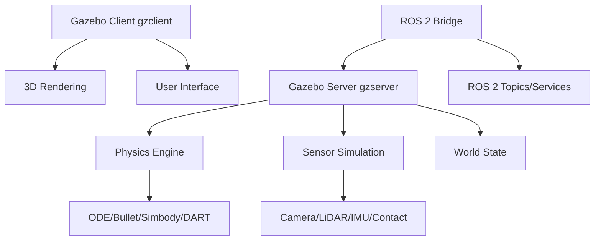

# Chapter 1: Gazebo Simulation Environment

## Overview

Gazebo is the industry-standard robot simulator that enables you to test algorithms, design robots, and train AI systems in realistic virtual environments before deploying to real hardware. This chapter teaches you to set up and use Gazebo effectively for humanoid robot development.

:::info Learning Time
**Estimated Reading Time**: 60-70 minutes
**Hands-on Activities**: 45 minutes
**Total Chapter Time**: 2 hours
:::

---

## 1.1 Why Simulation?

### The Development Cycle Problem

**Without Simulation:**
```
Design → Build Hardware → Test → Find Bug → Redesign → Rebuild → Retest
```
- ⏱️ Weeks to months per iteration
- 💰 Expensive hardware prototypes
- ⚠️ Risk of hardware damage
- 🐌 Slow algorithm development

**With Simulation:**
```
Design → Simulate → Test → Find Bug → Fix → Retest (minutes!)
```
- ⚡ Minutes to hours per iteration
- 💻 No hardware needed initially
- ✅ Safe testing of dangerous scenarios
- 🚀 Rapid algorithm development

### Benefits of Gazebo Simulation

**1. Cost Reduction**
- No need for multiple physical robots
- Test without hardware damage risk
- Cheaper than real sensors (LiDAR, cameras)

**2. Speed**
- Test 24/7 without battery constraints
- Parallel testing (multiple simulations)
- Faster-than-real-time simulation possible

**3. Safety**
- Test dangerous scenarios (falls, collisions)
- No risk to humans or equipment
- Extreme environment testing

**4. Reproducibility**
- Exact same conditions every time
- Deterministic testing
- Easy to share scenarios

**5. Scalability**
- Test with 1 or 100 robots
- Various environments instantly
- Different sensor configurations

---

## 1.2 Gazebo Architecture

### Gazebo Components



**Key Components:**

| Component | Purpose |
|-----------|---------|
| **gzserver** | Physics simulation, sensor data generation |
| **gzclient** | 3D visualization, GUI |
| **Physics Engine** | Computes dynamics, collisions |
| **Sensor Plugins** | Simulates cameras, LiDAR, IMU, etc. |
| **ROS 2 Bridge** | Connects Gazebo to ROS 2 |

### Gazebo vs. Gazebo Classic

**Gazebo Classic (Gazebo 11)**
- Older, stable version
- Tight ROS 1 integration
- Large existing ecosystem
- Being phased out

**Gazebo (Ignition/Gazebo Sim)**
- Modern rewrite
- Better performance
- Modular architecture
- ROS 2 native

:::tip For This Course
We'll use **Gazebo Classic** with ROS 2 Humble for maximum compatibility and resources. The concepts apply to both versions.
:::

---

## 1.3 Installation and Setup

### Installing Gazebo with ROS 2

**Ubuntu 22.04 + ROS 2 Humble:**

```bash
# Install Gazebo Classic
sudo apt update
sudo apt install ros-humble-gazebo-ros-pkgs ros-humble-gazebo-ros2-control

# Verify installation
gazebo --version
# Should show: Gazebo multi-robot simulator, version 11.x.x

# Test Gazebo
gazebo
```

### First Launch

```bash
# Launch Gazebo with ROS 2
ros2 launch gazebo_ros gazebo.launch.py

# Or launch with a world file
gazebo worlds/empty.world
```

**Gazebo Interface:**
- **Left Panel**: Insert models
- **Center**: 3D viewport
- **Top Toolbar**: Tools (select, move, rotate, scale)
- **Right Panel**: World/Model properties

---

## 1.4 Gazebo Worlds

### Understanding Worlds

A **world** defines the simulation environment:
- Lighting conditions
- Physics properties
- Ground plane
- Static objects (buildings, obstacles)
- Initial robot poses

### Built-in Worlds

```bash
# List available worlds
ls /usr/share/gazebo-11/worlds/

# Launch specific worlds
gazebo worlds/cafe.world
gazebo worlds/willowgarage.world
gazebo worlds/robocup14_spl_field.world
```

### Creating a Custom World

**my_world.world**:
```xml
<?xml version="1.0"?>
<sdf version="1.6">
  <world name="my_robot_world">

    <!-- Physics settings -->
    <physics type="ode">
      <max_step_size>0.001</max_step_size>
      <real_time_factor>1.0</real_time_factor>
      <real_time_update_rate>1000</real_time_update_rate>
    </physics>

    <!-- Lighting -->
    <light name="sun" type="directional">
      <cast_shadows>true</cast_shadows>
      <pose>0 0 10 0 0 0</pose>
      <diffuse>0.8 0.8 0.8 1</diffuse>
      <specular>0.2 0.2 0.2 1</specular>
      <attenuation>
        <range>1000</range>
      </attenuation>
      <direction>-0.5 0.1 -0.9</direction>
    </light>

    <!-- Ground plane -->
    <include>
      <uri>model://ground_plane</uri>
    </include>

    <!-- Add a simple box obstacle -->
    <model name="box_obstacle">
      <static>true</static>
      <pose>2 0 0.5 0 0 0</pose>
      <link name="link">
        <collision name="collision">
          <geometry>
            <box>
              <size>1 1 1</size>
            </box>
          </geometry>
        </collision>
        <visual name="visual">
          <geometry>
            <box>
              <size>1 1 1</size>
            </box>
          </geometry>
          <material>
            <ambient>1 0 0 1</ambient>
            <diffuse>1 0 0 1</diffuse>
          </material>
        </visual>
      </link>
    </model>

  </world>
</sdf>
```

**Launch custom world:**
```bash
gazebo my_world.world
```

---

## 1.5 Gazebo Models

### Model Database

Gazebo includes a large model database:
- **Robots**: TurtleBot, PR2, Husky, etc.
- **Objects**: Tables, chairs, boxes, cylinders
- **Environments**: Buildings, outdoor scenes

**Accessing models:**
```bash
# Online model database
# http://models.gazebosim.org/

# Local models
ls ~/.gazebo/models/
ls /usr/share/gazebo-11/models/
```

### Inserting Models

**Method 1: GUI**
1. Click "Insert" tab (left panel)
2. Browse models
3. Click to select
4. Click in world to place

**Method 2: World File**
```xml
<include>
  <uri>model://turtlebot3_waffle</uri>
  <pose>0 0 0 0 0 0</pose>
  <name>my_robot</name>
</include>
```

**Method 3: ROS 2 Service**
```bash
ros2 service call /spawn_entity gazebo_msgs/srv/SpawnEntity \
  '{name: "my_box", xml: "<sdf version=\"1.6\">...</sdf>"}'
```

---

## 1.6 Gazebo-ROS 2 Integration

### ROS 2 Gazebo Plugins

Plugins connect Gazebo to ROS 2:

**Common Plugins:**
- `libgazebo_ros_diff_drive.so` - Differential drive controller
- `libgazebo_ros_camera.so` - Camera sensor
- `libgazebo_ros_laser.so` - LiDAR sensor
- `libgazebo_ros_imu.so` - IMU sensor
- `libgazebo_ros_joint_state_publisher.so` - Joint states

### Example: Camera Plugin

```xml
<gazebo reference="camera_link">
  <sensor type="camera" name="camera1">
    <update_rate>30.0</update_rate>
    <camera name="head">
      <horizontal_fov>1.3962634</horizontal_fov>
      <image>
        <width>800</width>
        <height>800</height>
        <format>R8G8B8</format>
      </image>
      <clip>
        <near>0.02</near>
        <far>300</far>
      </clip>
    </camera>

    <plugin name="camera_controller" filename="libgazebo_ros_camera.so">
      <ros>
        <namespace>/robot</namespace>
        <remapping>image_raw:=camera/image_raw</remapping>
        <remapping>camera_info:=camera/camera_info</remapping>
      </ros>
      <camera_name>camera</camera_name>
      <frame_name>camera_link</frame_name>
    </plugin>
  </sensor>
</gazebo>
```

### Launching Gazebo with ROS 2

**launch/gazebo_world.launch.py**:
```python
from launch import LaunchDescription
from launch.actions import IncludeLaunchDescription
from launch.launch_description_sources import PythonLaunchDescriptionSource
from launch_ros.actions import Node
from ament_index_python.packages import get_package_share_directory
import os


def generate_launch_description():
    # Get package directory
    pkg_gazebo_ros = get_package_share_directory('gazebo_ros')

    # Gazebo launch
    gazebo = IncludeLaunchDescription(
        PythonLaunchDescriptionSource(
            os.path.join(pkg_gazebo_ros, 'launch', 'gazebo.launch.py')
        ),
        launch_arguments={
            'world': '/path/to/my_world.world',
            'verbose': 'true'
        }.items()
    )

    return LaunchDescription([
        gazebo,
    ])
```

---

## 1.7 Physics Configuration

### Physics Engines

Gazebo supports multiple physics engines:

| Engine | Pros | Cons | Use Case |
|--------|------|------|----------|
| **ODE** | Fast, stable | Less accurate | General robotics |
| **Bullet** | Good collision detection | Moderate speed | Complex contacts |
| **Simbody** | Very accurate | Slower | Biomechanics |
| **DART** | Fast, accurate | Newer, less tested | Advanced dynamics |

### Configuring Physics

```xml
<physics type="ode">
  <!-- Time step -->
  <max_step_size>0.001</max_step_size>

  <!-- Real-time factor (1.0 = real-time, 2.0 = 2x speed) -->
  <real_time_factor>1.0</real_time_factor>

  <!-- Update rate -->
  <real_time_update_rate>1000</real_time_update_rate>

  <!-- Gravity -->
  <gravity>0 0 -9.81</gravity>

  <!-- ODE-specific settings -->
  <ode>
    <solver>
      <type>quick</type>
      <iters>50</iters>
      <sor>1.3</sor>
    </solver>
    <constraints>
      <cfm>0.0</cfm>
      <erp>0.2</erp>
      <contact_max_correcting_vel>100.0</contact_max_correcting_vel>
      <contact_surface_layer>0.001</contact_surface_layer>
    </constraints>
  </ode>
</physics>
```

**Key Parameters:**
- `max_step_size`: Simulation time step (smaller = more accurate, slower)
- `real_time_factor`: Speed multiplier
- `iters`: Solver iterations (more = more accurate, slower)
- `erp`: Error reduction parameter (0.1-0.8)
- `cfm`: Constraint force mixing (softness)

---

## 1.8 Interacting with Gazebo

### Gazebo Topics

```bash
# List Gazebo topics
ros2 topic list | grep gazebo

# Common topics:
# /gazebo/link_states - All link positions/velocities
# /gazebo/model_states - All model positions/velocities
# /clock - Simulation time
```

### Gazebo Services

```bash
# List services
ros2 service list | grep gazebo

# Useful services:
# /gazebo/pause_physics
# /gazebo/unpause_physics
# /gazebo/reset_simulation
# /gazebo/reset_world
# /gazebo/spawn_entity
# /gazebo/delete_entity
# /gazebo/set_entity_state
```

### Example: Spawning a Robot

```python
#!/usr/bin/env python3
import rclpy
from rclpy.node import Node
from gazebo_msgs.srv import SpawnEntity
import os


class RobotSpawner(Node):
    def __init__(self):
        super().__init__('robot_spawner')

        # Create service client
        self.spawn_client = self.create_client(
            SpawnEntity,
            '/spawn_entity'
        )

        # Wait for service
        while not self.spawn_client.wait_for_service(timeout_sec=1.0):
            self.get_logger().info('Waiting for spawn service...')

        self.spawn_robot()

    def spawn_robot(self):
        # Read robot description
        robot_xml = open('/path/to/robot.urdf', 'r').read()

        # Create request
        request = SpawnEntity.Request()
        request.name = 'my_robot'
        request.xml = robot_xml
        request.robot_namespace = '/robot'
        request.initial_pose.position.x = 0.0
        request.initial_pose.position.y = 0.0
        request.initial_pose.position.z = 0.5

        # Call service
        future = self.spawn_client.call_async(request)
        rclpy.spin_until_future_complete(self, future)

        if future.result() is not None:
            self.get_logger().info(f'Robot spawned: {future.result().status_message}')
        else:
            self.get_logger().error('Failed to spawn robot')


def main():
    rclpy.init()
    spawner = RobotSpawner()
    rclpy.shutdown()


if __name__ == '__main__':
    main()
```

---

## 1.9 Performance Optimization

### Tips for Faster Simulation

**1. Reduce Visual Quality**
```bash
# Run headless (no GUI)
gzserver my_world.world

# Or in launch file
gazebo.launch.py gui:=false
```

**2. Simplify Collision Meshes**
- Use primitive shapes (box, cylinder, sphere)
- Reduce mesh polygon count
- Use collision meshes separate from visual meshes

**3. Adjust Physics**
```xml
<!-- Larger time step (less accurate, faster) -->
<max_step_size>0.002</max_step_size>

<!-- Fewer solver iterations -->
<iters>20</iters>
```

**4. Disable Unnecessary Sensors**
- Only enable sensors you need
- Reduce sensor update rates
- Lower camera resolution

---

## 1.10 Learning Objectives

By completing this chapter, you should be able to:

### Knowledge Objectives
- [ ] **Explain** the benefits of robot simulation
- [ ] **Describe** Gazebo architecture and components
- [ ] **List** common Gazebo plugins for ROS 2

### Comprehension Objectives
- [ ] **Understand** world files and model descriptions
- [ ] **Compare** different physics engines
- [ ] **Explain** how Gazebo integrates with ROS 2

### Application Objectives
- [ ] **Install** and configure Gazebo
- [ ] **Create** custom world files
- [ ] **Launch** Gazebo with ROS 2
- [ ] **Spawn** models programmatically

---

## 1.11 Key Takeaways

:::tip Essential Concepts
1. **Simulation** accelerates development and reduces costs

2. **Gazebo** consists of gzserver (physics) and gzclient (visualization)

3. **Worlds** define environments; **models** define objects/robots

4. **Plugins** connect Gazebo sensors to ROS 2 topics

5. **Physics configuration** balances accuracy and speed

6. **ROS 2 services** enable programmatic control of simulation
:::

:::warning Common Pitfalls
- ❌ Using too small time steps (slow simulation)
- ❌ Complex collision meshes (performance issues)
- ❌ Not testing in simulation before hardware
- ❌ Forgetting to source workspace before launching
- ❌ Unrealistic physics parameters
:::

---

## 1.12 Hands-On Exercise

### Exercise: Create a Simple Environment

**Goal**: Create a world with obstacles and spawn a simple robot

**Steps**:

1. **Create world file** with ground, lighting, and obstacles
2. **Launch Gazebo** with your world
3. **Insert a TurtleBot3** from the model database
4. **Write a Python script** to spawn additional obstacles
5. **Control the robot** using keyboard teleop

**Bonus**: Add a camera to the robot and view the image in RViz!

---

## Next Steps

In the next chapter, we'll learn about **URDF and SDF** - the formats for describing robot structure and properties.

---

## Further Reading

- [Gazebo Tutorials](http://gazebosim.org/tutorials)
- [Gazebo ROS 2 Integration](https://github.com/ros-simulation/gazebo_ros_pkgs)
- [SDF Format Specification](http://sdformat.org/)
- [Gazebo API Documentation](http://osrf-distributions.s3.amazonaws.com/gazebo/api/dev/index.html)

---

**Chapter 1 Complete! ✅**

You now understand Gazebo fundamentals and can create simulation environments for robot development!
