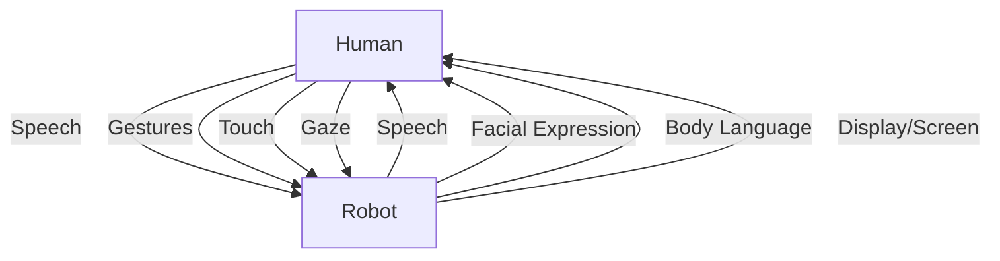

---
sidebar_position: 4
title: "Chapter 4: Natural Human-Robot Interaction Design"
description: "Creating intuitive and safe interactions between humans and humanoid robots"
---

# Chapter 4: Natural Human-Robot Interaction Design

## Overview

Natural human-robot interaction (HRI) is essential for humanoid robots working alongside humans. This chapter covers speech recognition, gesture understanding, social behaviors, safety protocols, and multimodal interaction design.

:::info Learning Time
**Estimated Reading Time**: 60-70 minutes
**Hands-on Activities**: 45 minutes
**Total Chapter Time**: 2 hours
:::

---

## 4.1 Principles of Natural HRI

### Design Goals

**Effective HRI should be:**
1. **Intuitive**: Natural for humans (no training required)
2. **Safe**: Physical and psychological safety
3. **Transparent**: Clear robot intentions
4. **Adaptive**: Responds to human preferences
5. **Robust**: Handles errors gracefully

### Interaction Modalities



---

## 4.2 Speech Recognition and Understanding

### Voice Interface

**Pipeline:**
1. **Speech-to-Text** (ASR)
2. **Natural Language Understanding** (NLU)
3. **Intent Recognition**
4. **Action Execution**
5. **Text-to-Speech** (TTS)

```python
import speech_recognition as sr
from google.cloud import texttospeech
import openai

class VoiceInterface:
    def __init__(self):
        self.recognizer = sr.Recognizer()
        self.tts_client = texttospeech.TextToSpeechClient()
        openai.api_key = "your-api-key"

    def listen(self):
        """
        Listen to microphone and convert to text
        """
        with sr.Microphone() as source:
            print("Listening...")

            # Adjust for ambient noise
            self.recognizer.adjust_for_ambient_noise(source)

            # Listen
            audio = self.recognizer.listen(source)

        try:
            # Speech-to-text
            text = self.recognizer.recognize_google(audio)
            print(f"You said: {text}")
            return text

        except sr.UnknownValueError:
            print("Could not understand audio")
            return None

        except sr.RequestError as e:
            print(f"Error: {e}")
            return None

    def understand_intent(self, text):
        """
        Extract intent and entities from text using LLM
        """
        prompt = f"""
        Extract the intent and entities from this command:
        "{text}"

        Return JSON format:
        {{
            "intent": "pick_up" | "place" | "navigate" | "handover" | "other",
            "object": "object name",
            "location": "location name",
            "parameters": {{}}
        }}
        """

        response = openai.ChatCompletion.create(
            model="gpt-4",
            messages=[{"role": "user", "content": prompt}]
        )

        import json
        intent_data = json.loads(response.choices[0].message.content)

        return intent_data

    def speak(self, text):
        """
        Convert text to speech and play
        """
        # Configure voice
        synthesis_input = texttospeech.SynthesisInput(text=text)

        voice = texttospeech.VoiceSelectionParams(
            language_code="en-US",
            name="en-US-Neural2-F",  # Female voice
            ssml_gender=texttospeech.SsmlVoiceGender.FEMALE
        )

        audio_config = texttospeech.AudioConfig(
            audio_encoding=texttospeech.AudioEncoding.MP3
        )

        # Generate speech
        response = self.tts_client.synthesize_speech(
            input=synthesis_input,
            voice=voice,
            audio_config=audio_config
        )

        # Play audio
        with open("output.mp3", "wb") as out:
            out.write(response.audio_content)

        import os
        os.system("mpg123 output.mp3")  # Linux
        # os.system("start output.mp3")  # Windows

# Usage
voice = VoiceInterface()

# Listen to command
command_text = voice.listen()

if command_text:
    # Understand intent
    intent = voice.understand_intent(command_text)
    print(f"Intent: {intent}")

    # Execute action
    if intent['intent'] == 'pick_up':
        robot.pick_up_object(intent['object'])
        voice.speak(f"I'm picking up the {intent['object']}")

    elif intent['intent'] == 'navigate':
        robot.navigate_to(intent['location'])
        voice.speak(f"Going to {intent['location']}")
```

---

## 4.3 Gesture Recognition

### Hand Gesture Detection

**Using MediaPipe:**
```python
import cv2
import mediapipe as mp
import numpy as np

class GestureRecognizer:
    def __init__(self):
        self.mp_hands = mp.solutions.hands
        self.hands = self.mp_hands.Hands(
            static_image_mode=False,
            max_num_hands=2,
            min_detection_confidence=0.5
        )
        self.mp_draw = mp.solutions.drawing_utils

    def detect_hands(self, image):
        """
        Detect hands in image

        Returns:
            List of hand landmarks
        """
        # Convert to RGB
        image_rgb = cv2.cvtColor(image, cv2.COLOR_BGR2RGB)

        # Process
        results = self.hands.process(image_rgb)

        if results.multi_hand_landmarks:
            return results.multi_hand_landmarks

        return []

    def recognize_gesture(self, hand_landmarks):
        """
        Recognize gesture from hand landmarks

        Returns:
            Gesture name: 'point', 'wave', 'thumbs_up', 'open_palm', etc.
        """
        # Extract key points
        landmarks = hand_landmarks.landmark

        # Fingertip positions
        thumb_tip = landmarks[4]
        index_tip = landmarks[8]
        middle_tip = landmarks[12]
        ring_tip = landmarks[16]
        pinky_tip = landmarks[20]

        # Finger base positions
        index_base = landmarks[5]
        middle_base = landmarks[9]

        # Check gestures

        # Pointing (index extended, others closed)
        if (index_tip.y < index_base.y and
            middle_tip.y > middle_base.y):
            return 'point'

        # Thumbs up
        if (thumb_tip.y < landmarks[2].y and
            index_tip.y > index_base.y):
            return 'thumbs_up'

        # Open palm (all fingers extended)
        if all([
            index_tip.y < index_base.y,
            middle_tip.y < middle_base.y,
            ring_tip.y < landmarks[13].y,
            pinky_tip.y < landmarks[17].y
        ]):
            return 'open_palm'

        # Wave (hand moving side-to-side)
        # (requires temporal analysis)

        return 'unknown'

    def get_pointing_direction(self, hand_landmarks):
        """
        Get 3D pointing direction
        """
        landmarks = hand_landmarks.landmark

        # Index finger tip and base
        tip = np.array([landmarks[8].x, landmarks[8].y, landmarks[8].z])
        base = np.array([landmarks[5].x, landmarks[5].y, landmarks[5].z])

        # Direction vector
        direction = tip - base
        direction = direction / np.linalg.norm(direction)

        return direction

# Usage
recognizer = GestureRecognizer()
cap = cv2.VideoCapture(0)

while True:
    ret, frame = cap.read()
    if not ret:
        break

    # Detect hands
    hands = recognizer.detect_hands(frame)

    for hand in hands:
        # Recognize gesture
        gesture = recognizer.recognize_gesture(hand)
        print(f"Gesture: {gesture}")

        if gesture == 'point':
            # Get pointing direction
            direction = recognizer.get_pointing_direction(hand)
            print(f"Pointing direction: {direction}")

            # Robot looks in that direction
            robot.look_at_direction(direction)

        elif gesture == 'thumbs_up':
            robot.speak("Thank you!")

        elif gesture == 'open_palm':
            robot.stop()

    cv2.imshow('Gesture Recognition', frame)

    if cv2.waitKey(1) & 0xFF == ord('q'):
        break

cap.release()
cv2.destroyAllWindows()
```

---

## 4.4 Gaze Tracking and Attention

### Eye Contact and Joint Attention

```python
import cv2
import dlib

class GazeTracker:
    def __init__(self):
        # Face detector
        self.detector = dlib.get_frontal_face_detector()

        # Facial landmark predictor
        self.predictor = dlib.shape_predictor(
            "shape_predictor_68_face_landmarks.dat"
        )

    def detect_face(self, image):
        """
        Detect face in image
        """
        gray = cv2.cvtColor(image, cv2.COLOR_BGR2GRAY)
        faces = self.detector(gray)

        if len(faces) > 0:
            return faces[0]
        return None

    def get_eye_center(self, landmarks, eye_points):
        """
        Compute eye center from landmarks
        """
        points = np.array([(landmarks.part(i).x, landmarks.part(i).y)
                          for i in eye_points])
        center = points.mean(axis=0).astype(int)
        return center

    def estimate_gaze_direction(self, image, face):
        """
        Estimate where person is looking
        """
        # Get facial landmarks
        landmarks = self.predictor(image, face)

        # Left eye: points 36-41
        # Right eye: points 42-47
        left_eye = self.get_eye_center(landmarks, range(36, 42))
        right_eye = self.get_eye_center(landmarks, range(42, 48))

        # Nose tip: point 30
        nose = (landmarks.part(30).x, landmarks.part(30).y)

        # Estimate gaze (simplified)
        # In practice, use deep learning models like GazeNet

        eye_center = ((left_eye + right_eye) / 2).astype(int)

        # Direction from nose to eye center
        gaze_vector = eye_center - np.array(nose)

        return gaze_vector

    def is_looking_at_robot(self, gaze_vector, threshold=50):
        """
        Check if person is looking at robot
        """
        # Simplified: check if gaze is roughly forward
        magnitude = np.linalg.norm(gaze_vector)

        if magnitude < threshold:
            return True
        return False

# Usage
gaze_tracker = GazeTracker()

while True:
    frame = camera.get_frame()

    face = gaze_tracker.detect_face(frame)

    if face:
        gaze = gaze_tracker.estimate_gaze_direction(frame, face)

        if gaze_tracker.is_looking_at_robot(gaze):
            # Person is looking at robot
            robot.make_eye_contact()
            robot.speak("Hello! How can I help you?")
```

---

## 4.5 Social Behaviors

### Proxemics (Personal Space)

**Maintain appropriate distance:**
```python
class ProxemicsController:
    def __init__(self):
        # Hall's proxemic zones
        self.INTIMATE_DISTANCE = 0.45  # < 45cm
        self.PERSONAL_DISTANCE = 1.2   # 45cm - 1.2m
        self.SOCIAL_DISTANCE = 3.6     # 1.2m - 3.6m
        self.PUBLIC_DISTANCE = 7.6     # > 3.6m

    def get_appropriate_distance(self, relationship, task):
        """
        Determine appropriate distance based on context
        """
        if task == 'handover':
            return self.PERSONAL_DISTANCE

        elif task == 'conversation':
            if relationship == 'stranger':
                return self.SOCIAL_DISTANCE
            else:
                return self.PERSONAL_DISTANCE

        elif task == 'collaboration':
            return self.PERSONAL_DISTANCE

        return self.SOCIAL_DISTANCE

    def maintain_distance(self, human_position, robot_position, desired_distance):
        """
        Adjust robot position to maintain appropriate distance
        """
        # Current distance
        current_distance = np.linalg.norm(human_position - robot_position)

        # If too close
        if current_distance < desired_distance - 0.2:
            # Move back
            direction = (robot_position - human_position) / current_distance
            target_position = human_position + direction * desired_distance

            robot.navigate_to(target_position)

        # If too far
        elif current_distance > desired_distance + 0.2:
            # Move closer
            direction = (human_position - robot_position) / current_distance
            target_position = robot_position + direction * (current_distance - desired_distance)

            robot.navigate_to(target_position)
```

### Facial Expressions

**Humanoid robots with expressive faces:**
```python
class FacialExpressionController:
    def __init__(self, robot):
        self.robot = robot

        # Expression definitions (servo positions)
        self.expressions = {
            'neutral': {
                'eyebrows': 0,
                'eyes': 0,
                'mouth': 0
            },
            'happy': {
                'eyebrows': 10,
                'eyes': 5,
                'mouth': 20  # Smile
            },
            'sad': {
                'eyebrows': -10,
                'eyes': -5,
                'mouth': -15  # Frown
            },
            'surprised': {
                'eyebrows': 20,
                'eyes': 15,
                'mouth': 10
            },
            'confused': {
                'eyebrows': -5,
                'eyes': 0,
                'mouth': -5
            }
        }

    def set_expression(self, expression_name):
        """
        Set facial expression
        """
        if expression_name in self.expressions:
            expr = self.expressions[expression_name]

            self.robot.set_servo('eyebrows', expr['eyebrows'])
            self.robot.set_servo('eyes', expr['eyes'])
            self.robot.set_servo('mouth', expr['mouth'])

    def express_emotion(self, emotion, intensity=1.0):
        """
        Express emotion with variable intensity
        """
        if emotion in self.expressions:
            expr = self.expressions[emotion]

            # Scale by intensity
            for part, value in expr.items():
                scaled_value = value * intensity
                self.robot.set_servo(part, scaled_value)

# Usage
face_controller = FacialExpressionController(robot)

# React to human emotions
human_emotion = detect_human_emotion(camera_image)

if human_emotion == 'happy':
    face_controller.set_expression('happy')
    robot.speak("You seem happy today!")

elif human_emotion == 'sad':
    face_controller.set_expression('sad')
    robot.speak("Is everything okay?")
```

---

## 4.6 Safety in HRI

### Collision Avoidance

**ISO 13482 compliance:**
```python
class SafetyController:
    def __init__(self, robot):
        self.robot = robot

        # Safety zones
        self.DANGER_ZONE = 0.3   # Stop immediately
        self.WARNING_ZONE = 0.6  # Slow down
        self.SAFE_ZONE = 1.0     # Normal operation

        # Speed limits
        self.MAX_SPEED_NEAR_HUMAN = 0.1  # m/s
        self.MAX_SPEED_NORMAL = 0.5      # m/s

    def detect_humans(self, sensor_data):
        """
        Detect humans using cameras/LiDAR
        """
        # Use YOLO or similar for human detection
        humans = []

        # Process camera image
        detections = self.robot.object_detector.detect(sensor_data['camera'])

        for det in detections:
            if det['class'] == 'person':
                # Estimate distance using depth camera
                distance = sensor_data['depth'][det['bbox']]

                humans.append({
                    'position': det['position'],
                    'distance': distance
                })

        return humans

    def compute_safe_velocity(self, humans):
        """
        Compute safe velocity based on human proximity
        """
        if not humans:
            return self.MAX_SPEED_NORMAL

        # Find closest human
        min_distance = min(h['distance'] for h in humans)

        if min_distance < self.DANGER_ZONE:
            # STOP
            return 0.0

        elif min_distance < self.WARNING_ZONE:
            # Slow down
            # Linear interpolation
            speed = self.MAX_SPEED_NEAR_HUMAN * (
                (min_distance - self.DANGER_ZONE) /
                (self.WARNING_ZONE - self.DANGER_ZONE)
            )
            return speed

        elif min_distance < self.SAFE_ZONE:
            return self.MAX_SPEED_NEAR_HUMAN

        else:
            return self.MAX_SPEED_NORMAL

    def emergency_stop(self):
        """
        Immediate stop
        """
        self.robot.stop_all_motors()
        self.robot.set_brake(True)
        self.robot.speak("Emergency stop activated")

# Control loop
safety = SafetyController(robot)

while True:
    # Get sensor data
    sensor_data = robot.get_sensors()

    # Detect humans
    humans = safety.detect_humans(sensor_data)

    # Compute safe velocity
    safe_velocity = safety.compute_safe_velocity(humans)

    # Apply velocity limit
    robot.set_max_velocity(safe_velocity)

    # Check for emergency
    if safe_velocity == 0:
        safety.emergency_stop()

    time.sleep(0.01)  # 100 Hz
```

---

## 4.7 Multimodal Interaction

### Combining Multiple Modalities

```python
class MultimodalInteractionManager:
    def __init__(self, robot):
        self.robot = robot
        self.voice = VoiceInterface()
        self.gesture = GestureRecognizer()
        self.gaze = GazeTracker()

    def process_interaction(self):
        """
        Process multimodal input
        """
        # Get inputs from all modalities
        speech_input = self.voice.listen()
        gesture_input = self.gesture.recognize_gesture(camera_frame)
        gaze_input = self.gaze.estimate_gaze_direction(camera_frame, face)

        # Fusion: combine modalities
        intent = self.fuse_modalities(speech_input, gesture_input, gaze_input)

        return intent

    def fuse_modalities(self, speech, gesture, gaze):
        """
        Combine information from multiple modalities
        """
        # Example: "Pick up THAT" + pointing gesture

        if speech and 'pick up' in speech.lower():
            if gesture == 'point':
                # Get pointing direction
                direction = self.gesture.get_pointing_direction()

                # Find object in that direction
                target_object = self.robot.find_object_in_direction(direction)

                return {
                    'action': 'pick_up',
                    'object': target_object
                }

        # Example: Looking at object + "that one"
        if speech and ('that' in speech.lower() or 'this' in speech.lower()):
            # Use gaze to determine object
            target_object = self.robot.find_object_at_gaze(gaze)

            return {
                'action': 'select',
                'object': target_object
            }

        return None

# Usage
interaction_manager = MultimodalInteractionManager(robot)

while True:
    intent = interaction_manager.process_interaction()

    if intent:
        print(f"Intent: {intent}")

        # Execute action
        if intent['action'] == 'pick_up':
            robot.pick_up(intent['object'])
            robot.speak(f"Picking up {intent['object']}")
```

---

## 4.8 Learning Objectives

By completing this chapter, you should be able to:

### Knowledge Objectives
- [ ] **Explain** principles of natural HRI
- [ ] **Describe** multimodal interaction
- [ ] **List** safety considerations in HRI

### Application Objectives
- [ ] **Implement** speech recognition and synthesis
- [ ] **Recognize** hand gestures
- [ ] **Design** social behaviors (proxemics, expressions)
- [ ] **Ensure** safe human-robot collaboration

---

## 4.9 Key Takeaways

:::tip Essential Concepts
1. **Natural HRI** should be intuitive, safe, and transparent

2. **Multimodal interaction** combines speech, gestures, and gaze

3. **Proxemics** maintains appropriate personal space

4. **Facial expressions** convey robot emotions and intentions

5. **Safety** is paramount - collision avoidance and emergency stops

6. **Gesture recognition** enables non-verbal communication

7. **Voice interface** provides natural command input
:::

:::warning Safety First
- Always maintain safe distances from humans
- Implement emergency stop mechanisms
- Limit speeds when humans are nearby
- Comply with ISO 13482 safety standards
- Test extensively before deployment
:::

---

## Module 4 Complete! 🎉

**Congratulations!** You've completed Weeks 11-12: Humanoid Robot Development.

**You've learned**:
- ✅ Humanoid robot kinematics and dynamics
- ✅ Bipedal locomotion and balance control
- ✅ Manipulation and grasping with humanoid hands
- ✅ Natural human-robot interaction design

**Next**: Continue to subsequent modules for advanced topics!

---

## Further Reading

- [Human-Robot Interaction: An Introduction (Goodrich & Schultz)](https://www.cambridge.org/core/books/humanrobot-interaction/0B5F4B3F3F3F3F3F3F3F3F3F3F3F3F3F)
- [Social Robotics (Fong et al.)](https://www.ri.cmu.edu/pub_files/pub4/fong_terrence_2003_1/fong_terrence_2003_1.pdf)
- [ISO 13482: Safety requirements for personal care robots](https://www.iso.org/standard/53820.html)

---

**Chapter 4 Complete! ✅**

**Module 4 Complete! 🎊**

You now have comprehensive knowledge of humanoid robot development from kinematics to natural interaction!
